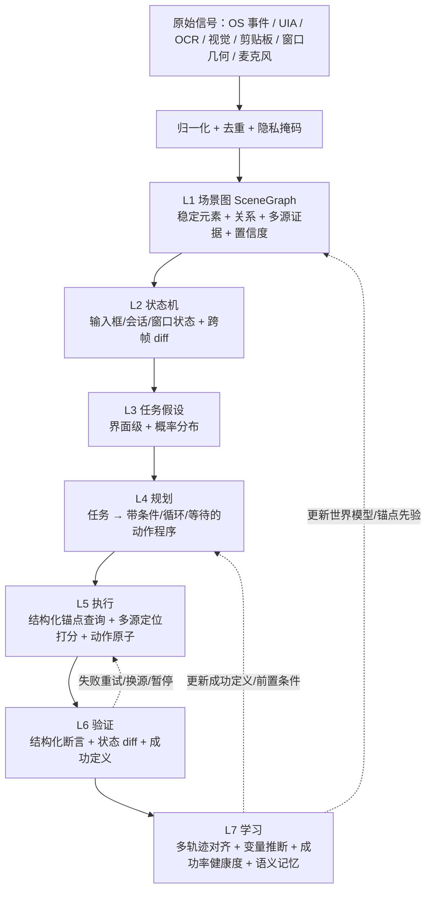

# 全域情境感知与操作辅助：全流程打通技术方案

> 🗄️ **已合并归档（2026-08-13）**：本文件内容已并入《技术文档-AI智能体输入法.md》v0.5 §5.8；本文件保留为方案设计依据，不再单独维护。

> 版本：v0.1（方案草案，评审通过后并入《技术文档-AI智能体输入法.md》v0.4.x）  
> 日期：2026-08-13  
> 状态：待评审  
> 上游：`技术文档-AI智能体输入法.md`（v0.4）、`鼠标模拟控制与操作记忆-技术路线-2026-08-12.md`  
> 现状依据：`agent-sdk/ACCEPTANCE.md`（截至 v0.4.22）、`agent-sdk/crates/owo-agent-core/src/*` 实测代码

---

## 0. 结论摘要

本方案把现有的“散装工具函数 + 线性动作图 + 字符串锚点”重构为一条**真正会收敛、会回流的分层情景理解漏斗**，用一个统一的**场景图（SceneGraph）世界模型**贯穿“感知 → 定位 → 控制 → 验证 → 学习”全流程。

核心结论：

1. **方向正确，但闭环没打通。** v0.4.22 已经实现 L0–L3 感知、UIA/OCR/视觉三源、窗口级截取、元素注册表、窗口模板、动作图执行、静默观察与情景记忆、PP-OCRv6、本地 VL。问题是这些模块各管一段，缺一个统一世界模型把它们串起来，验证失败也不回流到学习。
2. **先补“世界模型 + 多源定位打分 + 结构化断言”这三件事，收益最大。** 这直接解决真实 QQ/微信自绘控件定位差、输入框清空误判、动作图只能走直线三个最痛的问题。
3. **学习层要重做泛化。** 现在“重复 Type 变 `{value}`”太弱，必须换成“多轨迹对齐 + 变量边界推断 + 前置条件/验证学习 + 成功率健康度”。
4. **外部共识已验证**：OmniParser（截图→编号元素）、iris-mcp/vision-mcp（UIA 优先 → OCR → 视觉 handoff）、AWM（从轨迹归纳可复用工作流）都支持本项目的既有方向；本方案的增量是把它们工程化到 Rust 里并接成闭环。

---

## 1. 目标与范围

### 1.1 目标

让 Agent 能：

1. **看懂屏幕**：不仅知道“用户打开了 QQ”，还能稳定地知道“QQ 在哪个会话、输入框是否为空、发送按钮在哪”，并统一到可计算的坐标与元素模型。
2. **可靠地操作电脑**：点击、输入、快捷键、滚动、拖拽、启动应用，每步带定位打分、前置校验、结果验证、失败重试/换源。
3. **从用户行为中学习**：后台静默观察白名单应用内的操作，判定结果，自动沉淀为“流程技能 + 语义记忆”，并在下次主动建议或复用。
4. **全程安全可审计**：默认 deny，敏感面熔断，隐私最小化，审计与主 Agent 分离。

### 1.2 范围

- 实施范围：`agent-sdk` 内 Rust 核心 + HTTP 接口 + Web/Tauri 桌面端展示 + 契约测试。
- 不改 OwO C++ 输入法代码。
- 输入法融合（TSF/IMK）仍不实施（D5–D7 锁定）。
- 本文档只覆盖“全域情景感知 + 操作辅助”这条主线，不含云端执行、公开市场、多格式笔记。

---

## 2. 现状基线（代码事实）

### 2.1 已实现并实测通过（v0.4.22）

| 能力 | 模块/证据 |
|---|---|
| L0 前台/剪贴板事件 | `perception.rs`、`platform.rs`：前台窗口轮询去重、剪贴板序列号掩码 |
| L1 UIA 树 | `accessibility.rs`：`foreground_ui_tree` / `ui_tree_for_hwnd`，深度/节点截断 |
| L2 按需截图 + 环形缓冲 | `perception.rs`、`platform.rs`：内存 5 帧、不落盘、用后即毁 |
| L3 任务假设 | `perception.rs::infer_task_hypothesis`：本地启发式（coding/chatting/gaming/browsing） |
| OCR 双通道 | `ocr.rs`（Media.Ocr）+ `paddle_ocr.rs`（PP-OCRv6 云 API，失败回退） |
| 窗口级截取 | `platform.rs::capture_window_bmp/deep`：PrintWindow 优先、BitBlt 回退、后台只读 |
| 窗口模板 | `window_template.rs`：UIA/OCR 双路径 ROI 提取、持久化、检测 |
| 元素注册表 | `element_registry.rs`：UIA+OCR 融合、稳定 ID、stale 淘汰 |
| 视觉网关 | `vision.rs`：Ollama/BYOK 双通道、场景描述、yes/no 验证、grounding 交叉验证 |
| 动作图执行 | `executor.rs`：UIA 锚点 + OCR 兜底 + SendInput + ValuePattern 回读 + 敏感熔断 |
| 操作学习 | `learn.rs`：录制→泛化→沉淀流程技能包；主动建议引擎 |
| 静默观察 | `observe.rs`：模拟面日志→情景记忆 JSONL→挖掘技能包 |
| 浏览器自动化 | `computer_use.rs`：Playwright 子进程、持久化 profile |
| 桌面工具 | `computer_use.rs`：`screen_ocr`/`desktop_click/type/key/shortcut/launch/scroll/wait_until` 等 |

真实桌面实测：QQ 群聊受控发送、文件发送、表情上屏、Notepad 示范→换参复用、VSCode 语音改代码 30/30、浏览器搜索/下载等均已实锤。

### 2.2 剩余缺口（本方案要补的）

| # | 缺口 | 现状证据 | 影响 |
|---|---|---|---|
| G1 | 元素注册表未进入执行主链路 | `executor.rs::find` 仍是“递归 UIA + 字符串匹配 + 同步 OCR 兜底”，`SceneElement` 稳定 ID 只活在 `element_registry` 单测里 | 每次点击都重新 OCR/遍历，不稳定、慢 |
| G2 | 视觉 grounding 未并入统一定位 | `vision.rs::ground_element` 是独立工具，`cross_validate_box` 只判断“点是否在框内”，`source=vision` 未进 `SceneElement.evidence` | 视觉只做旁路，不参与打分 |
| G3 | 验证谓词简陋且分散 | `executor.rs::verify` 只有 `value:`/`ui:` 两个字符串前缀；`computer_use.rs` 另有一套 OCR 断言 | “发送成功”判定脆弱，输入框清空被占位符误判 |
| G4 | 动作图只能走直线 | `execute_graph` 沿单边遍历，无分支/循环/等待/重试；`ActionType` 无 Scroll/Drag/Wait/Assert | 真实流程（登录框、未找到、重试）表达不了 |
| G5 | 学习泛化形同虚设 | `generalize_to_graph` 只是线性串 + Type 重复变 `{value}` | 学到的技能不能换参数、不能适应漂移 |
| G6 | 无结果判定与成功率 | `Observation` 无 success/failure 字段；`ProactiveEngine` 只算序列相似度计数 | 文档 5.5 的“≥3 次且成功率 ≥80%”没有实现 |
| G7 | 真实面静默观察未实现 | `observe.rs` 只接模拟面日志；真实 UIA 事件/窗口状态采样未做 | 真实用户行为学不进来 |
| G8 | 语义记忆/向量检索缺失 | 只有 JSONL 情景记忆 + `state_hash`，无 embedding/RAG，无 `memory.recall` | 历史操作“想不起来” |
| G9 | 窗口模板未用于定位控制 | `window_template` 只 build/detect，没有作为定位源接入 `executor` | 固定布局应用拿不到稳定 ROI |
| G10 | 本地 ONNX OCR 未落地 | PP-OCRv6 走云 API，RapidOCR/onnxruntime 未部署 | 离线/隐私场景缺确定性 OCR |

---

## 3. 问题诊断：为什么“效果不好”

现在不是能力不够，而是**能力之间没有形成一个统一的世界模型和反馈回路**：

1. 四套平行结构各记各的：`SituationSnapshot`（应用级）、`SceneElement`（元素级）、`WindowTemplate`（ROI 级）、`OcrSummary`（版面级）互不相通，没有跨帧状态机，也没有“哪个元素就是上一个帧的发送按钮”。
2. 定位是“字符串包含 + 顺序回退”，不是多源概率融合；稳定 ID 和模板没进执行器。
3. 验证是散落的字符串谓词，没有“成功定义”可学、可存、可复用。
4. 学习把“示范轨迹”线性化，没有对齐、没有变量边界、没有结果统计。
5. 每层之间没有置信度/不确定性传播，失败后不能回流到学习层。

因此要做的不是再加工具，而是把现有模块重组成一条会收敛、会回流的漏斗。

---

## 4. 目标架构：统一情景理解漏斗



关键原则：

1. **SceneGraph 是唯一事实来源**：感知、定位、执行、验证、学习都读它、写它，不再各存一套。
2. **每一层输出带置信度**：不确定就降级（只读感知/询问），不硬猜。
3. **验证失败必回流**：重试 → 换定位源 → 暂停询问 → 把失败模式写回技能健康度。
4. **视觉只做证据，不做控制**：grounding 必须与 OCR/UIA 交叉验证后，才作为一条打分证据进入定位。

---

## 5. 关键模块设计

### 5.1 场景图（新增 `scene.rs`，取代 `element_registry.rs` 的地位）

目标：把 `perception::SituationSnapshot`、`element_registry::SceneElement`、`window_template::WindowTemplate`、`ocr::OcrSummary` 统一为跨帧世界模型。

```rust
// scene.rs（新增）
pub struct SceneGraph {
    pub revision: u64,
    pub state_hash: u64,
    pub app: Option<ForegroundApp>,
    pub window: Option<WindowState>,          // hwnd/几何/DPI/可见性/遮挡
    pub elements: Vec<SceneElement>,          // 稳定元素 + 多源证据
    pub relations: Vec<ElementRelation>,      // parent/contains/overlaps/occludes
    pub entities: HashMap<String, EntityState>, // input_box.empty, window.focused ...
    pub hypotheses: Vec<TaskHypothesis>,
    pub template_hits: HashMap<String, f64>,  // ROI 命中率，用于模板健康度
}

pub struct SceneElement {
    pub id: String,                 // 稳定 ID（跨帧）
    pub app_id: String,
    pub name: String,
    pub role_hint: String,
    pub evidence: Vec<Evidence>,    // 多源证据，替代单一 confidence
    pub rect: Rect,                 // 屏幕坐标 + 客户区坐标
    pub confidence: f64,            // 融合后
    pub stale_frames: u32,
    pub last_hit: Option<String>,   // 最近一次成功操作
}

pub struct Evidence {
    pub source: EvidenceSource,     // Uia | Ocr | Vision | Template | History
    pub rect: Rect,
    pub confidence: f64,
    pub text_hash: Option<u64>,
}
```

融合规则（不再取 max，而是加权合并 + 显式冲突）：

- UIA 提供语义角色与几何，权重最高（确定性）。
- OCR 提供文本与几何，补自绘控件；同名且矩形重合时与 UIA 合并。
- 视觉 grounding 只有与 OCR/UIA 交叉验证后才作为 `Evidence::Vision` 加入（G2）。
- 历史命中先验：同一稳定 ID 过去成功命中的位置作为弱证据。
- 冲突（同名但几何差异大）标记 `conflict=true`，定位时降置信度。

文件映射：新增 `scene.rs`，`element_registry.rs` 的稳定 ID 跟踪逻辑并入，`fuse_sources` 升级为多源（UIA+OCR+Vision+Template）。

### 5.2 多源定位打分（新增 `locate.rs`）

目标：把 `executor.rs::find_recursive`（字符串匹配）替换为结构化锚点查询 + 概率定位（G1/G2/G9）。

```rust
// locate.rs（新增）
pub struct AnchorQuery {
    pub app_id: Option<String>,
    pub role: Option<String>,
    pub name_pattern: String,
    pub parent: Option<String>,
    pub min_confidence: f64,
    pub source_priority: Vec<EvidenceSource>,
    pub stable_id: Option<String>,
    pub text_hash: Option<u64>,
    pub context_rect: Option<Rect>,   // 限定搜索区域
}

pub struct LocateResult {
    pub candidates: Vec<(SceneElement, f64)>,
    pub best: Option<SceneElement>,
    pub uncertainty: f64,
    pub used_source: Option<EvidenceSource>,
}

pub fn locate(graph: &SceneGraph, query: &AnchorQuery) -> LocateResult;
```

打分公式（可调）：

```text
score = w_uia * evidence(uia)
      + w_ocr * evidence(ocr)
      + w_vision * evidence(vision, cross_validated)
      + w_template * template_hit(roi)
      + w_history * prior_hit(stable_id)
```

- 命中后把 `SceneElement.id` 写回执行器的锚点池，下一步直接按稳定 ID 定位，减少每次全量 OCR（G1）。
- `uncertainty` 高于阈值时：降级为只读感知，或把候选列表交给 Agent/用户确认，不硬点。

文件映射：新增 `locate.rs`；`executor.rs::WindowsUiaSource::find` 改为调用 `locate`；`vision.rs::cross_validate_box` 的产出写入 `SceneElement.evidence`。

### 5.3 动作程序（升级 `learn.rs::ActionGraph` → 新增 `action_program.rs`）

目标：支持分支、循环、等待、重试、子流程（G4）。

```rust
// action_program.rs（新增）
pub enum ProgramNode {
    Step(StepNode),       // 定位 → 校验 → 动作 → 验证
    Assert(Assertion),
    WaitUntil(Assertion, Timeout),
    Branch { cond: Assertion, then: Program, otherwise: Program },
    Loop { cond: Assertion, body: Program, max_iter: usize },
    Retry { body: Program, max_attempts: usize, on_fail: RetryPolicy },
    Sub { program: String }, // 子流程技能
}
```

`ActionType` 扩展：`Click / Type / Shortcut / Inject / Launch / ClickAt / Scroll / Drag / Wait / Assert / Hover / RightClick / DoubleClick`。

执行器从“沿单边遍历”改为**解释器 + 状态机**：每一步 = `locate → precheck（前台/遮挡/可见）→ perform → assert → record`；`Branch/Loop/Retry` 依据 `Assertion` 结果跳转。现有 `execute_graph` 的线性语义作为兼容入口保留。

文件映射：新增 `action_program.rs`；`executor.rs::execute_graph` 改为内部调用 `execute_program`，旧的线性图自动转换为 `Vec<Step>`。

### 5.4 结构化断言与成功定义学习（新增 `assert.rs`）

目标：把散落的字符串谓词统一为结构化断言，并让“成功定义”可学、可存、可复用（G3）。

```rust
// assert.rs（新增）
pub enum Assertion {
    WindowTitle { contains: String },
    UiaExists { name: String, role: Option<String> },
    UiaValue { name: String, contains: String },
    OcrContains { text: String, region: Option<Rect>, ignore_placeholder: bool },
    OcrBoxGone { text: String },
    PixelDiff { region: Rect, min_ratio: f64 },
    ClipboardChanged,
    VisionConfirm { question: String, min_confidence: f64 },
    StateDiff { field: String, expected: Value },
}

pub struct VerificationRecipe {
    pub assertions: Vec<Assertion>,
    pub timeout_ms: u64,
    pub retry: usize,
}

pub fn evaluate(assertion: &Assertion, graph: &SceneGraph) -> AssertResult;
```

“输入框清空”误判修复：`OcrBoxGone { text: "输入消息..." }` 用确定性 OCR 判断占位文本是否消失，而不是让 VL 回答“是否清空”（VL 会把占位符当成未清空）。视觉只做可选的二次确认。

成功定义学习（G6 前置）：静默观察时对“操作后 1–3s 的 `EntityState` diff”做统计，把变化最稳定且可观测的字段自动生成默认 `Assertion`，随技能存储，用户可改。

文件映射：新增 `assert.rs`；`executor.rs::verify` 与 `computer_use.rs` 的 OCR 断言统一迁入；`ActionNode.verify: Option<String>` 改为 `Option<VerificationRecipe>`（保留字符串兼容解析）。

### 5.5 记忆三层（升级 `observe.rs`，新增语义记忆）

目标：打通“情景记忆 → 流程技能 → 语义记忆”，补结果判定、成功率、向量检索（G6/G7/G8）。

```rust
// observe.rs（扩展）
pub enum Outcome { Success, Failure, Unknown }

pub struct Observation {
    pub ts: String,
    pub app_id: String,
    pub kind: String,
    pub summary: String,          // 内容掩码
    pub detail: serde_json::Value,
    pub state_hash: u64,
    pub outcome: Option<Outcome>, // 新增
    pub normalized: Vec<String>,  // 归一化动作序列
}

// memory.rs（新增：语义记忆）
pub struct SemanticMemory {
    // 本地 embedding + 向量索引（可用 hnswlib / sqlite-vec / 本地 ONNX embedding）
}

pub fn recall(query: &str, top_k: usize) -> Vec<MemoryEntry>;
```

真实面观察源（G7）：不装全局低级钩子，优先 UIA `AutomationEvent`（Focus/PropertyChange）+ 窗口状态轮询 + 前台/剪贴板去重采样；键盘只记动作摘要（类型 + 长度），不记内容；密码/支付框直接跳过。

结果判定：操作后 1–3s 读 `SceneGraph.entities` diff——出现预期变化=Success，无变化/回退=Failure，无法判定=Unknown（不自动沉淀）。

沉淀门槛落地（对齐文档 5.5）：同 app + 归一化序列 ≥3 次且成功率 ≥80% 才生成候选；候选必须用户确认转 active。

文件映射：`observe.rs` 扩展 `Outcome` + 归一化 + 真实面采样；新增 `memory.rs`；`learn.rs::ProactiveEngine` 接入成功率门槛。

### 5.6 多轨迹对齐与变量推断（升级 `learn.rs::generalize_to_graph`）

目标：把“重复 Type 变 `{value}`”替换为真正的泛化（G5）。

```rust
// learn.rs（升级）
pub fn generalize_traces(
    traces: &[Vec<RecordedAction>],   // 同一任务的多次示范
) -> Result<ActionGraph, String>;
```

流程：

1. **归一化**：动作 → `app_id + action_type + semantic_anchor/text_hash + normalized_rect`。
2. **多轨迹对齐**：两两做序列对齐（编辑距离/Needleman-Wunsch），找公共骨架和可变位。
3. **变量边界推断**：位置稳定但取值变化的锚点/文本 → 变量（联系人、正文、路径），带类型标注。
4. **前置条件学习**：进入流程前的状态（目标应用已启动、窗口在前台、会话已选中）。
5. **验证学习**：从成功样本的状态 diff 生成默认 `VerificationRecipe`（见 5.4）。

文件映射：`learn.rs` 新增 `generalize_traces`，保留 `generalize_to_graph` 作为单轨迹兼容入口；`FlowSkillManifest` 增加 `preconditions` 与 `verify` 字段。

### 5.7 技能健康度与自愈（升级 `FlowSkillPackage` / `executor`）

目标：技能漂移后能降级、自愈、预警（G6 延伸）。

```rust
// learn.rs（扩展 FlowSkillPackage）
pub struct SkillHealth {
    pub attempts: usize,
    pub successes: usize,
    pub recent_failures: Vec<FailureMode>,
    pub state: SkillState, // Active | Degraded | Disabled
}
```

- 每次执行记录 outcome；连续 2 次失败标记 `Degraded`，提示重新学习，不静默重试。
- 窗口模板命中率监控：ROI 命中率下降 → 自动重建，重建前坐标点击降级为询问（G9）。
- 用户空闲时只读 OCR 校验模板，提前预警。

---

## 6. 隐私、权限与安全边界（延续 v0.4 决策）

1. 默认只开 L0/L1；L2/L3 逐项授权、随时热撤；桌面端常驻感知层级指示灯。
2. 内容默认掩码；聊天授权粒度为单会话级，发送动作必须预览 + 审批。
3. 敏感面（密码/支付/验证码）在任何轨熔断：不感知、不学习、不执行。
4. 学习样本本地加密、可暂停、可一键清空；行为记录与审计分离。
5. 真实面观察源不使用全局低级钩子，优先 UIA 事件 + 轮询快照；正式版默认关或白名单。
6. 所有鼠标/键盘动作经 deny/ask/allow；白名单外应用默认只读。
7. 视觉/OCR/窗口抓取一律按不可信输入处理，视觉 grounding 必须交叉验证。
8. 数据出境开关继续约束云 OCR（PP-OCRv6）、云模型、BYOK 视觉。

---

## 7. 里程碑与验收标准

### M-A：统一场景图 + 多源定位（对应 G1/G2/G9）

交付：`scene.rs`、`locate.rs`；`element_registry` 并入场景图；视觉 grounding 写入 `evidence`；窗口模板作为定位源；执行器改用 `locate`。

验收（契约测试 + 实测）：

- 同一 QQ 窗口连续 5 帧稳定元素 ID 保持率 ≥ 95%；移动/遮挡后仍能按稳定 ID 命中。
- `locate("发送")` 命中与人工标注框 IoU ≥ 0.8（20 例）。
- 视觉 grounding 与 OCR 不重合时被拒绝、不进入候选。
- `cargo fmt --all -- --check` 与 `cargo clippy --workspace --all-targets -D warnings` 干净；`cargo test --workspace` 全绿。

### M-B：动作程序 + 结构化断言（对应 G3/G4）

交付：`action_program.rs`、`assert.rs`；`execute_program`；`verify` 统一迁入；占位符误判修复。

验收：

- 动作程序可表达“if 输入框为空 then 点击输入框；type；assert 上屏；否则 retry”的分支/重试流程（脚本化假源测试）。
- 占位符“输入消息...”存在时，`OcrBoxGone` 仍正确判清空（回归用例）。
- 每步失败按“重试 → 换源 → 暂停”处理，且失败模式写审计。

### M-C：静默学习 + 记忆三层（对应 G5/G6/G7/G8）

交付：`observe.rs` 真实面采样 + `Outcome` + 归一化；`learn.rs::generalize_traces`；`memory.rs` 语义记忆；成功率门槛。

验收：

- 同一任务 3 次成功示范 → 泛化出变量边界正确、可换参复用的动作图（换联系人/文件复用成功率 ≥ 80%，首期 ≥ 70%）。
- 成功率 <80% 或 <3 次不生成候选；候选需用户确认转 active。
- 真实面静默观察只记掩码摘要；密码/支付框 0 采样。
- `memory.recall` 可按“应用 + 动作意图 + 结果”检索到历史技能（本地 embedding）。

### M-D：技能健康度与自愈（G6 延伸 / G9）

交付：`SkillHealth`、模板命中率监控、失败降级、空闲校验预警。

验收：

- 连续 2 次失败标记 Degraded 并提示重新学习，不静默重试。
- 窗口模板命中率下降触发重建；重建前坐标点击降级为询问。

### M-E：本地 ONNX OCR 落地（G10，可并行）

交付：RapidOCR/PP-OCRv6 ONNX + `ort` 推理，作为 `ocr_preferred` 的本地 provider；云 API 作为可选增强。

验收：无网环境下 PP-OCRv6 同模型本地识别与云 API 结果一致的字符级重合率 ≥ 90%；延迟 p95 满足 5.4 预算。

---

## 8. 落地优先级（建议顺序）

1. **M-A 先做**：场景图 + 定位打分是全局地基，收益最大，直接解决真实 QQ/微信定位差。
2. **M-B 紧随**：动作程序 + 结构化断言让控制真正可分支、可验证。
3. **M-C 再上**：学习与记忆才有稳定的输入和验证信号可用。
4. **M-D 收口**：健康度/自愈让系统长期可用。
5. **M-E 并行**：本地 OCR 不阻塞主链路，可穿插推进。

每阶段提交必须带契约测试（AGENTS.md 要求），并保持 `cargo fmt` 与 `clippy -D warnings` 干净。

---

## 9. 风险与缓解

| 风险 | 缓解 |
|---|---|
| 场景图跨帧 ID 不稳定（自绘控件漂移） | 名称+角色+位置邻近 + 多源证据 + 视觉 grounding 加权；漂移超阈值降级询问 |
| 多源融合打分幻觉 | 视觉只作交叉验证后的弱证据；UIA/OCR 确定性源权重更高；不确定不硬点 |
| 动作程序复杂度失控 | 先只支持 Step/Branch/Retry/Wait/Assert，Loop 与 Sub 逐步开放；线性图自动兼容 |
| 静默学习采样到敏感内容 | 只记掩码摘要、密码/支付跳过、本地加密、可暂停清空、录制指示灯 |
| 本地 embedding/OCR 增加体积与延迟 | 用可配置 provider（本地 ONNX 默认、云可选）；语义记忆用增量索引 |
| 真实面观察源权限（UIA 事件/高敏） | 不装全局钩子，优先 UIA 事件 + 轮询；正式版默认关或白名单 |
| QQ/微信版本更新破坏模板 | 模板命中率监控 + 自动重建 + 重建前降级询问 |

---

## 10. 开放问题（评审时确认）

1. `SceneGraph` 与现有 `SituationStore` 的关系：是替换还是并存一段过渡期（建议：SceneGraph 作为定位/执行/学习的新事实源，`SituationStore` 保留作为 L0–L3 事件与快照入口，两者共享 `SceneElement`）。
2. 本地 embedding 选型：`sqlite-vec` vs `hnswlib` vs 本地 ONNX embedding（需结合数据规模与无网部署评估）。
3. `memory.recall` 的权限粒度：是否独立于 Agent 工具的可撤销开关（建议独立）。
4. M-E 本地 OCR 的 ONNX 模型档位默认值（small/medium），以及对安装包体积的影响。
5. 首期动作程序是否包含 `Loop`，还是先用 `Retry + WaitUntil` 覆盖 90% 场景。

---

## 附录：文件变更清单

| 操作 | 文件 | 内容 |
|---|---|---|
| 新增 | `agent-sdk/crates/owo-agent-core/src/scene.rs` | SceneGraph / SceneElement / Evidence / EntityState |
| 新增 | `agent-sdk/crates/owo-agent-core/src/locate.rs` | AnchorQuery / LocateResult / locate 打分 |
| 新增 | `agent-sdk/crates/owo-agent-core/src/action_program.rs` | ProgramNode / execute_program |
| 新增 | `agent-sdk/crates/owo-agent-core/src/assert.rs` | Assertion / VerificationRecipe / evaluate |
| 新增 | `agent-sdk/crates/owo-agent-core/src/memory.rs` | SemanticMemory / recall |
| 改造 | `element_registry.rs` | 并入 scene.rs，fuse_sources 升级多源 |
| 改造 | `executor.rs` | find→locate，execute_graph→execute_program，verify→assert |
| 改造 | `learn.rs` | generalize_traces、SkillHealth、preconditions/verify |
| 改造 | `observe.rs` | Outcome、归一化、真实面采样 |
| 改造 | `vision.rs` | cross_validate 产出写 SceneElement.evidence |
| 改造 | `window_template.rs` | 命中率监控、失效重建、接入 locate |
| 改造 | `paddle_ocr.rs` | 本地 ONNX provider（M-E） |
| 改造 | `lib.rs` / `owo-agent-server` | 注册新模块与新 HTTP 接口 |
| 改造 | `desktop/web/` | 技能健康度展示、语义记忆检索 UI、学习确认 |
