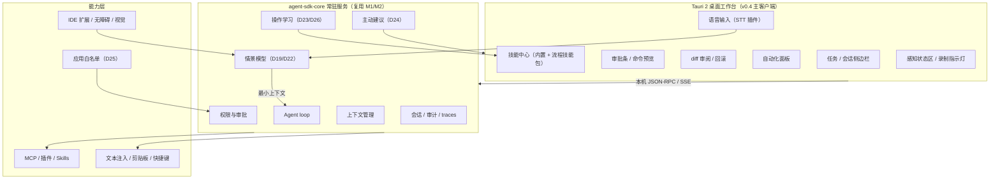
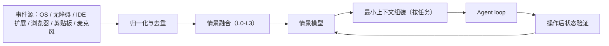
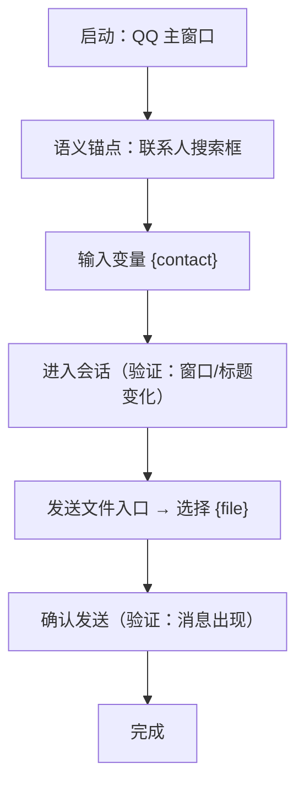
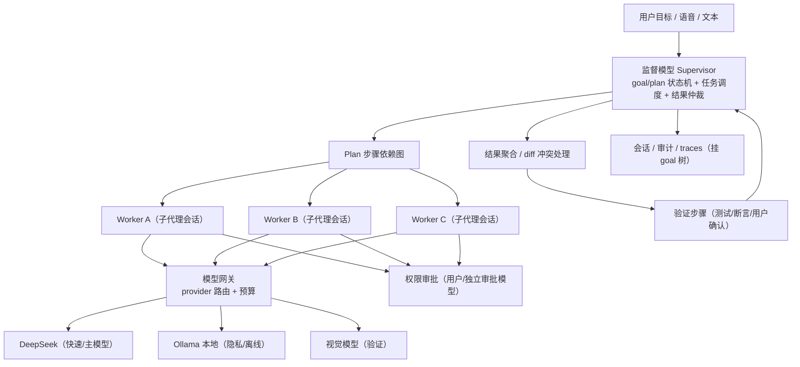

# 技术文档续写计划：v0.4（Codex 式桌面端 + 全域情景感知 + 操作学习）

> 🗄️ **已合并归档（2026-08-13）**：本文件内容已并入《技术文档-AI智能体输入法.md》v0.5；其中 §14 桌面功能缺口与 §15 Agent 并行编排作为开放方向保留，本文件不再单独维护。

> 版本：v0.4 计划草案（决策已确认 2026-08-12）  
> 日期：2026-08-12  
> 状态：已合并进主文档（2026-08-12，主文档升级为 v0.4）；本文件保留为决策与验收依据  
> 上游文档：`技术文档-AI智能体输入法.md`（v0.3）  
> 现状依据：`agent-sdk/ACCEPTANCE.md`（v1 主要完成）

---

## 0. 结论摘要

1. **v1（M1/M2 主体）已完成**：CLI/TUI、HTTP API、会话/审计/diff/revert、权限审批、AGENTS.md / Skills / 子代理、MCP（stdio/HTTP）、evals/traces、本地插件 SDK 均已实现并有实测记录。
2. **v0.4 的三条主线**：
   - 桌面工作台升级为 **Codex 式主客户端**（任务会话、审批条、diff 审阅、自动化、技能中心、设置诊断）；
   - 随包内置 **标准技能包**（文档/表格/演示/PDF/LaTeX/浏览器/可视化/图像等），遵循 Agent Skills 标准并带契约测试；
   - 新增 **全域情景感知 + 操作学习**：Agent 不只感知“用户在 VSCode 写代码”，而是理解用户当前在什么应用、在做什么（写代码/聊 QQ/打游戏/看文档），能按指令操作白名单应用，并能通过观察用户示范和受限自主探索，持续学会新的电脑操作。
3. **已确认的关键决策（2026-08-12）**：
   - 学习模式：**示范学习 + 受限自主探索双轨**；
   - 感知强度：**截图按需采集**（环形缓冲、不落盘）；
   - 主动性：**允许检测重复操作后主动建议**（默认仅提示、不执行，可静默）；
   - 应用范围：**生产力工具优先 + 聊天类白名单**，游戏只读辅助，未进白名单的应用默认只读辅助；
   - 学习成果：**流程技能包**（SKILL.md + 动作图），可查看/编辑/删除/分享。
4. **输入法融合不作为 v0.4 实施项**：列为 v0.5+ 路线，前置条件是 Agent 能力整体成熟、全域感知与操作学习稳定；届时输入法复用同一情景模型，作为第四种客户端（TSF/IMK 壳 + librime 复用），SDK 核心不变。

---

## 1. 现状盘点

| 项 | v0.3 规划 | 当前状态（ACCEPTANCE） | 与 v0.4 的关系 |
|---|---|---|---|
| SDK 核心（loop/工具/上下文/会话/审计） | M1 | ✅ | 语义不变，补用量统计 |
| CLI/TUI | M1 | ✅ 全屏 TUI / REPL / 管道 | 保持 |
| HTTP API（SSE/OpenAPI 3.1） | M1 | ✅ | 桌面端复用同一契约 |
| 权限/审批（deny/ask/allow） | M1 | ✅ 越权拒绝 + 审计 | 桌面端做审批 UI；学习模块复用 |
| AGENTS.md / Skills / 子代理 | M2 | ✅ 热加载、@子代理 | 技能包与流程技能包基于此扩展 |
| MCP（stdio/HTTP） | M2 | ✅ | 保持 |
| evals / traces | M2 | ✅ 20+ 用例、回放 | 新增技能包与学习契约测试 |
| 本地插件 SDK | M1/M3 | ✅ manifest + 工具调用 | 与技能包统一 |
| 文本层桌面控制 | M1 预留 | ⚠️ 接口预留未落地 | 桌面端阶段落地 |
| Tauri 桌面工作台 | M3 | ⬜ 未开工 | v0.4 主线 |
| 全域情景感知（行为上下文） | 无 | ⬜ 空白 | v0.4 新增模块 |
| 操作学习（示范/自主探索） | 无 | ⬜ 空白 | v0.4 新增模块 |
| 输入法壳（TSF/IMK） | 明确不实施 | — | v0.5+ 路线，仅文档前置条件 |

---

## 2. 方向决策清单（D17–D26）

| # | 决策点 | 结论（已确认/待评审） |
|---|---|---|
| D17 | 客户端主形态 | ✅ Tauri 2 桌面工作台为“Codex 式主客户端”；CLI/HTTP 保持开发者入口 |
| D18 | 内置技能 | ✅ 随包内置标准技能包 v1（约 10 个核心技能），遵循 Agent Skills 标准，带权限声明与契约测试 |
| D19 | 用户操作感知 | ✅ 升级为**全域情景感知**：事件层 + 界面层 + 视觉层 + 语义层四层模型 |
| D20 | 语音入口 | ✅ 桌面端以插件形态内置本地优先 STT，与情景感知联动；语音命令先转写确认再执行 |
| D21 | 输入法融合 | ✅ 不实施（v0.5+ 路线图）；D5–D7 维持“不实施”锁定 |
| D22 | 感知强度 | ✅ 默认 L0/L1（事件级 + 界面级）；L2 截图**按需采集**，环形缓冲不落盘，用后即毁 |
| D23 | 学习模式 | ✅ 双轨：**用户示范学习**（默认）+ **受限自主探索**（沙箱 + 任务级审批 + 预算上限） |
| D24 | 主动性 | ✅ 允许**离线检测重复操作后主动建议**；默认仅提示不执行，可一键执行/忽略/永久静默 |
| D25 | 应用范围 | ✅ 生产力工具白名单（优先）+ 聊天类白名单（会话授权）；游戏只读辅助；未进白名单默认只读辅助 |
| D26 | 学习成果 | ✅ **流程技能包**（SKILL.md + 动作图 + 测试），可查看/编辑/删除/分享；未白名单应用默认不沉淀技能 |

---

## 3. Codex 式桌面端（D17）

### 3.1 产品形态（最小完整形态）

- **任务/会话管理**：侧边栏任务列表，新建/继续/fork/归档/置顶/重命名；会话树与断点恢复。
- **对话与输入**：Markdown 消息、附件（图片/文件）、流式输出、语音输入（D20）、任务内 @子代理。
- **工具执行与审批**：实时进度流、审批条（deny/ask/allow + 命令预览 + 危险命令二次确认）；审批与主 Agent 分离。
- **diff 审阅**：按文件/按块查看，接受/拒绝/回滚；会话级 undo。
- **内置终端（可选）**：桌面端内运行命令并查看输出，或转交系统终端。
- **自动化**：定时任务/提醒/监控，全部经审计；桌面端常驻时生效。
- **技能中心**：内置技能包 + 用户流程技能包列表，启用/禁用、创建/安装、查看/编辑/删除/分享。
- **感知状态区**：当前情景摘要（前台应用、感知层级、学习/录制指示灯），用户可随时查看“Agent 现在知道什么”。
- **设置与诊断**：模型/权限/白名单/沙箱/网络/数据出境/日志/健康检查。

### 3.2 架构（复用 v0.3 分层，不改 SDK 语义）



- 桌面壳无状态，核心服务常驻；壳崩溃可重建，核心崩溃自动恢复会话。
- 全部复用 v0.3 的 JSON-RPC/SSE 契约，不新增第二套协议。

### 3.3 性能预算（沿用 3.3 并新增）

| 场景 | 预算（p95） |
|---|---|
| 全局快捷键唤起桌面端 | < 150ms |
| 审批条显示 | < 100ms |
| diff 审阅页打开（100 文件内） | < 500ms |
| 情景快照组装（一次任务） | < 200ms |
| 语音转写（本地，5s 音频） | < 2s |
| 截图按需采集 + 本地摘要 | < 1s |

---

## 4. 内置技能包（D18）

### 4.1 原则

- 遵循 Agent Skills 开放标准（`SKILL.md` + resources），跨客户端可复用。
- 与插件系统统一：技能 = 指令 + 资源 + 可选工具（MCP/插件）；权限在 manifest 声明，核心强制。
- 每个技能带契约测试与示例输入，纳入 eval 门禁。

### 4.2 内置技能清单（v1）

| 技能 | 用途 | 权限 | 优先级 |
|---|---|---|---|
| `documents` | 创建/编辑/批注 Word（.docx），渲染校验 | files + 可选导出 | P0 |
| `spreadsheets` | 生成/分析/验证 xlsx/csv | files | P0 |
| `pdf` | 读取/生成/表单/渲染验证 PDF | files | P0 |
| `browser` | 自动化浏览器：导航/表单/截图/网页测试 | network + 浏览器控制 | P0 |
| `presentations` | 创建/编辑 PPT/幻灯片 | files | P1 |
| `latex` | TeX 编译与报错修复 | files + shell（编译） | P1 |
| `visualize` | 图表/交互式可视化/模拟 | files + 可选本地服务 | P1 |
| `imagegen` | 位图生成/编辑（模型支持时） | files + 模型能力 | P1 |
| `skill-creator` | 创建/更新技能包（dogfooding） | files | P2 |
| `plugin-creator` | 脚手架本地插件 | files | P2 |
| `computer-use` | v2 预留：截图理解 + 鼠标/键盘 | 高敏，需显式审批 | 占位 |

### 4.3 技能包结构（契约）

```
agent-sdk/skills/<name>/
├── SKILL.md            # 名称 / 描述 / 工作流 / 触发条件
├── manifest.json       # 权限声明、依赖工具、最低版本
├── assets/             # 模板、参考资源
└── tests/              # 契约测试（端到端用例）
```

验收：每技能 ≥ 3 个端到端用例；`run-eval-gate.ps1` 通过；Win/macOS 双平台通过。

---

## 5. 全域情景感知（D19 / D22）

### 5.1 目标场景

1. **生产力场景（P0）**：用户在 VSCode 打开 `src/parser.rs`（光标在 `parse_config`），说“帮我修改和优化”。情景感知给出 {焦点=VSCode，项目=当前工作区，打开文件，光标符号，最近 diff} → 意图解析 → `agent.turn` → diff 审批 → 应用。
2. **聊天场景（P1）**：用户在 QQ 与同事讨论需求，说“把这段聊天整理成待办”。系统感知到当前 QQ 会话（已授权）→ 提取会话内容 → 生成待办 → 确认后上屏或写入文件。
3. **游戏场景（只读）**：用户打游戏时问“这关怎么过”。系统识别前台为游戏（白名单外）→ 只读感知（截图/状态）→ 基于游戏画面给出攻略/提醒；不自动操作游戏。

### 5.2 分层感知模型

| 层 | 感知内容 | 实现 | 默认状态 |
|---|---|---|---|
| L0 事件层 | 前台应用、窗口标题、选区、剪贴板 | OS API | 开（最小） |
| L1 界面层 | UI 元素树（按钮/输入框/列表）、浏览器 DOM、IDE 文件与符号 | 无障碍 API + IDE/浏览器扩展 | 白名单应用开，其余按授权 |
| L2 视觉层 | 屏幕截图、OCR、区域识别 | 本地视觉模型，**按需采集** | 仅任务时临时采集 |
| L3 语义层 | “正在做什么”的任务假设（写代码/聊天/游戏/阅读） | 本地推理（小模型） | 本地，不进审计日志 |

- 每一层权限独立可撤；L2 只允许环形缓冲（最近 N 秒摘要，不落盘），用户指令到达时冻结当前帧打包，任务结束立即销毁。
- L3 任务假设只用于意图消歧和主动建议，不进入云端模型请求；云端只收到组装后的最小上下文。

### 5.3 情景模型（Situation Model）

一次情景快照的结构化描述（JSON）：

```json
{
  "foreground_app": { "id": "qq", "title": "QQ - 项目群" },
  "permission_level": "chat_authorized",
  "ui_context": {
    "window": "QQ 主窗口",
    "active_view": "会话列表",
    "accessible": true
  },
  "content": { "type": "conversation", "masked": true },
  "task_hypothesis": { "label": "chatting", "confidence": 0.9 },
  "recent_actions": ["focus", "select_conversation", "copy_message"],
  "capture": { "screenshot": null, "captured_at": null }
}
```

- 消息/文档内容只以“掩码 + 最小片段”形式存在，默认不写入审计与学习样本。
- 情景快照由核心服务统一组装，任何工具/插件不能绕过该接口直接读取原始感知数据。

### 5.4 感知管线



- 感知不阻塞主流程：事件流异步进入情景模型，Agent 只在需要时取快照。
- 每次操作后必须验证状态变化（窗口是否打开、消息是否发出、文件是否写入），失败自动换路径（无障碍 → 视觉 → 询问用户）。

### 5.5 隐私边界

- 默认只开 L0；L1/L2/L3 逐项授权；桌面端随时显示当前感知层级。
- 截图：按需 + 环形缓冲 + 用后即毁；不进审计、不进学习样本，除非用户显式导出。
- 聊天类应用：消息内容默认掩码，只有用户授权的会话作为任务上下文；任何发送动作有预览 + 审批。
- 行为记录与审计分离：审计记录“用了什么上下文”，不记录全量内容。
- 数据出境开关沿用 v0.3 文档 7.5：云端只收最小上下文 + 发送预览。

---

## 6. 操作学习（D23 / D26）

### 6.1 双轨学习

**A 轨：示范学习（默认）**

1. **观察**：用户正常操作时（可暂停、可关闭），记录结构化动作轨迹：窗口变化、UI 元素（无障碍角色 + 标题 + 状态）、输入内容（掩码）、结果状态。不录屏。
2. **泛化**：把具体值抽象为变量和语义锚点——“联系人：小李”→ `{contact}`，“QQ 主窗口”按窗口类名/标题识别，“发送按钮”按无障碍角色 + 名称识别。坐标只作辅助，不作为主定位依据。
3. **验证**：在沙箱应用或用户确认下试跑；失败回到观察继续修正。
4. **沉淀**：产出**流程技能包**，用户可查看/编辑/删除/分享。
5. **执行**：首次执行必须审批；开启“自动复用”后，仅置信度高且目标环境匹配时免确认，随时可中止、可回滚。

**B 轨：受限自主探索**

- 仅限用户明确开启，且只在**沙箱/测试应用**或**生产力白名单应用 + 任务级审批**内进行。
- 每次探索有任务描述、动作预算（次数/时长）、可操作范围；试错轨迹完整记录并审计。
- 探索成功的动作序列同样进入泛化与验证流程；低置信结果不自动执行。
- 密码框、支付框、验证码、开发者模式外操作在任何轨都熔断：不学习、不执行、不记录。

### 6.2 动作图（Action Graph）

流程技能包的核心是动作图，而不是坐标序列：



- 节点 = 语义锚点 + 动作类型（click/type/shortcut/inject）；边 = 前置条件 + 验证步骤。
- 变量声明于技能包 manifest；执行时由用户或情景模型填充。
- UI 漂移检测：技能执行连续失败 N 次后标记“失效”，提示重新学习/验证，不静默重试。

### 6.3 流程技能包形态

```
agent-sdk/skills/user/<name>/
├── SKILL.md            # 用途、触发条件、变量说明
├── graph.json          # 动作图（语义锚点 + 验证步骤）
├── manifest.json       # 目标应用白名单、权限、敏感面声明
├── assets/             # 模板、截图参考（可选）
└── tests/              # 沙箱重现用例
```

- 与内置技能包同构：Agent 视角里没有“内置”和“用户学习”的差别。
- 分享 = 导出技能包目录；导入时校验目标应用、权限与敏感面声明。

### 6.4 学习安全与可解释性

- 录制指示灯：桌面端常驻显示“正在学习/未学习/已暂停”，点击可立即暂停并删除本次样本。
- 学习样本默认本地加密；可查看、一键清空；消息内容默认不采样。
- 每个流程技能包可回放执行记录；执行失败有完整 trace 可追溯。

---

## 7. 主动建议（D24）

- **检测**：本地离线归纳重复操作（同一应用 + 相似动作序列，次数/时段阈值可配置）。
- **建议形态**：仅提示，不执行——“检测到你重复‘导出周报’5 次，是否沉淀为技能 / 下次帮你完成？”提供“学习 / 执行一次 / 忽略 / 永久静默”四选。
- **默认**：提示模式开启（不执行）；“自动执行”需单独开启，且每个流程技能首次执行仍需审批。
- **防打扰**：全局可关；游戏/全屏/演示模式自动静默；同一建议 24 小时内不重复。

---

## 8. 应用白名单与只读辅助（D25）

### 8.1 白名单分级

| 级别 | 范围（示例） | 感知 | 操作 | 学习 |
|---|---|---|---|---|
| 生产力 P0 | VSCode/Cursor、浏览器、文件管理器、终端、Office/文档 | 全层（截图按需） | 审批后全权操作 | ✅ 可沉淀技能 |
| 聊天类 P1 | QQ、微信、飞书等 | 需**会话级授权**，消息内容掩码 | 审批后操作（发送有预览） | ⚠️ 不学消息内容，只学操作流程 |
| 游戏 | 任何游戏 | 只读（状态/截图/攻略/提醒） | ❌ 默认不操作 | ❌ 默认不学习 |
| 其他（未白名单） | 任意应用 | 只读辅助（摘要/建议） | ⚠️ 仅单次任务临时授权 | ❌ 默认不沉淀 |

- 白名单默认清单随产品发布，用户可增删；敏感类应用（支付/密码管理器）默认禁止自动操作。
- 临时授权只作用于单次任务，不升级为长期授权。

### 8.2 游戏只读辅助的边界

- 允许：识别前台游戏、按需截图、本地视觉问答、给出攻略/提示/提醒（如“电量低”）。
- 不允许：自动按键、自动点击、注入文本；自动化需用户对**具体游戏**单独授权，并提示反作弊/ToS 风险自担。

---

## 9. 文档续写方案（v0.3 → v0.4 正文改动）

| 章节 | 改动 |
|---|---|
| 1.1 定位 | 补充“桌面端为主客户端，全域情景感知 + 操作学习为差异化能力” |
| 1.5 决策清单 | 新增 D17–D26 |
| 3.1 v1 功能 | 桌面工作台升为 P0；新增感知状态区、录制指示灯 |
| 4.2 / 4.3 | 桌面端进程模型：常驻 core 服务 + 无状态壳 |
| 5.x | 新增 5.8 全域情景感知（分层模型/情景快照/感知管线）；5.4 文本注入细化 |
| 6.x | 新增 6.5 操作学习（双轨/动作图/流程技能包）；6.2 工具层新增 `perception.*`、`learn.*` |
| 7.x | 并入情景感知隐私边界、截图按需、消息掩码、录制指示灯 |
| 9 路线图 | 重排：M3 桌面端 + 技能包；M4 全域感知 + 语音；M5 操作学习 + 主动建议；M6 输入法融合（占位） |
| 11 开放事项 | 语音/OCR 移入路线图；游戏自动化标注“需单独授权 + ToS 风险” |
| 附录 B | 新增情景模型、感知层、动作图、流程技能包、示范学习、受限自主探索等术语 |

### 新增接口（v1 契约草案）

| 方法 | 说明 |
|---|---|
| `context.snapshot` | 取当前情景快照（按权限过滤） |
| `perception.subscribe` | 订阅 L0/L1 事件流（桌面端状态区用） |
| `learn.record` / `learn.pause` / `learn.clear` | 示范学习录制控制 |
| `skill.verify` | 在沙箱/测试环境验证流程技能包 |
| `proactive.suggest` | 主动建议事件（提示/忽略/静默） |
| `whitelist.manage` | 应用白名单增删与级别调整 |

---

## 10. 输入法融合：前置条件（v0.5+，不实施）

最终形态：输入法是“永远在线的表层入口”，Agent 是输入法内部的任务模式；轻交互走候选窗，中/重任务由输入法唤起同一 Agent 内核。开启条件：

1. v0.4 桌面端 + 技能包验收全过，M1 验收项（会话/审计/diff/revert/权限）无回归；
2. 全域情景感知稳定，隐私默认最小化，误判率与确认率有基线数据；
3. 文本层 computer-use（注入/剪贴板/只读上下文）在生产力白名单应用通过兼容矩阵；
4. 决策层重新评审 D5–D7，明确 TSF/IMK 壳 + librime 复用的工程投入（不自研拼音/词库）；
5. 轻/中/重三档交互（候选窗 / 斜杠命令 / 审批条）共享同一情景模型与技能包的设计评审通过；
6. 高敏输入事件（按键/候选）的安全门槛单独评审通过。

满足后，输入法只是第四种客户端：通过同一 JSON-RPC/SSE 调用 agent-sdk-core，产品形态为“一个入口、多个交互深度”，不需要推翻 v0.3 架构。

---

## 11. 里程碑与验收（草案）

| 阶段 | 内容 | 时长 | 验收要点 |
|---|---|---|---|
| P1 桌面端骨架 | Tauri 壳 + 会话/审批/diff/设置 + 技能中心；内置 documents/spreadsheets/pdf/browser 四技能 | 6–8 周 | 桌面端 M1 验收项全通；四技能契约测试过门禁；唤起 < 150ms |
| P2 全域感知 v1 | L0/L1 + L2 按需截图 + 语音插件（默认 SenseVoice-Small） + 意图解析；VSCode 场景 + QQ 只读场景 | 6–8 周 | “VSCode 语音改代码”20 次成功率 ≥ 80%；QQ 会话授权与消息掩码通过；截图用后即毁断言通过；50 条中文 + 20 条中英混说命令 WER < 5%、5s 音频 p95 < 2s（按 13.1 默认配置） |
| P3 操作学习 v1 | 示范学习 + 受限自主探索（默认 S0 层）+ 流程技能包 + 主动建议（默认阈值） | 6–8 周 | 示范一次“QQ 发文件”后换参数复用成功率 ≥ 80%；自主探索全部审批 + 审计且不越界；重复操作按默认阈值正确提示；所有参数可在设置页修改且即时生效 |
| P3.5 并行编排 | 监督模型 + worker 池 + Plan/Goal 循环 + 多 API 并行（第 15 节） | 6–8 周 | 3 任务并行加速 ≥ 2x；拆解 eval ≥ 80%；同文件写冲突 0；10 步长任务完成率 ≥ 70%；审批/审计无绕过 |
| P4 输入法融合（待决策） | TSF/IMK 壳 + librime 复用 + 三档交互 | 占位 | 前置条件全满足后再评审；不锁时间 |

---

## 12. 风险与缓解

| 风险 | 缓解 |
|---|---|
| 全域感知敏感（窗口/截图/消息） | 默认 L0、截图按需、消息掩码、录制指示灯、一键清空、审计分离 |
| 操作学习误学/越权 | 双轨中自主探索仅沙箱 + 审批 + 预算；敏感面熔断最高优先；流程技能包可回滚 |
| UI 漂移导致技能失效 | 连续失败标记失效，提示重新学习/验证，不静默重试 |
| 聊天内容泄露 | 默认不采样、不进审计；会话级授权；发送预览 + 审批 |
| 游戏自动化风险（反作弊/ToS） | 默认只读；自动化需具体游戏单独授权并明示风险 |
| 主动建议打扰 | 提示不执行、可静默、全屏/游戏自动静默、限频 |
| 感知延迟影响交互 | 感知异步化；情景快照 < 200ms；视觉按需 |
| 输入法融合过早启动 | 只写前置条件，不排实施；决策层未批准前 D5–D7 保持“不实施” |

---

## 13. 已确认决策与剩余开放问题

### 已确认（2026-08-12）

1. 学习模式：示范学习 + 受限自主探索双轨。
2. 感知强度：截图按需，环形缓冲不落盘。
3. 主动性：允许检测重复操作后主动建议（仅提示，不执行）。
4. 应用范围：生产力白名单优先 + 聊天类白名单；游戏只读；未白名单默认只读辅助。
5. 学习成果：流程技能包（SKILL.md + 动作图），可查看/编辑/删除/分享。

### 建议默认值（用户可配置，2026-08-12）

以下参数全部写入 `settings.json`，设置页可修改，改动即时生效并记入审计。默认值按参考硬件基线（16GB 内存、无独显）设定。

#### STT 本地模型

| 项 | 默认值 | 可配置项 |
|---|---|---|
| 主力模型 | SenseVoice-Small（sherpa-onnx，CPU 实时，约 240MB） | `stt.model` |
| 高精度可选档 | Qwen3-ASR 系（如 OctoASR 0.8B 8bit），默认不启用 | `stt.enable_high_accuracy` |
| 后处理 | Silero VAD + 标点/ITN + 热词表（代码符号/应用名/常用动词） | `stt.hotwords[]` |
| 验收口径 | 50 条中文 + 20 条中英混说命令 WER < 5%；5s 音频转写 p95 < 2s；模型进程按需启动、空闲卸载 | `stt.latency_budget_ms` |

#### 自主探索沙箱

| 层 | 环境 | v1 默认 |
|---|---|---|
| S0 隔离虚拟机 | Windows Sandbox/VM、macOS 虚拟机，安装真实目标应用 | ✅ 学习与验证默认环境 |
| S1 本机白名单应用 | 真实桌面生产力应用，仅低风险动作（点击/输入/快捷键/剪贴板） | ⬜ 默认关闭，需显式开启 + 单任务授权 |
| S2 聊天类 | 测试账号 + 测试会话 | ⬜ 只允许测试会话，禁止真实消息采样 |

- 机制：动作预算（次数/时长）、越界熔断、全程审计、崩溃隔离。
- 配置项：`explore.default_tier`、`explore.action_budget`、`explore.max_duration_s`、`explore.allow_s1`。

#### 主动建议阈值

| 项 | 默认值 |
|---|---|
| 触发 | 7 天滚动窗口内同一应用 + 相似动作序列（语义相似度 ≥ 0.9）≥ 5 次；或单日 ≥ 3 次 |
| 频控 | 同建议 24h 内 ≤ 1 次；全局每日 ≤ 3 条 |
| 场景抑制 | 全屏/演示/游戏/录屏时自动静默 |
| 衰减 | 同一建议被忽略 2 次后自动静默 30 天；提供永久静默入口 |
| 默认模式 | 仅提示、不执行；自动执行需单独开启且每技能首次执行仍审批 |

- 配置项：`proactive.enabled`、`proactive.weekly_threshold`、`proactive.daily_threshold`、`proactive.similarity`、`proactive.cooldown_hours`、`proactive.daily_cap`、`proactive.auto_silence_days`。

#### 流程技能包分享格式

| 项 | 默认值 |
|---|---|
| 分发形态 | 单文件 `.owskill`（ZIP）；解包即 Agent Skills 标准技能包目录 |
| 包内容 | `manifest.json`（含 `targetApps` / `permissions` / `variables` / `sensitivity`）、`SKILL.md`、`graph.json`、`assets/`、`tests/`、`versions.json` |
| 导入校验顺序 | schema → 权限只允许相等或降级 → 目标应用白名单匹配 → 沙箱回放 tests → 签名校验（v2 市场开启） |
| 硬性约束 | 禁止携带消息内容与真实截图样本；`sensitivity` 必填 |

- 配置项：`skills.share.format`、`skills.import.require_signature`（v2）。

### 剩余开放问题

1. 聊天类白名单首批具体应用（QQ / 微信 / 飞书？）与消息授权粒度。

---

## 14. 桌面端功能缺口与开发清单（P0/P1/P2）

> 依据 2026-08-12 桌面 UI 盘点：Tauri 2 壳 + Web 工作台已覆盖会话/审批/diff/技能/学习/自动化/白名单/设置/审计/主动建议；以下为缺口项，按“接口是否已存在”与产品价值排序。

### 14.1 P0：接口已存在，只差 UI（性价比最高）

| # | 功能 | 服务端现状 | 说明 |
|---|---|---|---|
| 1 | 操作记忆浏览器 | `/memory/observations`、`/memory/clear`、`/memory/mine-skill` 已存在 | UI 加“情景记忆”面板：列表/回放/删除/标注（成功/失败/未知）/一键挖掘技能 |
| 2 | 感知实验室 | `/perception/ocr`、`/perception/tree`、`/vision/describe\|verify\|ground` 已存在 | 截图 + OCR 坐标框叠加预览、UIA 树查看、视觉描述/验证/grounding 调试 |
| 3 | 桌面控制台 + 坐标拾取器 | `/desktop/*` 已存在（click/type/key/shortcut/launch/scroll/wait/activate） | 点哪点哪生成 `click_at` 参数，调试 QQ 类坐标点击 |
| 4 | 主动建议原因标注 | `/proactive/decide` 需扩展 feedback 字段 | 增加“无用/时机不对/已经会/不信任”原因，补误判率/确认率基线数据 |
| 5 | 设置表单化 | `GET/POST /settings` 已存在 | 从裸 JSON 编辑器改为分组表单（模型/STT/OCR/主动建议/探索沙箱/记忆保留期/白名单），带默认值说明 |

### 14.2 P1：技术路线未完成项

| # | 功能 | 说明 |
|---|---|---|
| 6 | PP-OCRv6 接入 | ONNX 下载脚本 + `ort` 推理 + `ocr.model_tier`（small/medium/system）配置 + 系统 OCR 对照基准 |
| 7 | 窗口级截图 + 窗口模板 + DPI 坐标 | `PrintWindow` 客户区截图、统一坐标模型（client/screen/dpi_scale）、QQ 窗口模板 ROI 建立/失效重建 |
| 8 | 本地 VL 3B 捆绑与视觉验证闭环 | 默认档 Qwen2.5-VL-3B Q4（纯 CPU）；“发送后视觉确认”接入技能验证链 |
| 9 | 静默学习真实桌面版 | 自动采样去重、结果判定（成功/失败/未知）、成功率门槛、与主动建议联动 |
| 10 | 内置终端面板 | v0.4 P1 唯一“可选未做”项 |
| 11 | 桌面通知 | 审批请求/任务完成/提醒推系统通知 + 托盘红点 |
| 12 | 快捷键与自启设置 UI | 当前硬编码/托盘菜单，移入设置页 |

### 14.3 P2：产品化大项

| # | 功能 | 说明 |
|---|---|---|
| 13 | 操作记忆 RAG | `memory.recall` 工具，按“应用 + 动作意图 + 结果”检索 |
| 14 | 自动化执行技能 | 定时任务从“提醒”升级为“定时跑流程技能包 + 审批队列 + 结果通知” |
| 15 | 技能市场/分享站 | .owskill 上传下载、评分、权限校验（v2 市场雏形） |
| 16 | 模型用量/成本/延迟仪表盘 | 网关已统计用量，缺可视化 |
| 17 | 悬浮球/候选窗模式 | 输入法融合前过渡入口：全局悬浮球唤起，轻任务候选窗出结果 |
| 18 | 云执行、公开市场、多格式笔记、完整 computer-use | v0.3 M4 大项，未开工 |

---

## 15. Agent 并行编排与 Plan/Goal 循环（v0.4.2 方向）

### 15.1 现状与问题

- 当前一个任务只在一个会话里串行执行：Agent loop 一轮一轮调用模型与工具，子代理（explorer/worker）由主代理串行派发。
- 模型网关支持多 Provider（DeepSeek、Anthropic、Ollama 等），但单任务只路由到一个模型。
- 缺少“目标/计划”一等公民：长任务没有可查看、可修改、可恢复的 goal 与 plan 状态。

### 15.2 目标

1. **监督模型（Supervisor）**：读用户目标 → 自动拆解子任务 → 分配 worker → 编排依赖 → 仲裁与聚合结果。
2. **并行执行**：多个 worker 子代理并行跑，可各自路由不同模型/API（强模型规划、快速模型干活、专用模型验证）。
3. **Plan/Goal 循环**（对齐 Codex 桌面端语义）：Goal = 目标对象（objective / 验收 / 预算 / 状态）；Plan = 步骤清单（依赖 / 状态 / 指派 / 验证）；循环 = 执行 → 验证 → 更新计划 → 直到完成或受阻。

### 15.3 总体架构



### 15.4 Plan/Goal 循环（Codex 式）

**Goal 对象**：

```json
{
  "id": "g_01",
  "objective": "把 parseConfig 补错误处理并加测试",
  "acceptance": ["错误输入返回 Err", "新增 3 个单元测试全绿"],
  "budget": { "max_steps": 20, "max_cost_usd": 1.0, "timeout_s": 1800 },
  "status": "active"
}
```

**Plan 对象**：

```json
{
  "id": "p_01",
  "goal_id": "g_01",
  "steps": [
    { "id": "s1", "title": "阅读 parseConfig 现状", "status": "done", "depends_on": [] },
    { "id": "s2", "title": "设计错误处理方案", "status": "in_progress", "depends_on": ["s1"], "assigned_to": "worker:plan" },
    { "id": "s3", "title": "实现修改", "status": "pending", "depends_on": ["s2"], "verification": "cargo test" },
    { "id": "s4", "title": "补充单元测试", "status": "pending", "depends_on": ["s2"] }
  ]
}
```

**循环流程**：

1. 解析用户目标 → 创建 Goal；
2. 监督模型生成 Plan（含依赖图，用户可改）；
3. 并行执行所有“就绪步骤”（依赖已完成）；
4. 每步执行后验证（测试 / 断言 / 用户确认）；
5. 更新步骤状态与计划；失败则重试、换 worker 或重新规划；
6. 全部完成 → 聚合 diff → 用户审阅 → Goal 完成；受阻（阻塞条件重复）→ Goal 标记 blocked 并汇报。

### 15.5 并行调度模型

| 模式 | 适用 | 说明 |
|---|---|---|
| Fan-out | 相互独立的子任务（改多个文件、多语言翻译） | 同时派发 N 个 worker，各自独立上下文 |
| Pipeline | 有阶段依赖（读取 → 处理 → 写回） | 每阶段可并行处理分片 |
| Map-reduce | 大文件/批量任务 | 分片处理 + 聚合结果 |

- **上下文隔离**：每个 worker 只带自己需要的上下文（文件/技能/会话摘要），避免上下文爆炸。
- **写冲突处理**：同一文件并发写 → 检测并串行化（文件锁），或由监督模型合并；diff 冲突进入人工审阅。
- **预算控制**：并行度上限（默认 3）、每 worker 轮次/成本上限、全局超时。

### 15.6 接口设计（契约草案）

| 方法 | 说明 |
|---|---|
| `goal.create` / `goal.get` / `goal.update` | 目标对象生命周期 |
| `plan.create` / `plan.update` / `plan.step.status` | 计划与步骤状态 |
| `task.dispatch` / `task.status` / `task.join` / `task.abort` | worker 并行任务控制 |
| `agent.turn.parallel` | 一次调用派发多个并行子任务 |
| SSE 事件 | `goal.progress` / `plan.updated` / `task.status` / `approval.request` |

### 15.7 与现有代码衔接

| 现有模块 | 扩展方式 |
|---|---|
| `subagent.rs` | 升级为可并行 worker 池（调度、join、abort、超时） |
| `gateway.rs` | 新增 `task: "supervisor" / "worker" / "verifier"` 路由；同一任务可并行多 provider |
| `agent.rs` | loop 外挂 goal/plan 状态机（每轮更新步骤状态） |
| `session.rs` | worker = 独立 fork 会话，结果回传父会话 |
| Web 工作台 | 新增“目标/计划/任务树”面板：goal 视图、plan 清单、worker 状态、审批队列 |

### 15.8 验收指标

- 3 个独立子任务并行 vs 串行：耗时加速 ≥ 2x；
- eval 用例：监督模型拆解正确率 ≥ 80%（10 个混合任务）；
- 同文件并发写冲突：0（串行化/合并机制生效）；
- ≥ 10 步长任务通过 plan/goal 循环完成率 ≥ 70%（真实模型）；
- 并行任务每个工具调用仍走审批 + 审计，无绕过；
- 用户可在 UI 随时查看/暂停/修改 plan，修改后按新计划继续。

### 15.9 风险与缓解

| 风险 | 缓解 |
|---|---|
| 上下文爆炸 | worker 上下文隔离 + 压缩 + 只回传摘要/diff |
| 成本失控 | 每 worker 预算 + 全局预算 + 并行度上限 |
| 并行写冲突 | 文件锁/串行化 + diff 冲突人工审阅 |
| 监督模型误拆 | 用户可改 plan；eval 回归拆解正确率 |
| 聚合幻觉（合并结果不实） | 每步验证 + 聚合后整体验证（测试/断言） |
| 审批绕过 | worker 工具调用一律走同一权限链与审计 |
