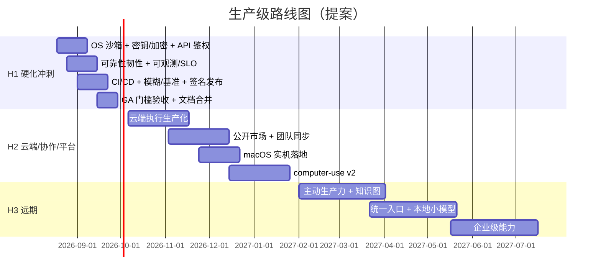

# 技术路线改进方案与未来技术安排（面向长期生产级应用）

> 版本：v0.1（改进提案）  
> 日期：2026-08-15  
> 依据：《技术文档-AI智能体输入法.md》v0.6、《macOS支持-决策评审-2026-08-13.md》（P5）、
> 《输入法融合-前置条件补齐评审-2026-08-13.md》（P6），以及 `agent-sdk/` 截至 2026-08-15 的实测现状（R5 并行轮进行中）。  
> 配套：《技术路线评审与前沿多模态Agent演进-2026-08-15.md》（路线批判与能力演进）、
> 《技术路线改进方案-能力拓展与功能分层-2026-08-15.md》（computer-use 定案、多 Agent 通信、功能分层蓝图）。  
> 状态：**提案，供决策评审**。本文件不改变已锁定决策 D1–D26；与主文档冲突处标注【建议】并提请决策层，最终是否并入主文档由文档负责人执行（附录 A 给出合并清单）。  
> 读者：产品/工程负责人、架构评审、SDK/插件生态开发者、运维与安全负责人。

---

## 0. 摘要与文档定位

### 0.1 一句话结论

当前产品在**功能覆盖**上已大幅超前基线（146 个 HTTP 路径、notes/plugin/workflow/goal/cloud/computer-use 多线核心库、桌面全面板、感知/学习/执行闭环、487 项 workspace 测试全绿），但在**生产级能力**上仍处于原型阶段。本方案提出一条三期路线：先在 v1 GA 前完成"生产级硬化冲刺"（P0 全清零），再按季度推进云端/协作/平台扩展（H2），最后进入主动生产力与知识图（H3）。

### 0.2 三条改进主线

1. **安全纵深**：把"策略层默认拒绝"延伸到"OS 边界默认拒绝"，补齐密钥安全存储、落盘加密、本地 API 鉴权、审计防篡改、供应链治理。
2. **可靠性与韧性**：服务端并发/取消/优雅关闭、存储备份与恢复、网关重试熔断、崩溃恢复协议，配套可量化的 SLO。
3. **发布运营与治理**：CI/CD、工具链锁定、模糊测试、版本与签名发布、ADR 与文档防漂移、事故响应流程。

### 0.3 与主文档的关系

- 主文档 v0.6 是**产品与功能基线**（决策 + 契约 + 验收），本文件是**能力计划与硬化路线**，不重复定义功能。
- 主文档中滚动追加的状态注（v0.5.9、C.2/C.3 历史）建议迁出到 `CHANGELOG`/`ACCEPTANCE.md`，主文档只保留当前版本决策与关键里程碑（见 7.1、附录 A）。
- 本文件提出的每项改动都遵循 AGENTS.md 硬约束：改动带契约测试、`cargo fmt`/`clippy` 干净、UTF-8、权限默认 deny、模型凭据不入代码/配置/提交。
- 系列分工：本文件管"把现在的系统做稳"；《能力拓展与功能分层》管"能力往哪加、加在哪一层、凭什么不做"；《路线评审与多模态演进》管"下一代往哪走"。三者结论统一回写主文档时合并（见能力拓展文档附录）。

### 0.4 与进行中 R5 并行轮的关系

R5 正在交付：`/metrics` 与 observability、`/eval/gate`、`/team`、`/memory/graph`、`/intent`/`/command`、远端插件市场（refresh/install-remote）、workflow 后端与 agent worker。本方案把这些交付物作为 **H1/H2 的输入吸收**，不重复立项；R5 收尾后按附录 A 与 7.1 做文档合并。

---

## 1. 现状评估：生产级成熟度盘点

### 1.1 已具备的强项（保留并继续加固）

| 维度 | 现状 |
|---|---|
| 功能面 | 146 路径 OpenAPI 与路由契约一致；notes/workflow/goal-plan/plugin-market/cloud-exec/computer-use 六线核心库；桌面 10+ 面板；感知四层 + 七层漏斗 + 本地 ONNX OCR |
| 安全策略 | deny 优先、审批与主 Agent 分离（autoreview.rs）、Prompt Injection 行级净化（injection.rs，内部样本拦截 100%）、敏感面熔断、插件 Ed25519 签名、`.owskill` zip-slip 防护 |
| 质量门禁 | `cargo test --workspace` 487 项全绿；路由契约 3/3；四技能 e2e 12/12；fmt/clippy 0 警告；TS SDK typecheck/build/test 通过 |
| 隐私 | 本地优先、egress 开关运行时生效、L2 截图环形缓冲不落盘用后即毁、内容掩码、记忆滚动清理 |
| 生态 | MCP stdio/HTTP、Agent Skills、AGENTS.md、插件 SDK、`.owskill`/`.owflow` 声明式格式 |

### 1.2 关键差距清单（P0 / P1 / P2）

> 证据均来自 2026-08-15 代码实测。P0 = v1 GA 前必须清零；P1 = v1 应做、可灰度；P2 = 后续排期。

#### P0 阻断项（v1 不能发货）

| 编号 | 差距 | 现状证据 | 影响 | 动作 |
|---|---|---|---|---|
| X01 | 无 OS 级执行沙箱 | `core/src` 无 sandbox 模块；`rg AppContainer/JobObject/bwrap/sandbox-exec` 无命中；权限仅策略层（permissions.rs） | 恶意插件/MCP/工具可在核心进程权限下写工作区外、读敏感区、联网、耗尽资源；"沙箱"声明与实现不符 | 3.1.1 |
| X02 | 模型凭据仅环境变量、无安全存储 | README/网关约定 `OPENAI_API_KEY`；`rg CredentialManager/DPAPI/keyring` 无命中 | 桌面用户长期使用不便；密钥以明文暴露在进程环境，同用户进程可读取 | 3.1.2（含 AGENTS.md 条款修订建议） |
| X03 | 本地 HTTP API 无鉴权令牌、CORS 全放开、无限流 | `server/src/lib.rs:304` `CorsLayer::permissive()`；无 auth/token/rate-limit 中间件；唯一防线是绑定 127.0.0.1 | 同机恶意网页/进程可直接调用本地 API（localhost fetch / DNS rebinding），触发注入、写文件、花钱 | 3.1.3 |
| X04 | 会话/审计/记忆 SQLite 明文落盘，审计无完整性保护 | `sqlite_store.rs` 无 encrypt；审计为普通表 | 本地数据泄露风险；审计可被同机篡改后掩盖越权行为 | 3.1.2 / 3.1.4 |
| X05 | 无 CI/CD、无工具链锁定、无依赖漏洞扫描 | 无 `.github/`；无 `rust-toolchain.toml`；无 cargo-deny/cargo-audit | 回归靠人工跑脚本；供应链不可审计；工具链漂移 | 3.4 / 3.1.5 |
| X06 | 无版本与发布治理 | `git tag` 为空；无 CHANGELOG；openapi 无版本策略；无降级/回滚路径定义 | 无法灰度、无法定位回归版本、升级不可控 | 3.5 / 7.2 |
| X07 | 服务端并发/取消/优雅关闭/背压不足 | 无并发上限中间件；无系统化超时矩阵；SSE 无 Last-Event-ID/resume 协议 | 长任务雪崩、僵尸任务、断线丢事件、关闭丢数据 | 3.2 |
| X08 | 云端执行仅为 HTTP 契约 + Mock | `cloud_exec.rs` v0.2 为 `MockRemoteTransport`/`HttpTransport` 契约层 | 无生产隔离、计量、凭据保管库；不能对外承诺云端能力 | 4.1（H2）；H1 内明确"本地默认、不承诺"边界 |

#### P1 应做项（v1 可灰度落地）

| 编号 | 差距 | 现状证据 | 动作 |
|---|---|---|---|
| X09 | 缺指标/结构化日志/关联 ID | 仅 trace.rs + 审计；R5 正在补 `/metrics`、observability API | 3.3（吸收 R5 交付） |
| X10 | 缺备份/迁移/损坏恢复 | 无 backup/restore 端点、无启动 integrity_check、无演练脚本 | 3.2.2 |
| X11 | 缺模糊与属性测试 | workflow DSL、`.owskill` ZIP、HTML 消毒、MCP JSON-RPC、ONNX OCR 输入无 fuzz 目标 | 3.4 |
| X12 | 非 Windows 无编译级门禁 | P5 依赖"人工遵守 cfg 隔离"，无 CI runner 兜底 | 3.6 |
| X13 | 性能预算无持续基准回归 | 3.3 预算仅文档化，无 bench harness 与阈值门禁 | 3.4 |
| X14 | 网关缺重试/退避/熔断/failover | gateway.rs 仅超时 + 60s 流式看门狗，无重试/熔断 | 3.2.4 |
| X15 | 隐私合规工具缺口 | 无数据导出、一键清空、保留期配置、DPIA 模板 | 3.1 |
| X16 | 许可证与开源战略冲突 | workspace `license = "GPL-3.0-only"`；D8/§8.3 目标为 Apache-2.0 式开源 SDK | 3.5（需决策层 + 法务） |
| X17 | 真实模型 eval 依赖外部 KEY、无周回归与独立评审评分 | C.3 记录历史 20/20；本轮因 KEY 跳过；R5 补 eval gate 骨架 | 3.4 |
| X18 | 兼容矩阵自动化不足 | Notepad/VSCode/QQ/浏览器为手工脚本，无常驻回归集 | 3.6 |

#### P2 后续项

| 编号 | 差距 | 动作 |
|---|---|---|
| X19 | 文档漂移 | P5 的"v1 Windows-only"未回写 D2；头部状态注"429/留待下一轮"与 C.3 "487"不一致；5.8.1 "截至 v0.4.22"过时 | 7.1 / 附录 A |
| X20 | 崩溃上报/遥测缺位 | 3.5（opt-in、本地诊断报告优先） |
| X21 | 本地模型深度支持未排期 | 5.3（含明确能力门槛） |
| X22 | 国际化/无障碍工程 | 7.4（技术债预算内渐进） |

### 1.3 成熟度评分（1–5，5 为生产级）

| 维度 | 评分 | 说明 |
|---|---|---|
| 功能覆盖 | 4 | 超出基线，六线核心 + 桌面全量闭环 |
| 安全 | 2.5 | 策略层强，OS 隔离/密钥/加密/鉴权缺口（X01–X04） |
| 可靠性 | 2.5 | 测试多、韧性机制少（X07/X10/X14） |
| 性能 | 3 | 预算定义明确，缺基准回归（X13） |
| 可观测 | 2.5 | trace/审计有，指标/日志/关联 ID 在途（X09） |
| 质量门禁 | 4 | 487 测试 + 契约强；缺 CI/模糊（X05/X11） |
| 发布工程 | 2 | 打包/签名骨架有，版本/CI/降级缺（X05/X06） |
| 平台 | 3 | Windows 实机强；macOS 顺延、无编译门禁（X12） |
| 生态 | 3 | SDK/MCP/Skills/市场骨架齐；云执行/公开市场未生产化 |
| 治理 | 3 | 决策记录习惯好；ADR 与文档防漂移弱（X19） |

---

## 2. 改进原则与总体策略

### 2.1 北极星

**本机服务 SLO 达标 + 信任边界成立 + 可安全升级**：用户可以在"放心"的前提下把真实工作交给 Agent，产品可以在不打断用户数据的前提下持续升级。

### 2.2 分期

- **H1（v1 生产级硬化，约 4–6 周）**：X01–X08 全部清零；X09/X10/X13/X14 落地；GA 门槛清单全绿。
- **H2（v2 云端/协作/平台，按季度）**：云端执行生产化、公开市场、团队空间、macOS、computer-use v2。
- **H3（v3+，年度）**：主动生产力、个人知识图、统一自然语言入口、本地小模型、企业级控制。

### 2.3 执行原则

1. **默认拒绝延伸到 OS 边界**：策略层 deny 与进程/网络/存储边界必须一致，任何"沙箱"承诺必须可被 OS 实测。
2. **安全 > 可靠 > 功能**：P0 未清零前，不新增面向外部的功能承诺。
3. **可逆性优先**：一切升级可回滚/降级；新能力默认 feature flag off → staged → GA。
4. **本地优先不妥协**：云能力保持显式开关（egress 模式推广到云端执行/市场/团队）。
5. **契约先行**：每个硬化改动带契约测试 + 验收证据，写入 ACCEPTANCE（M1 约束的延伸）。
6. **门禁自动化**：不让"记得跑哪个脚本"成为质量防线；CI 即门禁。
7. **证据驱动**：里程碑以实测数据验收，不以"已实现"描述验收。
8. **灰度交付**：staging 通道先行，生产证书/密钥/云端资源分层管理。

### 2.4 排序方法

优先级 = 风险概率 × 影响 ×（1 − 可逆性）÷ 落地成本。据此 P0 顺序：X01（沙箱）→ X02/X04（密钥与加密）→ X03（API 鉴权）→ X05（CI）→ X07（韧性）→ X06（发布）→ X08（云边界声明）。

---

## 3. H1：v1 生产级硬化方案

### 3.1 安全纵深

#### 3.1.1 OS 级执行沙箱（X01）

目标：`shell.exec`、插件宿主、MCP stdio、云端任务本地模拟执行，全部运行在受限进程边界内；核心进程不直接执行任何不可信命令。

方案要点：

- 新增 `core/src/sandbox.rs` 抽象：`SandboxPolicy { file_scope, network_policy, cpu_ms, mem_mb, ttl }` + `spawn()`/`kill()`；`tools.rs`、`plugin.rs`、`mcp.rs` 全部改为经沙箱执行器。
- Windows 主方案：**AppContainer**（低完整性 + capability SID + 网络白名单）限制文件/网络/注册表；**Job Object** 限制 CPU/内存/作业生命周期；低完整性（Low IL）为降级层。
- 桌面控制通道分离：文本注入/UIA 需要交互桌面权限，走独立的"受控 UI 进程"（最小权限 + 动作白名单），与通用执行沙箱隔离，防止"为注入开的口子"变成通用越权通道。
- 版本降级矩阵：Windows 版本/家庭版能力差异必须显式检测；无法建立 OS 隔离时，执行被标记为"受限降级模式"并在 UI 明示 + 审计，禁止静默假装安全。
- Linux bwrap、macOS sandbox-exec 进 H2（P5 已预留 trait 抽象）。

验收标准：

- 恶意样例矩阵（写工作区外、读系统敏感文件/注册表、任意联网、fork 炸弹式资源耗尽、注入核心进程）在 OS 层被阻断，且每例产生审计记录。
- 合法用例（工作区内读写、白名单网络、MCP 正常通信）不受影响。
- 沙箱不可用时明确降级提示，绝不静默。

#### 3.1.2 密钥安全存储与落盘加密（X02/X04）

方案要点：

- **钥匙串**：接入 `keyring` crate（Windows Credential Manager）；`ProviderConfig.apiKeyRef` 引用钥匙串条目，不再要求桌面用户常驻环境变量；环境变量保留为 CLI/CI 契约。
- **落盘加密**：SQLite 采用 SQLCipher（rusqlite bundled）或应用层 AES-256-GCM；数据加密密钥（DEK）经 DPAPI 保护，密钥文件 ACL 仅当前用户；覆盖会话/审计/记忆/索引库。
- **settings.json**：保持不含明文密钥（现状已满足），只存 `apiKeyRef`。
- 【建议】AGENTS.md 凭据条款由"只经环境变量"更新为"环境变量为 CLI/CI 契约；桌面端可选系统钥匙串；禁止写入代码/配置/提交"。此为对现有规则的扩展，需用户/决策层确认后生效。

验收标准：

- 复制走数据库文件后离线无法读取明文；导出/恢复流程经密钥校验。
- 进程环境与 settings.json 中零明文密钥；崩溃后钥匙串句柄可恢复。

#### 3.1.3 本地 API 鉴权与限流（X03）

方案要点：

- 启动时生成随机 bearer token，写入 `<data>/`（ACL 仅当前用户）；Tauri WebView 经自定义协议/IPC 注入 token 头，浏览器模式采用一次性配对码授权。
- CORS 由 `permissive()` 收紧为显式 origin 白名单（webview 协议 + 配对后的 localhost）；本地回环仍为主要防线。
- 限流：全局与每会话 RPM 双令牌桶；SSE 长连接心跳 + `Last-Event-ID`/resume 令牌。

验收标准：

- 无 token 请求 401；跨 origin 请求被 CORS 拒绝；压测触发限流并审计；断线重连不丢事件。

#### 3.1.4 审计防篡改（X04）

方案要点：

- 审计表 append-only（无 UPDATE/DELETE 路径）；分段 HMAC-SHA256 链（每 N 条锚定一次）；导出附带链与校验命令。
- 提供 `owo-agent audit verify|export` 子命令；审计保留期与备份策略同 3.2.2。

验收标准：

- 篡改任一审计行可被 `verify` 检出；导出文件可离线验证。

#### 3.1.5 供应链治理（X05）

方案要点：

- CI 门禁：`cargo-audit` + `cargo-deny`（licenses/bans/duplicates/sources）+ `rust-toolchain.toml` 锁定工具链。
- 发布产物：SBOM（CycloneDX）随 release；`onnxruntime.dll` 与 OCR/STT/视觉模型文件哈希 + 签名校验（更新清单签名已有，推广到模型下载）。
- MCP/插件/`.owskill` 导入的 egress 全程审计（现有导入校验保留）。

验收标准：

- PR 上新增已知漏洞依赖即 CI 失败；release 附 SBOM；模型下载校验失败即拒绝加载。

#### 3.1.6 审批与注入增强（X15 部分）

方案要点：

- `injection.rs` 由行级净化升级为"指令/数据分区 + 编码标记"；不可信内容永不进入指令区。
- `autoreview.rs` 升级路径明确：本地启发式预筛（已有）→ 可选独立模型复审（已有）→ 越界动作库持续扩充（GhostApproval 类样本回放）。
- 隐私工具：数据导出（全量 + 分类）、一键清空、保留期配置、DPIA 模板（本地优先产品合规文档）。

验收标准：

- 内部注入样本拦截 ≥95% 且正常样本零误报（维持现有基线）；越界动作库回放 100% 拦截。

### 3.2 可靠性与韧性

#### 3.2.1 服务端韧性（X07）

- 并发控制：全局 + 每会话令牌桶；同一会话 turn 串行，`agent.abort` 经 cancellation token 传播到模型/工具/插件/SSE。
- 超时矩阵：HTTP 请求、工具执行、模型调用、OCR/STT、插件启动各档独立超时（现有 gateway 超时保留并统一到配置）。
- 优雅关闭：SIGTERM → 停止接收 → 完成在途回合（上限时间）→ flush 存储 → 退出；强杀路径靠 checkpoint 恢复。
- panic 隔离：worker spawn + catch_unwind，崩溃不影响服务进程；核心自身崩溃靠桌面端拉起策略 + 恢复协议。
- SSE：心跳、`Last-Event-ID` 重放、resume 令牌、背压丢弃策略（慢消费者断开而非拖垮服务）。

#### 3.2.2 存储可靠性（X10）

- SQLite 开 WAL + busy_timeout；启动 `integrity_check` 失败即自动热备份 + 报障。
- schema 用 `user_version` + 迁移表管理（现有自动迁移保留并补版本记录）。
- 原子写统一：`tmp + fsync + rename`（把 notes.rs 的原子持久化模式推广到 settings/automations/skills）。
- 备份/恢复端点 + 演练脚本（`owo-agent backup` / `restore`）；恢复后完整性校验。

#### 3.2.3 会话与执行恢复

- 每回合结束 checkpoint（消息 + diff + 审批快照）；重启后按 checkpoint 幂等重放；事件带 `event_id` 去重。
- 云端任务断点续传沿用 cloud_exec 队列/恢复设计（已有），补客户端断线重连语义。

#### 3.2.4 模型网关韧性（X14）

- 重试退避：仅幂等请求与首包前；指数退避 + jitter。
- 熔断器：连续失败开→半开探测；provider failover（agent 任务按配置主/备）。
- 成本硬熔断：token/成本预算超限即停（已有 budget_violation，推广到流式路径每块检查）。
- 流式空闲看门狗保留（60s），失败自动重连/降级本地模型提示。

### 3.3 可观测性与 SLO（X09）

方案要点（吸收 R5 `/metrics` 与 observability API 的进行中交付，收尾后接续补全）：

- **指标**（Prometheus 文本格式）：RED（请求率/错误/延迟）+ 工具调度 p95 + 审批通过率/拦截率 + token/成本 + OCR/STT/插件启动时长 + SSE 活跃连接 + 队列深度 + 磁盘/内存。
- **日志**：结构化 JSON、分级；统一脱敏器（apiKey、消息内容、OCR 文本默认不落详文）；滚动保留与记忆保留期对齐。
- **关联**：每次 turn 生成 `trace_id`，贯穿 tool/permission/gateway/审计/指标；trace.rs 事件模型升级为可导出 OTEL 兼容子集。
- **SLO 表**：见附录 B；每个 SLO 配测量方式与错误预算，违反进入告警。

### 3.4 质量与测试工程（X05/X11/X12/X13/X17/X18）

- **CI/CD**：GitHub Actions 矩阵（windows/macos/linux × test/clippy/fmt/route_contract/node --check/TS typecheck）；PR 门禁 = R5 规划的 `scripts/gate.ps1`（收尾落地后作为 CI 常设门禁）；nightly 跑长基准。
- **模糊测试**：cargo-fuzz 目标——workflow DSL 解析、`.owskill` ZIP 解包、HTML 消毒器、MCP JSON-RPC 解析、action_program 反序列化、OCR 输入边界。
- **属性测试**：proptest——权限规则求值（deny 优先单调性）、token 估算、locate 打分单调性、settings 往返。
- **基准回归**：criterion + R5 `bench-metrics.ps1` 进 CI，绑定 3.3 预算阈值（IPC <5ms、工具调度 <10ms、面板唤起 <150ms、插件冷启动 <500ms 等），回退即失败。
- **故障注入**：kill -9 核心/插件、磁盘只读/写满、断网、时钟跳变、SSE 断线；脚本化进 nightly。
- **真实模型 eval**：每周预算运行 + 独立评审模型判分（不与主 Agent 同模型）+ 成功率/成本/延迟阈值；staging 环境与生产 KEY 隔离。
- **兼容矩阵自动化**：sim 面扩展为白名单应用回归集；真实应用（Notepad/VSCode/QQ/浏览器/Office）进 release checklist 与真人验收。

### 3.5 发布、签名与升级（X06/X16/X20 部分）

- **版本治理**：SemVer + Conventional Commits + CHANGELOG 自动生成 + 强制 git tag。
- **签名**：Windows Authenticode 代码签名证书覆盖核心 exe/桌面 exe/dll；NSIS 安装包签名；更新清单签名沿用（私钥保管升级为硬件/CI secret 管理）。
- **双通道 + 灰度**：stable/beta 通道、差分更新、失败自动回滚；升级前后数据迁移矩阵（db schema、settings、技能/插件 versions.json 已有）。
- **降级路径**：定义"可降级的最低数据版本"；新格式写入前做可读性检查。
- **许可证决策**【建议】：SDK/core 采用 Apache-2.0（对齐 D8 与 §8.3 开源 SDK 战略），闭源组件边界拆分明确；当前 workspace GPL-3.0-only 会阻碍第三方商业嵌入，需决策层 + 法务评审后变更。
- **崩溃上报**：opt-in；默认仅生成本地诊断包（日志 + 堆栈，脱敏后由用户主动提交），不自动上传。

### 3.6 平台与兼容（X12/X18）

- 非 Windows 编译门禁进 CI（P5 约束自动化）：`cfg(target_os)` 隔离成为可执行门禁而非人工约定。
- `UiActionSource`/平台 trait 跨平台 mock 契约测试，防止 Windows 实现与 stub 语义漂移。
- 兼容矩阵自动化：sim 面回归集 + 真实应用手动矩阵（每 release 固定清单）。
- macOS 前置条件卡片化：硬件、TCC 授权、AX 树、Vision OCR、sandbox-exec 落成 H2 工程卡片（承接 P5 评审的 2–3 周工程量估算）。

---

## 4. H2：云端、协作与平台扩展（按季度）

### 4.1 云端执行生产化（X08）

现状：`cloud_exec.rs` v0.2 已有 `CloudTransport` 抽象、HTTP 契约、任务队列/恢复/重试、`OWO_CLOUD_TOKEN` 凭据约定；缺生产后端。

方案：

- **后端服务**（Rust）：持久化任务队列 + worker 池；VM 级隔离优先于共享容器（代码执行类任务用 microVM 更稳）；镜像固定版本 + 定期漏洞扫描。
- **凭据模型**：用户长期 token 只做签发，执行用**短时凭据**（SCEP/OIDC 式换发），远程端永远拿不到用户模型 Key；仓库检出只读 + 最小文件集。
- **隔离与限额**：任务间强隔离；CPU/内存/时长/网络 egress 白名单；计量计费（§8.2 云端执行额度落地）。
- **断点续传与结果回传**：沿用现有 diff 回传 + revert 契约；补客户端断线重连与任务级取消。
- **边界声明**：H1 阶段云端执行默认关闭、仅本地模拟，不对外承诺 SLA；H2 上线时提供 staging 环境。

验收：恶意/越权任务在远端被隔离与熔断；凭据无落盘、任务隔离、审计完整；计量准确；断线重连与取消闭环。

### 4.2 公开插件市场与生态治理

现状：`plugin.rs` 签名/静态扫描/versions/安装更新回滚齐备；R5 补远端市场客户端（refresh/install-remote）。

方案：

- 服务端审核流水线：自动静态 + 动态沙箱扫描 → 人工抽查 → 签名；签发用分层 CA + 吊销列表；更新推送带健康度遥测（恶意率/更新失败率）。
- 治理指标与开发者仪表板（对应 §5.5.3）；创作者分成与结算（§8.3）。

验收：恶意包被静态/动态扫描拦截；吊销后客户端拒绝加载；更新失败自动回滚。

### 4.3 团队空间与加密同步

现状：R5 `team_api.rs` 骨架；notes 本地块模型与 FTS 已就绪；无同步服务。

方案：

- 密钥分级：设备密钥 → 用户密钥 → 团队密钥；服务端只中转密文（对齐 §5.7 端到端加密承诺）；设备注册/撤销。
- 同步：Yjs 中继 + 离线合并；冲突按 CRDT 语义；共享工作流/技能经签名 + 脱敏检查 + 沙箱回放（R5 team 骨架承接）。
- 权限：组织/项目/成员分级；共享前强制脱敏；导入按白名单 + 签名校验（现有 `.owskill` 导入校验推广）。

验收：双端离线合并无冲突丢块；密钥撤销后新设备无法解密；共享流程脱敏检查生效。

### 4.4 macOS 落地（P5 决策执行）

前置：Apple Silicon 硬件 + 真机验收环境。工程量按 P5 评审：CGEvent 注入（1–2 天）、AXUIElement + TCC（约 1 周）、CGWindowList 截图（0.5 天）、Vision OCR 桥接（2–3 天）、sandbox-exec（未实现项）、真机验收（高风险）。

验收：文本注入/只读上下文/OCR/STT 在 macOS 实机通过兼容矩阵；辅助功能授权流程体验达标；编译门禁自 H1 起持续兜底。

### 4.5 computer-use 审批版 v2

现状：computer_task.rs / computer_use.rs 已有任务审批、动作门禁、敏感熔断、超时预算、沙箱 e2e 脚本；截图 grounding 为旁路。

方案：

- 任务级审批 + 动作白名单 + 敏感面熔断（已有）扩展到"截图前/后状态审计"；测试优先在 VM/沙箱应用内执行（§7.3）。
- 视觉 grounding 交叉验证后进入统一决策（SceneGraph evidence，M-A 已铺路）；密码/支付框检测升级为本地模型辅助。

验收：沙箱应用内完成"打开→输入→保存"全程审批 + 审计；密码框触发熔断暂停。

---

## 5. H3：v3+ 远期技术安排（年度）

> 对应主文档 §12 五大支柱。原则不变：先"操作可靠"，再"跨应用编排"，最后"主动生产力"。

### 5.1 主动生产力引擎与个人知识图

- 多信号意图预测：前台情景 + 日历/待办/未读摘要 + 文件变化 + 历史工作流 + 空闲状态；本地小模型打分、云模型只做重任务（§12 支柱 2）。
- 知识图：R5 `memory_graph_api` 骨架 → 实体 + 关系 + 时间线的本地图 + 向量 + 全文混合检索；引用可追溯；默认不建全量索引、可一键清空/导出（§12 支柱 3）。
- 主动建议保持"默认仅提示、分级审批、场景抑制、静默机制"（D24 语义）。

### 5.2 统一自然语言入口

- R5 `intent_api`/`command` 骨架 → 意图识别 + 参数抽取 + 任务分解；语音/文本/截图/选区/拖拽共享同一意图层（§12 支柱 4）。
- 入口一致：桌面、CLI、悬浮球、（输入法融合后）候选窗得到同一结果；输入法融合仍以 §10.1 前置条件为准。

### 5.3 本地小模型与隐私个性化

- 场景：意图打分、隐私个性化、离线/隐私模式、审批预筛；能力门槛明确（工具调用、中文 OCR/摘要、低延迟）。
- 评估先行：本地模型换版必须过本地 eval 套件（X21 解除的入口条件）；ONNX 运行时与模型分发沿用签名校验（3.1.5）。

### 5.4 企业级能力

- SSO/策略下发/合规审计导出/自托管服务端；组织级审批与审计（§12 支柱 5 的企业延伸）。
- 数据驻留与 egress 策略的租户级控制，对齐现有本地优先与数据出境开关。

---

## 6. 路线图与里程碑

| 里程碑 | 交付 | 验收要点 | 依赖 |
|---|---|---|---|
| H1a 安全纵深 | sandbox.rs + 钥匙串 + 加密库 + token/限流 | 3.1.1–3.1.4 验收全过 | R5 收尾 |
| H1b 韧性 + 可观测 | 并发/取消/优雅关闭/恢复；/metrics 完整 + SLO | 故障注入脚本全过；SLO 测量就绪 | H1a |
| H1c 质量 + 发布 | CI 矩阵、fuzz/proptest/bench、签名 + 双通道 + SBOM | gate.ps1 全绿；release 可回滚 | H1b |
| H1d GA | 全部门槛清单 + 主文档合并 | 附录 B SLO 连续达标 + GA checklist 全绿 | H1c |
| H2 云端/协作/平台 | 云后端、市场服务端、同步、macOS、computer-use v2 | §4 各验收 | H1d |
| H3 远期 | 主动生产力、知识图、统一入口、本地小模型、企业控制 | §5 描述 + 专项评审 | H2 |

> 日期为提案估算；H1 为固定冲刺（P0 清零），H2/H3 按决策评审滚动更新。与 R5 的衔接见 0.4：R5 交付物先验收入库，H1 在此基础上展开，避免重复。

---

## 7. 工程治理与流程改进

### 7.1 ADR、文档拆分与防漂移（X19）

- 建 `builGoal/adr/`：每个不可逆决策一张 ADR（决策、背景、备选、后果）；已锁定决策 D1–D26 回填为 ADR 索引。
- 文档拆分：主文档只保留**规范性内容**（决策、架构、契约、验收口径）；滚动状态注/历史迭代迁到 `agent-sdk/CHANGELOG.md` 与 `ACCEPTANCE.md`。
- 收尾纪律：主文档的"完成度/门禁"数字改为指向 ACCEPTANCE 的活引用，不再在正文内嵌历史快照（消除"429 vs 487"类漂移）。

### 7.2 API 版本化与兼容策略

- OpenAPI `info.version` 与包版本同步；破坏性变更走 `/v1` 前缀或 content-negotiation；弃用周期 ≥2 个 minor + 响应头告警。
- 请求/响应契约由 `route_contract_tests` 快照锁定（已有），快照变更必须同 PR 说明理由。

### 7.3 事故与安全响应

- `SECURITY.md`：披露政策（建议 90 天窗口）、上报渠道、影响分级；CVE 处理流程。
- 事后复盘模板：时间线、根因、修复、回归测试、预防措施；安全事件与普通事故分开。

### 7.4 技术债预算与 feature flag

- 每轮迭代 ≤20% 容量用于技术债/硬化；R5 暴露的 GBK 编码损坏类问题固化 UTF-8 校验门禁（GATES 已有，升为 CI 常设）。
- 新能力统一 feature flag（off → staged → GA），避免"半成品进主链路"重演。

---

## 8. 新增风险与依赖

| 风险 | 等级 | 缓解 |
|---|---|---|
| AppContainer/Job 在 Windows 版本差异导致降级矩阵复杂 | 中 | 版本能力探测 + 显式降级提示；Home 版验证样例入 CI |
| SQLCipher/DPAPI 引入的构建与迁移成本 | 中 | 分阶段：先钥匙串 + 敏感列加密，再全库加密；迁移演练 |
| 本地 API token 被同机恶意进程窃取 | 中 | token 轮换 + ACL + 权限敏感端点二次确认；纵深依赖 OS 沙箱 |
| CI/CD 公有 runner 成本与 Windows 实机用例受限 | 中 | 编译/契约在 CI，实机用例保留本机 release checklist |
| 代码签名证书与私钥管理 | 中 | CI secret 管理 + 密钥轮换 + 签名流程双人复核 |
| 真实模型 eval 周回归成本不可控 | 中 | 预算上限 + 分级套件（快速/完整）+ 独立评审模型复用 |
| 许可证决策（GPL→Apache-2.0）延迟阻塞开源 | 中 | 提前启动法务评审；先内部拆分闭源组件边界 |
| 硬化冲刺与功能迭代争抢容量 | 高 | 8 条原则之"P0 未清零不加外部功能承诺"；20% 技术债预算兜底 |
| 云端执行生产化的安全合规成本被低估 | 高 | VM 级隔离 + 短时凭据 + staging 先行；不达标不承诺 SLA |

---

## 9. GA 门槛清单（退出标准）

| # | 门槛 | 达标口径 |
|---|---|---|
| 1 | P0 全清零 | X01–X08 逐项验收证据入库（ACCEPTANCE） |
| 2 | SLO 达标 | 附录 B 各指标连续 2 个发布周期达标 |
| 3 | 门禁自动化 | CI 全绿（fmt/clippy/test/route_contract/node/TS/fuzz 种子/bench 阈值） |
| 4 | 安全评审 | 第三方/内部安全评审通过；恶意样例矩阵全过 |
| 5 | 发布可回滚 | 签名 + 双通道 + 数据迁移 + 降级路径演练通过 |
| 6 | 备份恢复 | 灾难恢复演练通过（删库→恢复→完整性校验） |
| 7 | eval 达标 | 真实模型周回归成功率/成本/延迟达阈值并稳定 |
| 8 | 兼容矩阵 | 白名单应用矩阵 release checklist 全过 |
| 9 | 文档一致 | 主文档 + CHANGELOG + ACCEPTANCE + OpenAPI 版本一致 |
| 10 | 许可证 | 开源策略与仓库 license 一致（决策层 + 法务确认） |

---

## 附录 A：对主文档的具体修订建议清单

| # | 位置 | 现状 | 建议 |
|---|---|---|---|
| 1 | 1.5 D2 | "v1 优先 Windows 11 x64 + macOS" | 回写 P5 决策：v1 Windows-only，macOS 顺延 v2 |
| 2 | 头部状态注 | "429 项 / 留待下一轮" | 更新为 C.3 的 487 项并指向第四轮完成；长期迁出到 CHANGELOG |
| 3 | 5.8.1 | "截至 v0.4.22" | 更新为 v0.5.9/R5 现状，缺口表改为指向里程碑完成状态 |
| 4 | §9 路线图 | M1–M4 旧 gantt 与新修订并存 | 增加 H1 硬化冲刺与 R5 交付，标注历史快照 |
| 5 | 6.4 ProviderConfig | 仅 apiKeyRef 注释 | 明确钥匙串引用类型与桌面/CLI 两种凭据来源 |
| 6 | 4.5 IPC 鉴权 | "回环 + 会话令牌" | 升级为 token + origin 白名单 + 限流（3.1.3） |
| 7 | 7.2 插件沙箱 | "独立子进程 + WASM" | 补 OS 沙箱实现声明（AppContainer/Job，3.1.1） |
| 8 | 1.5 D8 | 开源策略 | 与 workspace license（当前 GPL-3.0-only）对齐或标注待法务 |
| 9 | 附录 C | 内嵌滚动完成度 | 改为指向 ACCEPTANCE/CHANGELOG 的活引用 |
| 10 | 新增 | — | 引用本文件为"生产级能力计划"，或合并 §13 摘要版 |

---

## 附录 B：SLO 速查表（提案，H1 落定后进主文档）

| 指标 | 目标（p95） | 测量 |
|---|---|---|
| 本机 HTTP 服务可用性 | ≥99.9%（会话内） | /health + 请求错误率 |
| 工具调度往返（本地） | <10ms | 现有预算，bench 回归 |
| IPC 往返 | <5ms | 现有预算，bench 回归 |
| 面板唤起 | <150ms | 桌面实机采样 |
| Agent 首 token（云端） | <3s | 网关计时 |
| 会话恢复 | <200ms | 恢复端点计时 |
| 崩溃恢复 RTO | <5s（桌面拉起）/ 回合内恢复 | 故障注入 |
| 审计/会话数据零丢失 | 100%（正常关闭）+ 崩溃 ≤ 最近 checkpoint | 故障注入 + 校验 |
| 审批拦截（内部注入样本） | ≥95% 且零误报 | autoreview/injection 回归集 |
| eval 任务成功率 | ≥80%（M1 口径）持续回归 | 周回归报告 |

> 说明：SLO 是承诺外部的内部目标（本产品本地优先，无外部 SLA 义务），用于错误预算与发布门禁；云端执行上线后另立远端 SLO。
