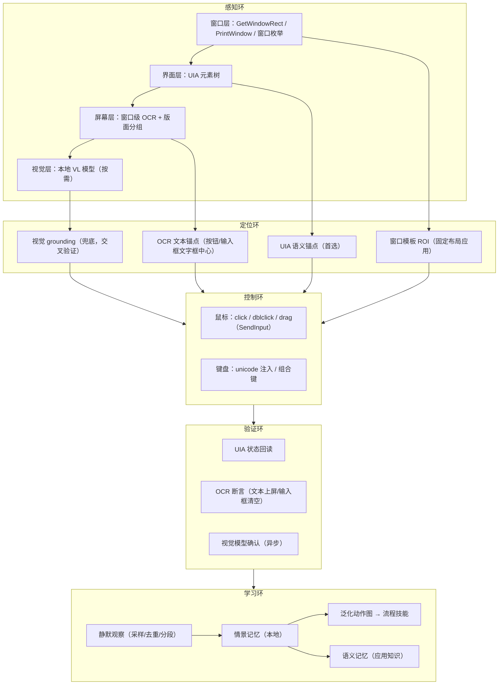
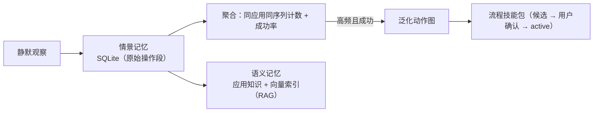
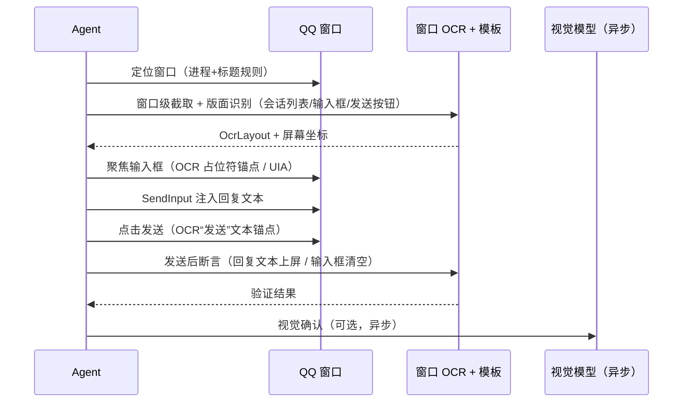

# 鼠标模拟控制与操作记忆：技术路线（v0.4.1 专项）

> 🗄️ **已合并归档（2026-08-13）**：本文件内容已并入《技术文档-AI智能体输入法.md》v0.5 §5.8（全域情景感知与操作辅助：全流程实现方案），本文件不再单独维护。

> 版本：v0.1（技术路线草案）  
> 日期：2026-08-12  
> 状态：待评审，评审通过后并入主技术文档 v0.4.x  
> 上游：`技术文档-AI智能体输入法.md`（v0.4，D19/D22/D23/D25/D26）、`输入法融合-P4前置条件评审-2026-08-12.md`（缺项 2/3）

---

## 0. 背景与目标

### 0.1 要解决的问题

1. **QQ 自动回复效果差**：QQ 新版界面大量自绘控件，UIA 元素树覆盖不全；现有 OCR 只输出文字摘要，没有窗口级定位、版面结构和可用于控制的坐标；主模型（DeepSeek）无视觉能力，无法判断“消息是否发出、界面是否切换”。
2. **情景理解停留在“应用级”**：现在知道用户打开了 QQ，但不知道 QQ 当前在哪个会话、输入框在哪、消息区状态如何；Agent 无法“看懂屏幕”。
3. **学习停留在“手动示范”**：现有学习需要用户手动开启录制；缺少**后台静默观察用户如何操作、操作结果如何**，并自动沉淀为本地技能/记忆的能力。

### 0.2 目标

1. **精准的情景理解**：不仅知道用户打开了什么应用，还能理解应用内界面结构（窗口、会话、输入框、按钮）和屏幕内容，统一到可计算的坐标与元素模型。
2. **可靠的鼠标模拟控制**：UIA 锚点 + OCR 文本锚点 + 窗口模板 + 视觉 grounding 四层定位，每步操作带结果验证。
3. **后台静默操作学习**：观察白名单应用内用户操作（结构化动作 + 前后状态摘要），判定结果，本地存储为情景记忆 → 泛化为流程技能 → 沉淀应用语义记忆。

### 0.3 核心判断

**视觉模型负责“理解与验证”，OCR+坐标负责“定位与控制”，UIA 负责“首选语义锚点”，三层互补，互不替代。**

- 视觉模型（Qwen-VL 等）能力再强，直接输出点击坐标也是弱控制——有幻觉、有延迟、成本高，只能作为兜底或验证。
- 确定性控制必须走：UIA 元素 → OCR 文本框 → 窗口模板 ROI → 屏幕坐标，每级都有可验证的几何信息。
- “操作完成没有”的判断用三层验证：UIA 状态回读 → OCR 断言 → 视觉模型确认（异步、可选）。

---

## 1. 现状盘点（代码事实）

| 模块 | 现有能力 | 缺口 |
|---|---|---|
| OCR（`ocr.rs`） | Windows Media.Ocr：文字 + 逐词框（`OcrBox`）+ 区域裁剪放大（`ocr_bmp_region`） | 无窗口级截取、无 DPI/坐标系换算、无版面分组、无控件语义、无置信度 |
| 执行器（`executor.rs`） | UIA 锚点查找/Invoke、`click_at`（屏幕坐标）、SendInput Unicode、快捷键、ValuePattern 回读、敏感熔断、动作图执行 | 无 OCR 文本锚点、无窗口模板、无“多策略重试”、验证谓词单一 |
| 平台（`platform.rs`） | 全屏 BitBlt 截图、前台窗口轮询、剪贴板序列号 | 无 `GetWindowRect/GetClientRect`、无 `PrintWindow` 窗口截取、无窗口枚举、无 DPI 感知、无多显示器坐标处理 |
| 感知（`perception.rs`） | L0/L1/L2 事件流、UI 树刷新、截图环形缓冲、任务假设 | 无“操作前后状态 diff”、无结构化版面（OcrLayout） |
| 学习（`learn.rs`） | 手动录制（start/record/stop）→ 泛化动作图 → 流程技能包（.owskill） | 无后台自动观察、无动作采样去重、无结果判定、无情景/语义记忆库 |
| 模型网关（`gateway.rs`） | OpenAI-compatible 流式 + 工具调用；DeepSeek 实测 | `capabilities.vision` 字段已预留但未接视觉模型；无视觉/文本双模型路由 |
| QQ 专项 | 无 | 无窗口模板、无会话定位、无自动回复闭环 |

---

## 2. 总体架构：感知 → 定位 → 控制 → 验证 → 学习



**约束（规范性）**：

1. 视觉模型**不直接输出控制指令**；grounding 结果必须与 OCR/窗口模板交叉验证后才允许点击。
2. 所有鼠标/键盘动作必须经过审批（deny/ask/allow），白名单外应用默认只读。
3. 学习默认本地、可暂停、可删除；消息内容、密码、支付框永不采样。
4. 每步操作必须有验证，验证失败按“重试 → 换定位源 → 暂停询问”的顺序处理。

---

## 3. 感知层技术路线

### 3.1 窗口级截取与统一坐标系（第一优先）

**目标**：从“全屏截图”升级为“按窗口截图 + 统一坐标换算”，这是窗口针对性 OCR 的基础。

**Windows 实现**：

- 窗口枚举：按进程名 + 窗口标题规则定位目标窗口（QQ 主窗口、VSCode 窗口等）。
- 窗口矩形：`GetWindowRect`（屏幕坐标）与 `GetClientRect`（客户区逻辑坐标）。
- 窗口截图：`PrintWindow(PW_RENDERFULLCONTENT)` 优先（可截被遮挡窗口），失败回退 `BitBlt` 窗口 DC；个别自绘窗口（如游戏）走全屏裁剪。
- DPI：进程声明 Per-Monitor V2 DPI Aware；维护 `dpi_scale = physical / logical`，多显示器支持负坐标。
- 统一坐标模型：

```json
{
  "source": "ocr",
  "text": "发送",
  "confidence": 0.93,
  "rect": { "client": { "x": 620, "y": 730, "w": 64, "h": 32 },
            "screen": { "x": 1020, "y": 850, "w": 64, "h": 32 } },
  "dpi_scale": 1.25,
  "window": { "hwnd": 123456, "title": "QQ", "process": "QQ.exe" }
}
```

- 缓存：按 `(hwnd, title, 界面版本, 区域)` 缓存 OCR 结果；窗口大小/标题变化即失效。

### 3.2 OCR 方案：确定性定位主力

**引擎分层**：

| 层 | 引擎 | 用途 | 取舍 |
|---|---|---|---|
| 快速路径 | Windows Media.Ocr（现有） | 高 DPI、文字密集区快速识别 | 零依赖；中文精度一般、无版面/方向信息 |
| 主力路径 | **PP-OCRv6（ONNX 本地）**：det + rec，档位 tiny 1.5M / small 7.7M / medium 34.5M | 中文精准识别 + 检测框/置信度；small 起步、medium 精度档可配置 | ✅ 已确认（2026-08-12）：RapidOCR v3.9+ 默认即 PP-OCRv6 small，ONNXRuntime/OpenVINO 纯 CPU 可跑，Rust 用 ort 推理；**不采用 PP-StructureV3**（文档版面解析，偏重、面向文档而非 UI 控制） |
| 专用路径 | 窗口模板 + 区域 OCR（现有 `ocr_bmp_region` + 放大） | 小字按钮、红包面板、验证弹窗 | 按 ROI 裁剪，快且准 |

**模型档位决策**：

- 默认 `PP-OCRv6_small`（7.7M，纯 CPU 快），配置项 `ocr.model_tier = "small" | "medium" | "system"`；中文精度不足时切 medium（34.5M，仍远小于 VLM，CPU 可用）。
- 版面分组（按钮/输入框/消息气泡）由我们自己基于检测框聚类 + `role_hint` 启发式完成，**不依赖 PP-Structure 的文档版面模型**（PP-StructureV3 的目标是表格/公式/阅读顺序，与 UI 控制场景不匹配）。
- PaddleOCR-VL-1.6（0.9B VLM，文档解析 OmniDocBench 96.33%）**不作控制主力**：纯 CPU 交互延迟不可接受；仅作为可选“文本场景理解/完成验证”层（见 3.4），验证通过后再决定是否替代 Qwen2.5-VL-3B 的文本类任务。

**版面理解（OcrLayout）**：OCR 输出从“文本列表”升级为“结构化版面”：

```json
{
  "window": "QQ",
  "blocks": [
    { "role_hint": "message_bubble", "text": "在吗？", "rect": {...}, "confidence": 0.95 },
    { "role_hint": "input_placeholder", "text": "输入消息...", "rect": {...}, "confidence": 0.90 },
    { "role_hint": "button", "text": "发送", "rect": {...}, "confidence": 0.93 }
  ],
  "version": "2026-08-12T16:00:00Z"
}
```

- 分组规则：按词框坐标聚类成行/区块（行高、间距、左对齐）；再按内容启发式标 `role_hint`（按钮 = 短文本 + 右/下边缘；输入框 = 占位符文本；气泡 = 多行文本块）。
- **坐标换算**：OCR 输出的词框是输入图像像素坐标；窗口截图时加上窗口客户区偏移并乘 DPI 缩放得到屏幕坐标；全屏截图时直接是物理像素坐标，需除以缩放得到逻辑坐标。
- 验收：QQ 会话窗口文本召回率 ≥ 90%；按钮/输入框定位误差 ≤ 4px（1080p、100% 缩放）。

### 3.3 窗口模板（针对固定布局应用）

- 概念：每个目标应用（QQ、微信等）维护一张“窗口模板”= 相对窗口客户区的 ROI 集合 + 语义标签（`session_list`、`message_area`、`input_box`、`send_button`）。
- 建立：首次进入时用 UIA + OCR 版面自动识别 ROI 并缓存；用户可微调修正。
- 失效：窗口尺寸/主题/版本变化导致 ROI 命中率下降 → 自动重建，重建前不执行坐标点击（只读感知）。
- 价值：QQ 这类自绘界面即使拿不到 UIA 元素，也能用模板 + OCR 稳定定位。

### 3.4 视觉模型：理解与验证，不直接控制

**模型选型**：

| 档位 | 模型 | 用途 |
|---|---|---|
| 本地默认 | Qwen2.5-VL-3B（llama.cpp/Ollama，Q4 量化，纯 CPU） | ✅ 已确认（2026-08-12）：纯 CPU 可用且快；场景描述、完成验证、紧急 grounding |
| 本地更快速档（候选） | SmolVLM2-2.2B / Gemma3n（小模型） | 若 3B 在参考硬件上超预算则启用；仅验证类任务 |
| 文本理解替代档（候选） | PaddleOCR-VL-1.6（0.9B，文档解析 SOTA） | 仅作异步“文本场景理解/完成验证”；纯 CPU 慢，不作为控制主力；先评测再决定 |
| 本地高精度 | Qwen2.5-VL-7B / MiniCPM-V（16GB 内存档，需显式开启） | 复杂界面理解（可选） |
| 云端可选 | BYOK 强视觉模型（GPT-4o / Qwen-VL Max） | 本地置信度低或用户开启云能力时 |

- 性能预算：单窗口截图理解 p95 < 3s（纯 CPU、3B 量化）；超预算自动退化为“OCR + 窗口模板 + 规则验证”，视觉仅作异步确认。

**职责边界**：

1. 场景描述：输入窗口截图 → 输出结构化描述（“这是 QQ 聊天窗口，会话列表第 2 项是高亮，输入框为空”）。
2. 完成验证：发送动作后 → 回答“回复文本是否已上屏 / 输入框是否已清空”（yes/no + 置信度）。**异步执行，不阻塞控制主链路。**
3. Grounding 兜底：问“发送按钮在哪里” → 返回坐标 box；**必须与 OCR 文本锚点/窗口模板交叉验证，重合才允许点击**。

**网关改造**：`gateway.rs` 增加视觉 Provider 路由——`task: "vision"` 走视觉模型，主 Agent 仍走 DeepSeek 等文本模型；截图按需采集、用后即毁、发送预览沿用 7.5 数据出境开关。

### 3.5 融合理解：情景模型升级到“界面级”

- 多源融合：UIA 树 + OCR 版面 + 窗口模板 + 视觉描述 → 统一 `SceneElement` 列表。
- 每个元素带 `source`、`confidence`、`rect(screen/client)`；UIA 元素可附带语义锚点。
- 任务假设从“应用级”升级到“界面级”：
  - 现在：`{ foreground: "qq", task: "chatting", confidence: 0.9 }`
  - 目标：`{ window: "QQ", session: "项目群", message_area: [3 条新消息], input_box: { empty: true }, send_button: { rect: ... } }`

---

## 4. 控制层技术路线

### 4.1 定位策略优先级

1. **UIA 语义锚点**：有角色/名称、可 Invoke/ValuePattern → 不依赖坐标（现有）。
2. **OCR 文本锚点**：按钮/输入框文字框 → 中心点坐标点击（新增）。
3. **窗口模板 ROI**：固定布局应用的语义区域 → 坐标点击（新增）。
4. **视觉 grounding**：交叉验证后点击（兜底）。

点击前前置校验：目标窗口在前台或可激活、区域在屏幕内、无高优先级遮挡；校验失败不执行，转询问。

### 4.2 鼠标/键盘模拟能力

| 动作 | 实现 | 现有/新增 |
|---|---|---|
| 单击/双击/右键 | SendInput mouse 事件 | 单击现有，双击/右键新增 |
| 长按拖拽 | mouse down → move 序列 → up（文件拖入聊天框） | 新增 |
| 滚动 | mouse wheel | 新增 |
| 文本输入 | SendInput Unicode（现有 `send_unicode`） | 现有 |
| 组合键 | `send_shortcut` | 现有 |
| 中文输入 | 直接注入 UTF-16 Unicode，不依赖 IME 状态 | 现有 |

### 4.3 验证与重试

**断言类型**：

| 断言 | 说明 |
|---|---|
| `window_title` | 标题变化（窗口打开/切换） |
| `uia_exists` / `uia_value` | 元素出现 / ValuePattern 回读 |
| `ocr_contains` | 屏幕/窗口 OCR 出现目标文本 |
| `ocr_box_gone` | 输入框文本清空（QQ 发送成功标志） |
| `clipboard_changed` | 剪贴板序列号变化 |
| `pixel_diff` | 区域像素变化（消息上屏） |
| `vision_confirm` | 视觉模型 yes/no（异步） |

**重试策略**：同一断言同法重试 ≤ 2 次 → 换定位源（UIA→OCR→模板→视觉）→ 仍失败则暂停并询问用户。全程审计，含失败原因。

---

## 5. 后台静默操作学习（重点）

### 5.1 学习目标

在用户日常使用中，**后台自动观察**白名单应用内的操作（不录屏、不记录内容），得到结构化动作序列和“操作结果如何”，沉淀为：

1. **情景记忆**（episodic）：一条条“我在某应用做了什么、结果如何”；
2. **流程技能**（procedural）：高频操作泛化为动作图（复用现有流程技能包）；
3. **语义记忆**（semantic）：应用知识（“QQ 发送按钮在窗口右下”“这个流程通常需要 3 步”）。

### 5.2 观察源

| 源 | 采集内容 | 隐私约束 |
|---|---|---|
| 鼠标事件 | 点击位置（归一化坐标）、目标元素（UIA 命中）、动作类型 | 不记录移动轨迹全量，只记动作点 |
| 键盘事件 | 输入类型（文本/快捷键/删除）与长度，**不记录文本内容** | 密码框/支付框直接跳过 |
| 窗口状态 | 标题、激活、大小变化 | 低敏 |
| UI 树 diff | 元素增删、值变化 | 只记结构摘要 |
| OCR 状态摘要 | 操作前后关键文本（去重、截断） | 不落完整消息内容 |
| 剪贴板 | 仅类型 + 长度 | 需授权 |

### 5.3 采样、去重与分段

- 节流合并：同窗口同元素同动作 300ms 内合并为一次；连续 5s 无操作作为操作段边界。
- 序列归一化：`app_id + action_type + semantic_anchor / ocr_text_hash + 归一化坐标`，保证同一动作在不同屏幕尺寸下相似。
- 结果判定（操作后 1–3s）：
  - **成功**：UI 树/OCR/窗口状态出现预期变化；
  - **失败**：无变化或状态回退；
  - **未知**：无法判定 → 不自动沉淀，仅存情景记忆。

### 5.4 记忆分层与存储



- 情景记忆：本地 SQLite（复用 SessionStore），字段 = 时间、应用、归一化序列、前后状态摘要、结果；可查看/删除/暂停/清空。
- 流程技能：复用 `learn.rs` 泛化与 `.owskill` 机制；静默生成候选技能，**不打扰式沉淀**——桌面端“技能中心”出现新候选，用户确认后转 active。
- 语义记忆：从高频流程抽取“应用知识”条目（按钮位置、快捷键、步骤数），后续供 RAG 检索和主动建议使用。

### 5.5 沉淀门槛

| 门槛 | 默认值（可配置） |
|---|---|
| 静默生成候选技能 | 同应用同归一化序列 ≥ 3 次且成功率 ≥ 80% |
| 用户显式示范 | ≥ 1 次即生成候选 |
| 候选技能自动转 active | 必须用户确认 |
| 技能执行失败降级 | 连续失败 2 次标记失效，提示重新学习 |
| 情景记忆保留期 | 默认 30 天 / 1 万条（可配置，滚动清理） |
| 开发阶段默认 | 静默学习、QQ 自动应答、情景记忆**默认全开**，持续迭代调参（正式版再收紧） |

### 5.6 与主动建议联动

- 学习到的高频流程进入主动建议候选集（复用 `proactive.rs`），触发特征升级：序列相似度 + 历史成功率 + 时机（目标应用在前台、用户空闲）。
- “自动执行”仍需单独开启，且每技能首次执行仍审批。

---

## 6. QQ 自动回复专项（落地目标场景）

### 6.1 现状为什么差

1. QQ 新版界面自绘控件多，UIA 元素树覆盖差；
2. OCR 只有全屏文字摘要，没有窗口定位/版面/坐标控制；
3. DeepSeek 无视觉，无法确认“发送成功/对方回复”；
4. 回复生成（文本模型）与界面控制链路脱节，没有统一的“感知→控制→验证”闭环。

### 6.2 专项方案



1. **窗口定位**：按 `QQ.exe` 进程 + 标题规则枚举 QQ 主窗口；客户区截图走 `PrintWindow`。
2. **界面理解**：窗口模板 + OCR 版面给出会话列表、消息区、输入框、发送按钮坐标。
3. **回复生成**：文本模型（DeepSeek 等）基于已授权会话内容生成回复；内容经预览 + 审批。
4. **控制**：聚焦输入框 → 注入回复文本 → 点击发送（模拟键盘回车一般不会错）；发送前检查窗口可见、无遮挡。
5. **验证**：发送后 1–3s OCR 断言“输入框清空 + 回复文本出现在消息区”；视觉模型异步二次确认。
6. **学习**：静默记录用户手动回复的完整流程（选会话 → 输入 → 发送 → 结果），泛化为 `qq_reply` 流程技能；用户确认后可用于后续自动回复。

触发策略可配置：**仅用户指令触发** / **白名单会话自动应答**；开发阶段默认全开，正式版默认仅指令触发。

### 6.3 验收指标

| 指标 | 目标 |
|---|---|
| QQ 单条回复端到端成功率（20 次实测） | ≥ 80% |
| 发送后验证准确率 | ≥ 95% |
| QQ 窗口 OCR 文本召回率 | ≥ 90% |
| 发送按钮定位误差（1080p） | ≤ 4px |
| 静默学习：录制一次手动回复 → 换联系人复用 | ≥ 70%（首期）/ 80%（目标） |

---

## 7. 里程碑与任务拆分

### M-A：感知增强（2–3 周）

- 平台层：窗口枚举、`GetWindowRect/GetClientRect`、`PrintWindow`、DPI/多屏坐标换算（`platform.rs` 扩展）。
- OCR 层：引入 PaddleOCR ONNX 或保留系统 OCR + 版面分组；输出 `OcrLayout`（`ocr.rs` 扩展）。
- 模板层：窗口模板建立/缓存/失效重建；QQ 模板首版。
- 测试：窗口截图冒烟、坐标换算单测、QQ 会话 OCR 召回率脚本（`scripts/window_ocr_eval.py`）。

### M-B：视觉辅助（2–3 周）

- 网关：`task: "vision"` 路由 + 本地 VL（Ollama/llama.cpp）+ 云端 BYOK 可选。
- 接口：`vision.describe`、`vision.verify`（异步）、`vision.ground`（交叉验证门控）。
- 测试：完成验证准确率 ≥ 90%（20 例）；grounding 与 OCR 重合校验用例。

### M-C：控制增强（2–3 周）

- 执行器：OCR 文本锚点、窗口模板 ROI、双击/右键/拖拽/滚动、多策略重试（`executor.rs`）。
- 验证库：`ocr_contains` / `ocr_box_gone` / `pixel_diff` / `vision_confirm` 断言。
- QQ 专项：窗口定位 → 输入 → 发送 → 验证全链路。
- 测试：Notepad 回归 + QQ 20 次端到端。

### M-D：静默学习（3–4 周）

- 观察器：鼠标/键盘/窗口/UI 树 diff/OCR 状态采样与去重（`observe.rs` 新增）。
- 记忆库：情景记忆 SQLite + 聚合 + 语义记忆（向量索引预留）。
- 沉淀管线：静默候选技能 → 用户确认 → active；失败降级。
- 主动建议联动：触发特征升级（成功率 + 时机）。
- 测试：脚本化桌面操作录制 → 泛化 → 复用成功率。

---

## 8. 风险与缓解

| 风险 | 缓解 |
|---|---|
| OCR 误识导致点错 | 置信度阈值 + 与 UIA/模板交叉验证 + 发送类动作强制预览/审批 |
| 窗口遮挡/最小化 | 点击前可见性检查；不可见则不执行 |
| DPI/多屏坐标偏差 | 统一 Per-Monitor V2 换算 + 实测矩阵（100%/125%/150% + 双屏） |
| 视觉模型幻觉 | 视觉只做验证/兜底；grounding 必须交叉验证；主控制走锚点坐标 |
| QQ 更新破坏模板 | 模板命中率监控，失效自动重建；重建前坐标点击降级为询问 |
| 静默学习采集敏感数据 | 内容不采样、密码/支付跳过、本地存储、可暂停/删除、录制指示灯 |
| 游戏反作弊/ToS | 白名单外默认只读；游戏自动化需单独授权 |
| 学习噪声（误学用户误操作） | 成功率门槛 + 结果判定 + 候选技能需确认 |

---

## 9. 决策状态

### 已确认（2026-08-12）

1. **OCR 引擎**：引入 PaddleOCR（ONNX 本地）；若需减少依赖体积，可改用 RapidOCR（同一模型 ONNX 打包）。
2. **本地视觉模型**：3B 档（Qwen2.5-VL-3B，Q4 量化，纯 CPU），要求快；单窗理解 p95 < 3s，超预算退化为 OCR + 模板。
3. **QQ 自动回复触发、静默学习、情景记忆保留期**：全部在桌面端设置中可配置；**开发阶段默认全开**，持续迭代调参；正式版收紧（QQ 默认仅指令触发、静默学习默认关或白名单）。
4. **情景记忆保留期默认**：30 天 / 1 万条，滚动清理，可配置。
5. **OCR 模型选型**：采用 PP-OCRv6（ONNX，RapidOCR 通道，Rust ort 推理），默认 small、可切 medium；不采用 PP-StructureV3；PaddleOCR-VL-1.6 仅作为可选异步验证层候选。

### 剩余开放问题

1. 本地 VL 3B 实测延迟/准确率不达标时，快速档选型（SmolVLM2-2.2B vs Gemma3n）。
2. QQ 客户端版本兼容面：QQ NT 各版本 UIA 暴露程度与模板 ROI 差异（需兼容性探测实验）。
3. 情景记忆到期处理：直接删除还是归档（加密压缩）。
4. 首期动作范围：仅文本回复，还是包含拖拽发文件。
5. 静默学习授权粒度：全局开关 + 白名单，还是逐步细化为按应用授权。

---

## 10. 进一步技术问题与可参考方案

### 10.1 元素稳定追踪与多源融合

- **问题**：UIA 元素、OCR 词框、视觉 box 每帧都在变，无法稳定关联“同一个按钮”；重复检测、漂移、重叠。
- **方案**：建立“窗口元素注册表”——每窗口维护稳定元素 ID（UIA AutomationId/Name + OCR 文本 hash + 归一化坐标加权），跨帧跟踪；多源合并为统一 `SceneElement`（UIA 作主键、OCR 补文本、视觉补描述），失效条件明确。
- **参考**：OmniParser（截图解析为带编号元素列表）、ShowUI / UGround（GUI grounding）、UIA AutomationId 规范。

### 10.2 等待与时机

- **问题**：UI 异步加载、动画、网络延迟，固定 sleep 不可靠。
- **方案**：断言驱动的 `wait_until(predicate, timeout)`——先 50ms 快轮询、后慢轮询；静默学习时记录“操作 → 结果出现”的耗时分布，作为该技能后续超时默认值。

### 10.3 前台与系统限制（UIPI / 前台锁）

- **问题**：坐标点击需要目标窗口在前台；Windows 前台锁限制 `SetForegroundWindow`；不同完整性级别进程间 UIPI 拦截输入。
- **方案**：优先 UIA Invoke（无需前台）；坐标点击前 `SetForegroundWindow` + `AttachThreadInput` 或注册热键；核心服务声明 UIAccess（无障碍工具 manifest，需签名与安全审查）；QQ 最小化到托盘时先恢复窗口。
- **参考**：Windows UIAccess 文档、FlaUI / pywinauto 对 UIA 的封装。

### 10.4 验证语义与“成功”定义

- **问题**：不同应用“发送成功”的表现不同（输入框清空 / 消息上屏 / 无任何变化）。
- **方案**：验证配方随技能包存储（动作图 `verify` 节点扩展为 `assertions[]`）；静默学习自动学习“成功标志”——操作后 1–3s 状态 diff 中变化最明显且稳定的可观测字段（OCR 文本、UI 树、窗口标题），作为默认断言，用户可改。

### 10.5 技能漂移与自愈

- **问题**：应用更新、主题变化、分辨率变化导致技能失效。
- **方案**：技能健康度（成功率 + 失败模式聚类）；连续失败标记失效并回滚到上一可用版本；窗口模板命中率监控；用户空闲时做只读 OCR 校验，提前预警。

### 10.6 视觉模型评测

- **问题**：3B 纯 CPU 的速度与准确率未知，视觉幻觉风险。
- **方案**：先用 ScreenSpot / 内部 QQ 截图集（50 张）评测 grounding 准确率；用“完成验证”二分类评测（是/否 + 置信度）；主链路 OCR-first，视觉只做异步确认，模型再差也不阻塞控制。
- **参考**：ScreenSpot、OSWorld、Windows Agent Arena。

### 10.7 自动化回归评测环境

- **问题**：真实 QQ 依赖登录态与测试账号，无法在 CI 自动回归。
- **方案**：搭“桌面实验台”——Windows VM + 自建“模拟 QQ 风格”测试应用（自绘界面、无 UIA）+ 脚本化任务（输入 → 发送 → 断言），用于 CI 回归；真实 QQ 只做定期人工验收。
- **参考**：OSWorld / Windows Agent Arena 的任务定义方式。

### 10.8 隐私与权限（UIAccess / 全局钩子）

- **问题**：静默学习需要键盘鼠标观察或 UIA 事件监听，属高敏能力；UIAccess 是高权限声明。
- **方案**：不装全局低级钩子，优先 UIA AutomationEvent（Focus/PropertyChange）+ 轮询快照；键盘只记动作摘要（类型 + 长度），不记内容；观察默认白名单 + 可暂停 + 录制指示灯；正式版默认关。

### 10.9 操作记忆检索（RAG）

- **问题**：情景记忆量大之后，如何“想起”某个历史操作。
- **方案**：语义记忆向量化（本地 embedding），按“应用 + 动作意图 + 结果”检索；以受控工具 `memory.recall` 暴露给 Agent，权限独立可撤。

---

## 11. 可参考的开源项目与基准

| 参考 | 用途 | 说明 |
|---|---|---|
| PaddleOCR / PaddleOCR-X | 中文 OCR + 版面分析 | 已确认引入；PaddleOCR-X 增加版面/表格/阅读顺序 |
| RapidOCR | PaddleOCR 的 ONNX 轻量打包 | 减少 Paddle 依赖，Rust 可用 ort 推理 |
| OmniParser / OmniTool（微软） | 截图 → 结构化元素 + 坐标 | 与“OCR 版面 + 视觉理解”思路一致 |
| OSWorld / Windows Agent Arena | 桌面 Agent 基准 | 任务集与评分方法可借鉴 |
| UI-TARS-desktop（字节） | 开源 GUI Agent 全栈 | 截图理解 + 控制闭环，可接 MCP |
| ShowUI / UGround / ScreenSpot | GUI grounding 模型与基准 | 评估视觉定位能力 |
| VideoGUI / iVideoGTA | 从用户操作视频学习 GUI 流程 | 与“静默学习”同思路（本方案用事件流，不做录屏） |
| AWM（Agent Workflow Memory） | 工作流记忆与复用 | 流程技能包的思想参照 |
| Mem0 / Letta（MemGPT） | Agent 记忆层 | 情景/语义记忆分层的工程参照 |
| FlaUI / pywinauto / WinAppDriver | UIA 封装与控制 | 与现有 WindowsUiaSource 对照补全能力 |
| llama.cpp / Ollama | 本地 LLM/VL 推理 | 3B 视觉模型运行底座 |

> 说明：以上均为公开项目/基准，具体版本与能力以各自最新仓库为准；除 PaddleOCR 外均非强制依赖，按需验证后采用。

---

## 12. 实施状态（2026-08-12 晚，后台静默模拟版）

为不干扰用户正常使用电脑，本轮先落地“后台模拟实验台”（对应 10.7 思路），
在 headless 虚拟窗口上迭代 Agent 闭环；真实 QQ/浏览器实机验证保留在用户显式要求时进行。

### 12.1 已落地

1. **模拟环境**：`owo-sim-qq --headless`（GDI 离屏渲染，提供 `/frame` BMP、`/ocr` 真值版面、
   `/click`、`/type`、`/key`、`/state`、`/log`、`/reset`）与 `owo-sim-browser`
   （本地搜索站 + 文章页 + PNG 图片下载）。
2. **双表面工具**：`screen_ocr`/`ocr_region` 输出整行 `lines`（坐标 + `role_hint`），
   `desktop_click/type/key/shortcut/activate/window_list/foreground/launch/wait`，
   `browser_navigate/search/snapshot/click/type/press/screenshot/download_image/close`
   （Playwright + 本机 Edge，持久化 profile，可 headless）。设置 `OWO_SIM_QQ_URL` 后桌面工具
   自动落到虚拟窗口；服务端直连写接口在模拟面下返回 400。
3. **验收结果（真实 DeepSeek 模型）**：
   - QQ 回复闭环 3/3 通过：读上下文 → 点击输入框 → 回复 → 点击发送 → OCR 验证上屏/清空 →
     等待对方回复 → 再回复 → 再验证；单轮 24–25s，2 条消息全部发出。
   - 浏览器搜索/下载 2/2 通过：导航本地搜索站 → 输入关键词 → 打开文章 → 下载 40,767B PNG，
     PNG 头校验通过。
4. **质量门禁**：fmt/clippy 0 警告；`cargo test --workspace` 全绿（core 86 等）。

### 12.2 与本章节路线的关系

- 感知层：OCR 增加“行合并 + role_hint”（3.2 的 OcrLayout 轻量版）；窗口级截取/窗口模板未做。
- 控制层：4.1 的 UIA 语义锚点 + OCR 文本锚点（坐标点击）已打通；双击/右键/拖拽/滚动未做。
- 验证层：OCR 断言（输入框清空/消息上屏）已落地；`pixel_diff`/`vision_confirm` 未做。
- 学习层：静默观察（5.x）未做，仍为后续 M-D。
- 视觉模型：未接入；模拟面用真值版面替代 Media.Ocr 的小字识别短板，真实桌面仍走 Media.Ocr。

### 12.3 下一步

1. 真实 QQ 复用同一套 `desktop_*` 工具（去掉 `OWO_SIM_QQ_URL`），补齐窗口级 OCR/模板定位。
2. PaddleOCR + 窗口模板（M-A）、本地 VL 完成验证与 grounding 交叉验证（M-B）。
3. 静默操作学习与情景/语义记忆（M-D）。

### 12.4 更新（2026-08-13）

- **OCR 引擎已落地 PP-OCRv6 云 API**（M-A 决策 1 的 API 形态）：`paddle_ocr.rs` 接入
  PaddleOCR AI Studio 任务式接口，实测离屏模拟帧 0.9s 返回 93 字符/12 框，能读出 Media.Ocr
  长期漏掉的“发送/输入消息”；本地 ONNX（RapidOCR 同模型打包）作为后续无网部署替换项。
- **真实 QQ 受控发送实锤**：UIA 语义锚点聚焦输入框 → SendInput → UIA 点击发送 → UIA 树验证上屏，
  与 6.2 专项方案的“定位→输入→发送→验证”闭环一致；同时验证忽略聊天中的 prompt-injection 内容。
