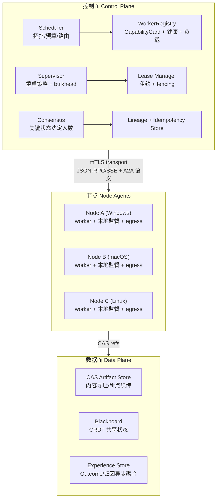
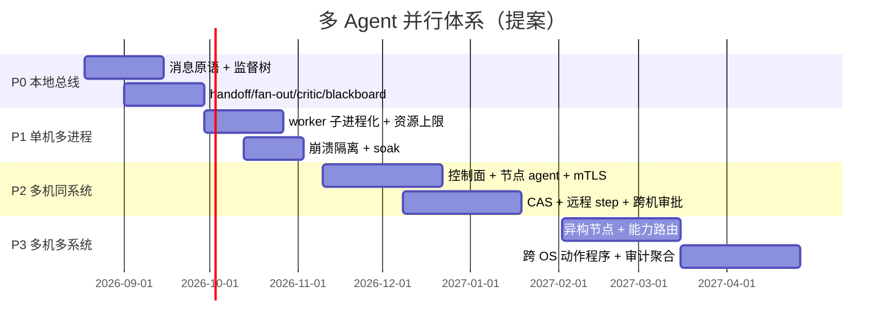

# 多 Agent 并行体系：生产级设计与跨机多系统扩展

> 版本：v0.1（提案）  
> 日期：2026-08-16  
> 依据：《技术文档-AI智能体输入法.md》v0.6、《技术路线改进方案-生产级GL-2026-08-15.md》、
> 《技术路线改进方案-能力拓展与功能分层-2026-08-15.md》、《技术路线评审与前沿多模态Agent演进-2026-08-15.md》、
> R5 并行轮交付（`goal.rs`/`plan.rs`/`cloud_exec.rs`/`agent_worker.rs`/`team_api.rs`/`observability_api.rs`），以及外部调研（附录 A）。  
> 状态：提案，供决策评审。对应目标：**从本地电脑控制，推广到多电脑多系统的并行操作体系**。  
> 读者：架构评审、工程团队、产品决策层、安全评审。

> 📌 **实施状态（2026-08-16）**：P0 已落地——`agent-sdk/crates/owo-agent-core/src/fleet.rs`（Agent 总线 / 有界邮箱 / 监督树 / 预算 / handoff 环检测 / fan-out 原语），lib.rs 顶层导出；
> 14 项契约测试全绿，core 全量测试绿，fmt/clippy 干净。workspace 全量门禁仍受 R5 主控收尾阻塞（`route_contract_tests`：`POST /team/export → 404`，/team 等 router 未挂载）。P1+ 依 §7 排期。

---

## 0. 摘要

本文把三类成熟领域的方法收敛为一个 **Agent 编排内核**：

1. **多 GPU 并行**提供"怎么分解"——数据并行（同任务多轨迹 + 聚合择优）、流水线并行（阶段流式）、角色/能力切分（类似张量并行与 ZeRO 的冗余消除）、参数服务（经验异步聚合）；
2. **操作系统与分布式系统**提供"怎么可靠"——OTP 监督树、有界消息队列与背压、租约与 fencing、幂等与血缘重算、法定人数共识、CRDT、事件溯源；
3. **2026 年多 Agent 生产实践**提供"怎么组织"——supervisor-worker 为默认、fan-out 只用于可并行子任务、writer-critic 用于质量、swarm 式自由协作几乎不适用于生产（无单一 trace、无中心协调、状态共享难审计）。

一句话架构：**中心调度 + 监督树 + 结构化消息 + 内容寻址数据面 + 能力契约路由**，同一编排内核从单机进程内（L0）平滑扩展到单机多进程（L1）、多机同系统（L2）、多机多系统（L3）。

---

## 1. 调研综述：可借鉴的并行与并发策略

### 1.1 多 GPU 并行策略 → Agent 映射

| GPU 策略 | 本质 | Agent 侧映射 | 借鉴点 | 代价 |
|---|---|---|---|---|
| 数据并行（DDP/NCCL Ring-AllReduce，通信量 O(2M·(n−1)/n)） | 同模型多副本各算梯度，聚合后同步 | **同任务多轨迹 fan-out**：多个 worker 各自求解，结果/评分作为"梯度"聚合，择优或投票 | 聚合复杂度与节点数近似无关，带宽友好 | 重复计算成本 ×N；必须配预算 |
| 流水线并行 | 模型按层切分到多设备，微批次流式通过 | **工作流阶段流水线**：研究→分析→写作→评审串成 stage，产物流式传递 | 阶段并发而非全任务串行；bubble = 等待时间，可用于人审/异步阶段 | 阶段间耦合、反压复杂 |
| 张量并行 | 单层切分到多设备联合计算 | **角色/能力切分**：不同 worker 持不同模型与工具集（研究者/执行/审查/合规） | 每个 worker 只带所需能力，减少资源冗余 | 需要能力契约与路由 |
| ZeRO 1/2/3 | 逐步消除优化器/梯度/参数冗余 | **上下文去重与分片**：只向 worker 分发任务所需最小上下文切片，而非全量会话 | 省 token/内存，符合最小权限 | 需要上下文切片与重组协议 |
| Parameter Server | 中心参数异步更新，周期聚合 | **经验/知识中心（Experience Store）**：worker 异步写 Outcome/归因，空闲期聚合进技能元数据（对应睡眠期计算） | 解耦"执行"与"学习"，容错好 | 异步一致性，需幂等写入 |

结论：Agent 并行**不需要照搬 GPU 通信库**，但要搬四种分解思想与"带宽感知聚合"——并行度收益必须扣掉通信/聚合/等待成本，这正是流水线 bubble 与 allreduce 复杂度公式教给我们的。

### 1.2 操作系统与分布式并发机制 → Agent 映射

| 机制 | 出处 | Agent 侧应用 |
|---|---|---|
| 进程/线程 + 调度器（CFS、工作窃取） | OS | worker 池 + 调度策略（FIFO/优先级/工作窃取）；worker 独占资源配额 |
| OTP 监督树（one_for_one / rest_for_one / 干净重启） | Erlang/Elixir | 三级监督树：节点级 / 会话级 / 任务级；崩溃即重启为干净状态；bulkhead 隔离 |
| Actor 有界邮箱 | Actor 模型 | agent 消息队列必须有界 + 背压；慢消费者断开而非拖垮 |
| MPI/消息传递 | HPC | 结构化消息总线（对齐 A2A 的 Task/Message 语义） |
| Raft/Paxos 共识 | 分布式系统 | 关键状态（任务最终态、审批锚点）多数派确认；分区时降级只读 |
| CRDT | 协作系统 | 黑板/共享状态无冲突合并 |
| 血缘重算（Lineage） | Spark/Ray | 结果丢失时按血缘重算，而非依赖每次持久化 |
| GCS + Object Store | Ray | 控制面状态集中 + 内容寻址结果仓库（CAS） |
| 事件溯源 + 心跳 + 断点续跑 | Temporal | 长任务全量事件记录，崩溃后精确续跑 |
| Operator + 一任务一 Job | Kubernetes（Anvil 类实践） | 任务级隔离边界与附加权限的参考 |

结论：**可靠性骨架抄 OTP/Ray/Temporal，互操作协议抄 A2A，并行分解抄多 GPU，隔离边界抄 K8s**——不发明已有几十年的可靠机制。

### 1.3 2026 年多 Agent 生产实践教训（设计约束来源）

- **supervisor-worker 是默认架构**，不是过渡态：单一 trace、单一协调点、可审计。
- **fan-out 只用于可并行子任务**（多目标、多数据块）；writer-critic 只用于质量关键产出。
- **swarm/peer-to-peer 几乎不适用于平台工程**：无中心协调 = 无单一 trace、状态共享竞争、失败难归因。
- 常见失败模式：无限 handoff 循环、无背压、无预算、共享状态无主。

由此得到五条基线约束：

1. 任何并行拓扑必须有**唯一调度主**（可迁移，但同一时刻唯一）；
2. 任何 agent 间通信走**结构化消息**，禁止自由文本串线（防信息丢失与注入）；
3. 任何并行执行必须有**预算**（轮次/token/时长/金额）与**取消传播**；
4. 任何共享状态必须有**主**（写单主）或 **CRDT**（合并），二选一；
5. 任何输出必须有 **trace 关联**（correlation_id 贯通父子），否则该并行拓扑不允许上线。

---

## 2. 体系架构：四层模型与编排内核

### 2.1 四层演进模型

| 层 | 形态 | 现状 | 本方案目标 |
|---|---|---|---|
| L0 | 单机进程内 | `goal.rs` JoinSet 并行（max_parallel=4）+ `subagent.rs` 嵌套会话（深度≤2）；**P0 已落地**：`fleet.rs` 总线/监督/fan-out/环检测 | critic/blackboard 编排模式接入 `goal.rs` worker 层（P0 收尾） |
| L1 | 单机多进程 | worker 与核心同进程 | worker 子进程化：隔离、资源上限、崩溃不扩散；模型/浏览器/插件进程纳入节点概念（P1） |
| L2 | 多机同系统 | `cloud_exec.rs` HTTP 契约 + Mock；`team_api.rs` 技能共享 | 控制面 + 节点 agent（Windows 网格）：mTLS、CAS、远程 step（P2） |
| L3 | 多机多系统 | macOS/Linux 仅编译 stub | 异构能力网格 + 跨 OS 动作程序 + 跨机 computer-use（P3） |

关键原则：**L0–L3 共享同一编排内核**（调度/监督/消息/预算/审计），每上一层只换 transport 与 identity，不换语义。

### 2.2 编排内核组件



职责边界：

| 组件 | 职责 | 不做 |
|---|---|---|
| Scheduler | 按能力契约 + 信任级 + 负载路由任务；执行预算 | 不直接执行工具 |
| WorkerRegistry | 登记 CapabilityCard、健康、负载、节点归属 | 不持有凭据明文 |
| Supervisor | 按重启策略拉起/隔离/熔断 worker | 不参与任务调度 |
| Lease Manager | 心跳租约、超时 fencing、防脑裂双写 | 不仲裁业务结果 |
| Consensus | 任务最终态、审计锚点多数派 | 不为每步动作做共识（性能） |
| CAS Store | 输入/输出/中间产物按哈希寻址 | 不存凭据与敏感原文（可策略化） |
| Blackboard | 共享工作区状态（CRDT 合并或写单主） | 不替代文件系统 |
| Experience Store | 收集 Outcome/归因，空闲期聚合 | 不在执行路径上同步写 |

### 2.3 任务模型

```
Task = {
  id, parent_id, idempotency_key,
  spec: { worker_kind | workflow_ref, input: [CAS refs], context_slice },
  budget: { max_turns, max_tokens, max_duration, max_cost },
  approval: { policy, human? auto_review? },
  state: queued → scheduled → running ⇄ awaiting_approval → succeeded|failed|canceled|fused,
  lineage: { input_hashes, dependent_tasks }
}
```

要点：

- 写操作路径必须带 `idempotency_key`（HTTP 层已有 `Idempotency-Key` 建议，落到任务层）；
- `context_slice` 是 ZeRO 思想的落实：worker 只拿任务所需最小上下文，不共享全量会话；
- 失败态只有三种去向：retry / rollback / ask-user，禁止"卡 Unknown"（对齐生产级 GL B4 要求）；
- `fused`（熔断）语义沿用 computer_task 的敏感面熔断，扩展到跨机执行。

---

## 3. 并行模式库（多 GPU 映射落地）

| 模式 | 触发条件 | 结构 | 上限 | 审批语义 | 失败语义 | 可观测点 |
|---|---|---|---|---|---|---|
| 数据并行 fan-out | 同一任务可拆 N 份独立输入（批量文件、多目标应用） | supervisor → N workers → gather | max_parallel（默认 4，可调）；结果去重 | 读轨迹自动；写/注入每份独立审批 | 部分成功：已成功结果保留，失败子任务可单独重试 | fan-out 数、单份耗时分位、部分成功率 |
| best-of-n 择优 | 高质量产出、成本可承受（报告/文案/方案） | N 份独立求解 → 独立评审仲裁 | N≤3 默认；预算 ×N | 全自动（评审只读），最终产物如需写入再审批 | 评审分歧 → 再评审一轮或 ask-user | 分歧率、择优分布 |
| 流水线并行 | 阶段间有明确顺序与产物契约（研究→分析→写作→评审） | stage 队列 + 有界缓冲 + 反压 | 每 stage 并发 1–2；总预算不变 | 关键 stage（写入/注入）各自审批 | 阶段失败按声明回退：后续 stage 取消，重跑上游 | pipeline bubble 占比、每 stage 时长 |
| 角色/能力切分 | 任务需要异构模型与工具（研究 vs 合规审查） | specialist worker 池，按 CapabilityCard 路由 | 每角色池上限 | 各角色权限独立，审查角色只读 | 角色缺失 → 降级提示或 ask-user | 角色池利用率、能力路由命中率 |
| 经验异步聚合 | 任何执行完成 | worker → Experience Store（幂等写）→ 空闲期聚合进技能元数据 | 写入频率限流 | 聚合产物（技能元数据）变更需用户可见 | 聚合失败不影响执行；下轮重试 | 聚合队列深度、技能元数据更新率 |
| 共识裁决 | 关键状态迁移、审批锚点、多源结果冲突 | 法定人数确认（Raft 式） | 仅控制面状态，不逐动作 | 人审批仍是最高优先 | 少数派 → 阻塞并告警 | 共识延迟、分区事件 |

选择规则（避免过度并行）：能用单 worker 完成的不拆；拆分收益（节省墙钟时间）小于 30% 的不拆；任何并行拓扑上线前必须过第 1.3 节五条基线约束。

---

## 4. 可靠性与故障模型

### 4.1 三级监督树（OTP 映射）

| 级 | 监督对象 | 重启策略 | 说明 |
|---|---|---|---|
| 节点级 | 节点 agent 进程 | one_for_one；连续 N 次崩溃熔断转人工 | 对应核心服务的 supervisor 与 Tauri 壳拉起策略 |
| 会话级 | 会话内 worker 组 | rest_for_one（相关会话组一起重启） | 防"半组存活 + 半组新状态"的不一致 |
| 任务级 | 单个任务 | 指数退避重试（沿用 cloud_exec 的 base·2^n，封顶 60s） | 重试只对幂等任务；否则进入 rollback/ask-user |

配套：

- **Bulkhead**：每个 worker 独立资源池（CPU/内存/句柄/网络配额），崩溃不污染邻居——对应现有插件"进程隔离销毁，核心不受影响"的承诺延伸到 worker。
- **Circuit Breaker**：节点/模型网关连续失败开闸，半开探测，避免排队重试已死的依赖（Zylos 类实践与 GL E 门禁一致）。

### 4.2 租约与 fencing（防脑裂）

- 节点心跳租约（默认 15s，可配）；租约超时 → 该节点任务迁移或标记 failed（按任务语义）。
- **Fencing**：写操作/审批单主；节点重连后必须先验证 fencing token（纪元号）再写，杜绝双主双写。
- 网络分区时控制面降级只读：不产生新写、不审批写动作，等待分区恢复或法定人数决议。

### 4.3 幂等与血缘重算（Ray/Spark 映射）

- 写操作幂等键全局唯一；重复提交 = 去重返回原结果（at-least-once + 去重 → exactly-once 效果）。
- 任务输入与产出哈希进 lineage；结果丢失（节点宕机/仓库丢块）时按血缘**重算**而非手工恢复。
- 血缘记录是审计的一部分：任何输出可回答"谁、用什么输入、怎么算出来的"。

### 4.4 共识与法定人数

- 仅对**控制面关键状态**做共识：任务最终态、审批锚点、审计摘要锚定；每步动作不做共识（性能与成本不允许）。
- 共识失败（分区/少数派）→ 该状态迁移阻塞 + 告警，不静默推进。

### 4.5 背压、死锁与活锁

- agent 邮箱有界（默认 1024 条），溢出丢弃可合并事件（进度类）、保留关键事件（审批/熔断）；慢消费者断开而非拖垮调度器。
- **handoff 环检测**：把 `plan.rs` 的 DAG 环检测推广为 agent 间等待图检测；周期扫描，发现环即仲裁（按优先级取消低预算分支）。
- 超时仲裁：任何 handoff/评审/共识步骤必须带超时；超时后的默认行为在任务定义时声明（重试/回退/询问）。

### 4.6 拜占庭对待与故障注入

- **不可信节点一律按拜占庭对待**：不依赖"多数节点诚实"做执行共识；防御靠审批、沙箱、隔离、结果验证与审计，而非信任共识。这符合本产品"一切能力可声明、可审批"的安全叙事。
- 友好节点故障走监督树；恶意/异常节点走熔断 + 凭据吊销。
- 故障注入矩阵（进 nightly）：节点宕机、网络分区、慢节点、时钟跳变、消息乱序/重复、恶意结果（越权/注入），断言状态机落到定义过的失败态且可恢复，不允许"卡 Unknown"。

---

## 5. 跨机多系统扩展

### 5.1 能力契约与路由（跨 OS 统一）

```json
CapabilityCard = {
  node_id, os, arch, version,
  actions: ["inject","click","type","scroll","launch","key","clipboard"],
  perception: ["uia","ax","dom","ocr","vision","stt"],
  models: ["cloud:openai","local:onnx","local:stt"],
  resources: { cpu, ram_mb, npu_tops, gpu },
  plugins: [...], permissions: [...],
  trust: "owned|team|external",
  egress: ["allowlist domains"]
}
```

路由规则：`任务需求 ∩ 能力 ∩ 信任级 ∩ 负载`——需求不满足则降级提示；信任级不足则拒绝（不跨级）；负载过高则排队。

跨 OS 执行的关键：**同一动作程序（action_program.rs）在目标节点上解释执行**，各 OS 只实现 `UiActionSource`（Windows 已有 UIA+SendInput；macOS 补 AX+CGEvent；Linux 预留），定位与注入都发生在目标节点本地，控制面只下指令与收证据。

### 5.2 身份、网络与安全

- **入网**：一次性配对码 + 设备密钥 → 节点证书（有效期 + 用途约束）；控制面与节点之间 mutual TLS；A2A push 通知用 HMAC-SHA256 校验（对齐 ra2a 实践）。
- **最小权限**：任务只拿 `context_slice` 与短期凭据；**用户模型 Key 不出本机**——跨机模型调用经本机委托代理转发（请求签名、不落远端），与 cloud_exec "token 只签发不落盘"原则一致。
- **egress 按节点策略**：每节点可声明允许网络域与数据驻留约束；跨区域/跨网络（如从内网到云）默认禁止，显式开启。
- **跨机审批**：审批事件回传**所有者设备**（默认人审在本机）；远端执行时实时回传"影响预览 + 结构化屏幕证据"，批准后才落写操作；审计按节点聚合哈希链（沿用生产级 GL C2）。

### 5.3 拓扑

| 拓扑 | 适用 | 说明 |
|---|---|---|
| 星型（控制面中心） | 个人多设备、小团队（默认） | 单一 trace、单一审批点、易于治理 |
| 层级（区域/团队控制面） | 团队/企业（v4 衔接） | 子控制面向父控制面汇报状态与审计摘要 |
| gossip 聚合 | 仅做状态冗余与聚合 | 不作执行共识主路径；执行仍由唯一调度主负责 |

### 5.4 数据面

- **CAS Artifact Store**：输入/输出/中间产物按内容哈希寻址；节点按需拉取、断点续传、跨节点去重；凭据与敏感原文不进 CAS（按策略）。
- **Blackboard**：共享工作区状态，单机默认本地；跨机用 CRDT（v2 团队同步的现成基础）或写单主，二选一，禁止自由并发写。
- 同步语义：弱一致 + 事件溯源；跨机状态以任务血缘与审计为准，不以黑板为准。

### 5.5 跨机 computer-use 专项（从本地控制推广的关键）

- **远程注入默认禁用**：逐节点登记 + 任务级审批 + 屏幕证据流（结构化 OCR/定位结果 + 缩略图，非原始画面） + 执行期录像审计（对齐生产级 GL C5）；敏感面熔断规则在目标节点本地执行。
- **延迟预算**：感知（UIA/OCR/截图）在目标节点本地完成，只回传结构化结果；避免原始画面与全量上下文跨网，否则远程操作的延迟与隐私双双失控。
- **两类场景分开治理**：本机控制多机（同屏多任务，人始终在场）与远端无人场景（仅限声明为无人、只读或沙箱内的任务）。
- 验收：跨机"感知→定位→动作→验证"闭环在 2 节点矩阵上成功率与单机同级别（≥95% 模拟面口径）；越权动作在远端被 OS 与门禁双层拦截。

---

## 6. 与现有代码的落地映射

| 现有实现 | 角色 | 扩展路径 |
|---|---|---|
| `goal.rs` Worker trait + WorkerRegistry + JoinSet | 本地并行调度 | Worker 增加节点归属与 CapabilityCard；Registry 升级为分布式注册表（健康/负载/信任级） |
| `plan.rs` DAG/waves/环检测 | 任务图 | 跨节点 DAG 调度：远程 step + 数据放置 hint（输入 CAS 化）；环检测推广到 agent 等待图 |
| `subagent.rs`（深度≤2 嵌套会话） | 父子协作 | 升级为本地总线原语：handoff/fan-out/critic/blackboard（能力分层文档 §2） |
| `cloud_exec.rs` CloudTransport（submit/status/cancel + HttpTransport + Mock） | 远程传输抽象 | 控制面传输：扩展局域网 transport；对齐 A2A 任务生命周期；Mock 保留用于测试 |
| `team_api.rs`（export/review/import/versions/audit） | 技能共享 | 增加节点登记/成员能力视图；脱敏评审机制复用为跨节点导入门禁 |
| `agent_worker.rs`（R5，Worker name="agent"） | 真实 Agent worker | 远程 worker runtime 原型：本地 supervisor + 能力自报 + 租约心跳 |
| `observability_api.rs` /metrics（R5） | 单机可观测 | 集群指标 + 分布式 trace（correlation_id 贯通节点）；CAS 引用进 trace |
| `workflow_api.rs`/`goal_api.rs`/SSE（R5） | 工作流/Goal 执行面 | 远程执行后端入口；审批事件跨机回传 |
| `sim/`（owo-sim-qq/browser） | 确定性测试 | 多节点模拟 harness：模拟节点故障/分区/慢节点，供混沌与回归 |
| 生产级 GL 的 crate 拆分 | 工程边界 | `owo-orchestration` 承载 scheduler/supervisor/bus/lease/consensus；`owo-protocol` 加 A2A 子集；`owo-types` 加节点/能力/任务强类型 |

新增模块建议（全部放 `owo-orchestration` 或新 `owo-fleet` crate，避免 core 膨胀）：

`bus.rs`（消息总线）/ `scheduler.rs`（拓扑+预算路由）/ `supervisor.rs`（三级监督树）/ `node_registry.rs`（CapabilityCard+健康）/ `lease.rs`（租约+fencing）/ `cas_store.rs`（内容寻址仓库）/ `consensus.rs`（关键状态法定人数）/ `lineage.rs`（血缘+幂等）。

---

## 7. 阶段路线与验收



| 阶段 | 交付 | 退出标准 |
|---|---|---|
| P0 | 本地 Agent 总线 + 监督树（进 `owo-orchestration`） | critic 评审一致率≥阈值；handoff 无环；取消级联无孤儿任务；预算/背压生效；契约测试全绿 |
| P1 | worker 子进程化 | worker 崩溃/资源耗尽不影响核心；模型/浏览器/插件崩溃可拉起；8h soak RSS<+10%（对齐 GL） |
| P2 | 2 节点 Windows 网格（控制面 + 节点 agent） | 2 节点 24h 稳定；断网/重启恢复；跨机审批回传正确；越权在远端被双层拦截 |
| P3 | macOS/Linux 节点 + 跨 OS 动作程序 | 异构矩阵回归（感知/定位/动作/验证）与单机同级；审计跨节点可验证 |

依赖与对齐：

- P0 依赖"能力分层文档 §2 多 Agent 通信"决策（Q7）；P1 依赖生产级 GL 的 OS 沙箱与插件进程隔离（H1）；
- P2 依赖云执行生产化定案（GL v2 前置）中的凭据与网络策略；P3 依赖 macOS 工程化（GL 2.7）与 CapabilityCard 契约；
- 任一阶段不得在上一阶段退出标准未过时启动。

---

## 8. 决策点与风险

### 8.1 新增决策建议（延续 D27+/D32+ 编号）

| # | 议题 | 建议 |
|---|---|---|
| D33 | 本地 Agent 总线是否进核心 | 进核心（P0），作为编排内核底座 |
| D34 | 分布式 WorkerRegistry/控制面 | v2 能力，不在 v1.0 承诺 |
| D35 | A2A 对齐范围 | 只对齐 AgentCard/任务生命周期/push+HMAC；不引入 swarm 式协作 |
| D36 | 不可信节点处理 | 一律按拜占庭对待：审批+沙箱+隔离+结果验证，不做信任共识 |
| D37 | 用户模型 Key | 永不出本机；跨机调用经委托代理 + 短期凭据 |
| D38 | 跨机能力默认状态 | 默认关闭，逐节点登记 + 显式开启 |
| D39 | 跨机 computer-use | 默认禁用；仅本机在场景场与显式声明的无人沙箱可开 |

### 8.2 风险登记（并入主文档 §10）

| 风险 | 等级 | 应对 |
|---|---|---|
| 分布式复杂度被低估（网络/时钟/脑裂） | 高 | L0/L1 先把语义钉死，L2/L3 只换 transport；故障注入矩阵进 nightly |
| 跨 OS 兼容矩阵成本（UIA vs AX vs DOM） | 中 | CapabilityCard 路由 + sim 面先行；真实矩阵按 release checklist |
| 节点证书/密钥管理 | 中 | 一次性配对 + 短有效期证书 + 吊销流程；复用插件签名治理 |
| 跨机审批疲劳 | 中 | 分级自治（参考路线评审 Q5）只对已验证技能开放，跨机默认 supervised 起步 |
| 跨机隐私/数据驻留 | 高 | 数据不跨区默认；CAS 内容策略化；屏幕证据只回传结构化结果 |
| 网络分区导致写双主 | 中 | Lease + fencing 纪元号；分区降级只读 |
| 并行成本失控（重复计算/token） | 中 | best-of-n ≤3、fan-out 预算硬上限、聚合收益 <30% 不拆 |

---

## 9. 与既有文档的关系

- 本文是"能力拓展与功能分层"文档 §2 的深化：那一份定"本地 Agent 总线"的语义，本文定"从本地到多机多系统的完整编排体系"。
- 与"生产级 GL"的关系：GL 管生产化底座（crate 拆分/CI/安全/云执行），本文的 P1/P2 依赖其 H1 产物（OS 沙箱、凭据库、SSE 语义），P2/P3 依赖其 v2 云执行定案。
- 与"路线评审"的关系：本文的 Experience Store 承接其 R1 执行反馈闭环；并行模式库的 best-of-n 与其"多轨迹择优"同源。
- 采纳后回写主文档：§12 增加"支柱 8：多 Agent 并行编排内核"；§9 路线图并入 P0–P3；登记 D33–D39。

---

## 附录 A：调研来源

1. 多 GPU 并行：NCCL Ring-AllReduce 通信量 O(2M·(n−1)/n)；PyTorch DDP / DeepSpeed ZeRO 1/2/3；流水线并行 bubble（CS336 Parallelism 讲义、UltraScale Playbook）。
2. Erlang/OTP 监督树与重启策略；Ray 血缘重建 + GCS + 对象仓库（Ray Core 文档、OSDI'18 Ray 论文）。
3. Temporal 事件溯源/心跳/断点续跑；Kubernetes Operator 与 Anvil Agents（一任务一 Job、append-only AgentRun）实践。
4. A2A 协议 v1.0：AgentCard、任务生命周期、push 通知 + HMAC-SHA256（ra2a Rust SDK、IBM mcp-context-forge A2A 实现）。
5. 2026 多 Agent 编排生产实践综述：supervisor-worker 默认、fan-out、writer-critic、swarm 几乎不适用、无限 handoff 失败模式（Datascience Dojo、KodeKloud、TestMu 多篇工程向文章）。
6. 项目内证据：`goal.rs`/`plan.rs`/`subagent.rs`/`cloud_exec.rs`/`agent_worker.rs`/`team_api.rs`/`observability_api.rs` 与 R5 交付记录（`.coord5/`）。

## 附录 B：术语表

| 术语 | 含义 |
|---|---|
| 编排内核 | 调度/监督/消息/预算/审计的统一运行时，L0–L3 共享 |
| CapabilityCard | 节点能力契约：OS/动作/感知/模型/资源/信任级/egress |
| CAS | 内容寻址存储，按哈希定位产物，支持去重与断点续传 |
| Lineage | 任务血缘：输入哈希 + 依赖关系，支持结果重算与审计追溯 |
| Fencing | 防脑裂机制：写操作校验纪元号，杜绝双主双写 |
| 监督树 | OTP 式层级监督与重启策略，崩溃即干净重启 |
| Experience Store | 执行结果/归因的异步聚合中心（Parameter Server 映射） |
| best-of-n | 多轨迹并行求解 + 独立评审择优的数据并行模式 |
| Bubble | 流水线阶段等待时间，可被设计为异步阶段（人审/聚合） |
