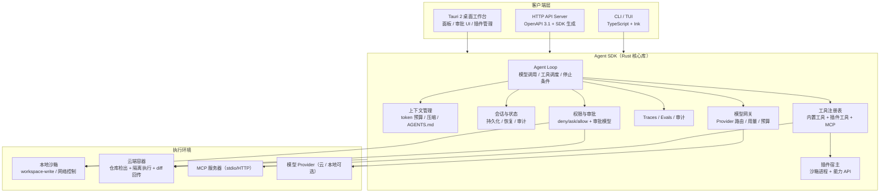
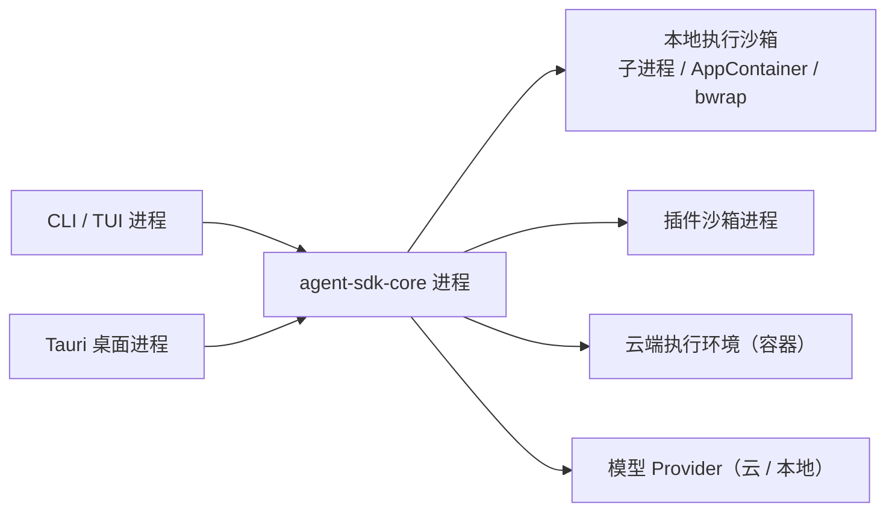
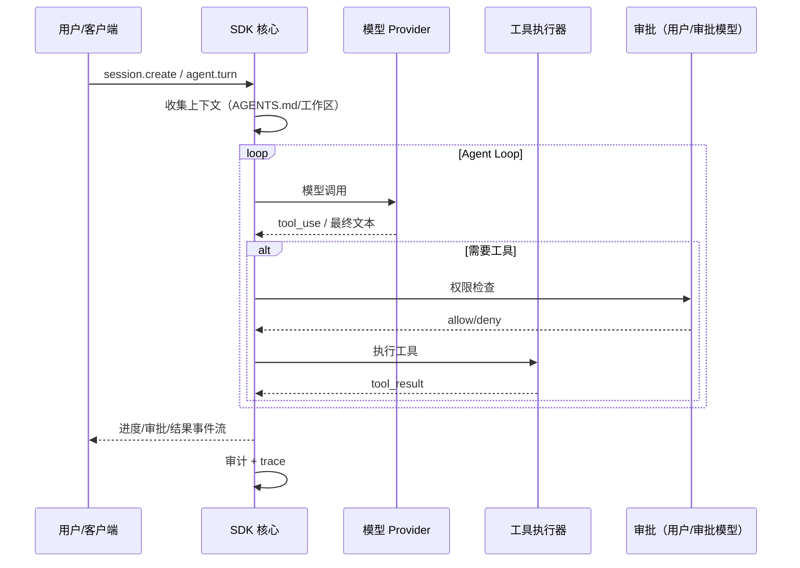
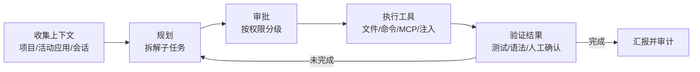
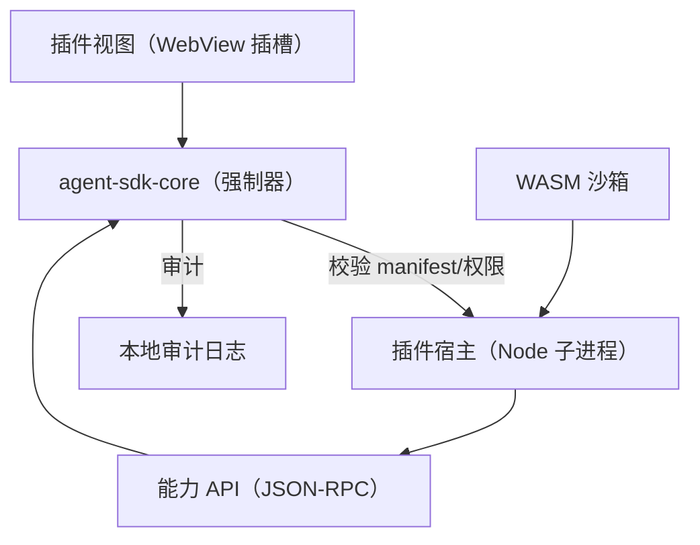
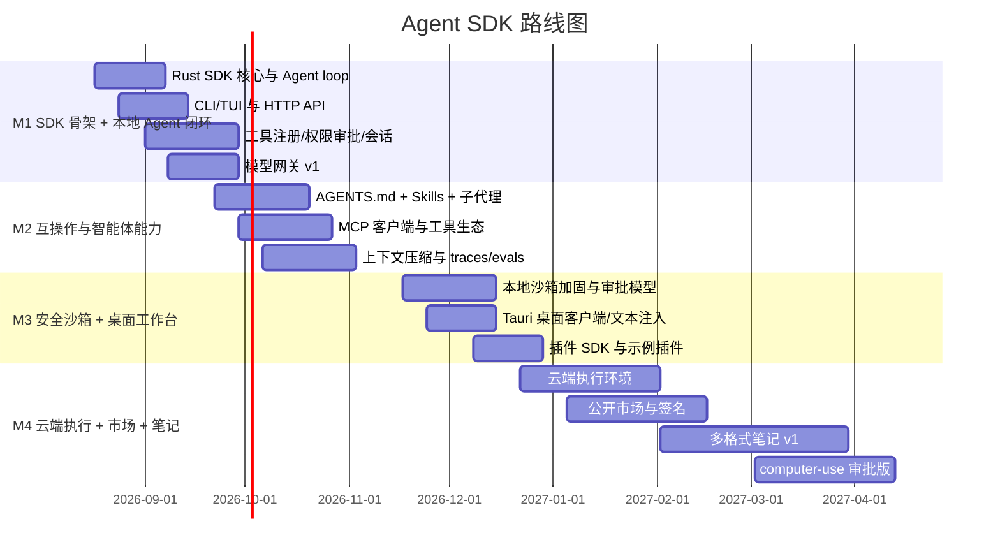

# 技术文档：Codex 式 Agent 智能体 SDK 与桌面工作台

> 版本：v0.4（已合并《技术文档-AI智能体输入法-v0.4续写计划.md》，D17–D26 已确认）  
> 日期：2026-08-12  
> 状态：核心决策已锁定；P1 桌面端 / P2 全域感知 / P3 操作学习已进入实现并持续迭代  
> 读者：产品与工程团队、SDK 开发者、插件生态开发者

> 📌 **v0.4 范围说明（2026-08-12）**：在 v0.3 Agent SDK 基础上新增三条主线——
> **Codex 式桌面主客户端**（任务/审批/diff/技能中心/感知状态/自动化）、**全域情景感知**
>（L0 事件 / L1 界面 / L2 视觉 / L3 语义四层）与**操作学习**（示范学习 + 受限自主探索双轨、
> 动作图、流程技能包、主动建议）。输入法融合仍为 v0.5+ 占位，D5–D7 维持“不实施”。

> ⚠️ **范围修订（v0.3，2026-08-11）**：本文件**只实施 Agent 智能体方案，并按 Codex 式 Agent SDK 路线开发**。
>
> - 产品形态：**Agent 智能体 SDK + 桌面工作台**（CLI/TUI、HTTP API、Tauri 桌面客户端三种客户端形态），不是输入法。
> - 实施范围：Agent SDK 核心（执行循环/工具注册表/上下文管理/会话/权限审批/审计）、模型网关、MCP + Skills + 子代理、本地沙箱执行 + 可选云端执行、插件 SDK 与沙箱、文本层桌面控制、评估与可观测（traces/evals）、设置与诊断。
> - **输入法路线不再计入技术路线**：Windows TSF / macOS IMK 壳、librime/Rime 二次开发（D6）、LLM 候选/改写/斜杠命令（D7）、真输入法注册（D5）均不实施；文档中与此相关的内容仅保留为背景，不作为实施依据。
> - 实现参照：OpenAI Codex（本地 CLI + 云端容器 + 审批式安全 + AGENTS.md + skills/MCP/subagents）、OpenCode（模型无关、客户端-服务端架构）、Claude Code（权限分层 + 独立审批）、OpenAI Agents SDK（SDK 化 agent loop）。

---

## 0. 文档说明

本文档面向**落地开发**，为"Codex 式 Agent 智能体 SDK 与桌面工作台"（以下简称 **Agent SDK / 本产品**）给出产品定义、总体架构、模块设计、公开接口契约、安全与隐私模型、商业模型、路线图与验收标准。输入法相关内容仅作为历史背景保留，不属于实施范围。

约定：

- 文档中标注"已锁定"的决策为规范性结论，实现时不得自行更改；如需变更，必须回到决策层评审。
- 标注"v2 开放"的事项属于后续阶段，不阻塞 v1 实现。
- 所有性能预算均以"参考硬件基线"为准（见 3.3），验收以 p95 分位计。
- 竞品数据截至 2026 年 8 月，来源见附录 A；第三方口径数据（如厂商延迟、营收估算）在正文中标注来源。

---

## 1. 摘要与产品定位

### 1.1 一句话定位

**面向开发者的 Agent 智能体 SDK + 桌面工作台：把"模型对话"变成"可编程、可审计、可扩展的智能体应用"，形态对齐 Codex——SDK 核心驱动本地/云端执行，CLI、HTTP API 与桌面客户端提供入口，AGENTS.md / Skills / MCP / 子代理提供可组合能力；v0.4 起桌面端为主客户端，全域情景感知与操作学习为差异化能力（Agent 不只感知"用户在 VSCode 写代码"，而是理解用户在什么应用、在做什么，并能学习、复用与主动建议电脑操作流程）。**

### 1.2 核心信念

- **Harness 即价值**：模型决定上限，Harness 决定下限；工具注册、上下文管理、权限审批、会话恢复、审计与评估是 SDK 的核心。
- **执行环境双轨**：本地沙箱（workspace-write、网络可控、审批式安全）与云端容器执行（长任务、隔离、可规模化）并存，由 SDK 统一抽象。
- **一切能力可声明、可审批**：工具、插件、网络、文本注入全部声明权限，默认拒绝；审批独立于主 Agent（用户审批 + 可选独立审批模型）。
- **开放生态**：MCP 工具互操作、Agent Skills 开放标准、插件沙箱与公开市场（v2），模型 Provider 无关（BYOK）。

### 1.3 三大价值主张

| 支柱 | v1 | v2 |
|---|---|---|
| Agent SDK 核心 | Rust 核心库：执行循环、工具注册表、上下文管理、会话、权限、审计、traces/evals；CLI/TUI + HTTP API | TypeScript SDK 绑定、可视化工作流、多 Agent 编排 |
| 执行环境 | 本地沙箱执行（文件/命令/MCP/注入），审批式安全；AGENTS.md + Skills + 子代理 | 云端容器执行（Codex Cloud 式）、computer-use 审批版 |
| 工作台与生态 | Tauri 桌面客户端（面板/审批 UI/插件管理）、文本层桌面控制、本地优先数据、插件 SDK | 公开插件市场、多格式笔记、云同步/发布 |
| 多格式笔记 | 仅知识底座（索引、RAG 准备） | Markdown + HTML + 白板/画布的统一文档模型，取代/超越 Obsidian |

### 1.4 目标用户与场景

- **开发者**：用 SDK 或 CLI 做代码任务（改 Bug、补测试、生成 PR 说明、查询代码库），或在自有产品中集成 Agent 能力。
- **内容创作者**：用桌面工作台做网页、PPT/文档写作、翻译/润色长文，并注入到目标应用。
- **知识工作者**：速记、会议纪要、本地知识库检索（v2 笔记工作区）。

典型场景：

1. 开发者用 CLI/TUI 在项目目录执行"给 `parseConfig` 补单元测试"，SDK 读取仓库（AGENTS.md 规则）、生成 diff、请求审批、写入并运行测试。
2. 桌面工作台全局快捷键唤起，读取当前 IDE/浏览器/记事本的只读上下文，Agent 改写选区或生成内容后经文本注入上屏。
3. 长任务（代码迁移、批量重构）提交到云端执行环境，SDK 返回进度事件流，完成后把 diff 带回本地供审阅和回滚。
4. v2：在笔记画布上拖入网页片段、HTML 块和手绘块，Agent 按指令生成并排版整页内容。

### 1.5 已锁定决策清单

| # | 决策点 | 结论 |
|---|---|---|
| D1 | 产品切入 | 只做 Agent 智能体方案：Agent SDK + 桌面工作台（v0.3 范围修订） |
| D2 | 目标平台 | v1 优先 Windows 11 x64 + macOS（Apple Silicon），共享 Rust 核心，无 IME 壳 |
| D3 | 模型部署 | 云端强模型默认（BYOK）；本地模型可选（离线/隐私模式），不做输入候选 |
| D4 | 商业模型 | Obsidian 式：核心免费 + 同步/发布/商业授权收费，无广告 |
| D5 | 输入法形态 | **不实施**（v0.3 范围修订） |
| D6 | 输入引擎 | **不实施**（v0.3 范围修订；不使用 librime/Rime） |
| D7 | 语言范围 | **不实施**（v0.3 范围修订；不涉及拼音输入） |
| D8 | 开源策略 | SDK 与客户端开源（参考 Codex Apache-2.0 / OpenCode 路线），闭源组件仅限可选运行时；最终以法务评审为准 |
| D9 | 桌面控制 | v1 文本层（注入/粘贴/快捷键 + 只读上下文）；v2 完整 computer-use（带权限审批） |
| D10 | 插件市场 | v1 本地插件 SDK + 沙箱 + 权限；v2 公开市场 |
| D11 | 笔记系统 | v2；采用 Markdown + HTML + 白板/画布的多格式文档模型 |
| D12 | 技术栈 | Rust 核心 SDK + Tauri 2 + TypeScript 客户端；CLI 与 HTTP API 先行 |
| D13 | 文档用途 | 落地开发，模块边界、接口、验收标准齐备 |
| D14 | Agent 架构 | 按 Codex 式：Agent loop + 工具注册表 + 权限审批（用户/独立审批模型）+ AGENTS.md + Skills + MCP + 子代理 + traces/evals |
| D15 | 执行环境 | 本地沙箱 + 云端容器双轨，SDK 统一抽象（参考 Codex Cloud / Copilot cloud agent） |
| D16 | 评估 | v1 即建立 evals 与 traces：任务成功率、审批拦截率、成本/延迟预算、回归基准 |
| D17 | 客户端主形态 | Tauri 2 桌面工作台为"Codex 式主客户端"；CLI/HTTP 保持开发者入口 |
| D18 | 内置技能 | 随包内置标准技能包 v1（documents/spreadsheets/pdf/browser 等），遵循 Agent Skills 标准，带权限声明与契约测试 |
| D19 | 用户操作感知 | 全域情景感知：事件层 + 界面层 + 视觉层 + 语义层四层模型 |
| D20 | 语音入口 | 桌面端内置本地优先 STT（默认 SenseVoice-Small）；语音命令先转写确认再执行 |
| D21 | 输入法融合 | 不实施（v0.5+ 路线图占位）；D5–D7 维持"不实施" |
| D22 | 感知强度 | 默认 L0/L1；L2 截图按需采集，环形缓冲不落盘、用后即毁 |
| D23 | 学习模式 | 双轨：用户示范学习（默认）+ 受限自主探索（沙箱 + 任务级审批 + 预算上限） |
| D24 | 主动性 | 允许离线检测重复操作后主动建议；默认仅提示不执行，可一键执行/忽略/永久静默 |
| D25 | 应用范围 | 生产力白名单优先 + 聊天类白名单；游戏只读辅助；未白名单默认只读辅助 |
| D26 | 学习成果 | 流程技能包（SKILL.md + 动作图 + 测试），可查看/编辑/删除/分享 |

---

## 2. 市场与竞品分析

### 2.1 现状综述

工程智能体在 2025–2026 年成为事实上的开发范式：Claude Code、OpenAI Codex、Cursor、OpenCode、Copilot 等把"模型 + Harness"组合成可交付产品，竞争焦点从"模型聊天"转向"Harness 工程"——上下文管理、权限审批、沙箱隔离、会话恢复、评估与可观测。2026 年出现两个明确趋势：**审批从人肉弹窗转向独立模型审批（Auto Mode / Auto-review）**，**互操作从单一产品转向开放协议（MCP、Agent Skills、A2A）**。

### 2.2 工程智能体产品（Harness 范式）

| 产品 | 已公开能力 | 对我们的启示 |
|---|---|---|
| Claude Code | 终端级工程 Agent；skills/hooks/MCP/subagents；分层权限（deny/ask/allow）；2026-03 起 Auto Mode 用独立分类器审每个工具调用 | 审批与主 Agent 分离；上下文压缩与工具输出落盘 |
| OpenAI Codex | 本地 CLI + 云端容器双执行；AGENTS.md 项目规则；sandbox/approval；skills/MCP/subagents；2026-04 起 Auto-review 独立审批越界操作 | SDK 化 agent loop + 云端执行 + 审批式安全的完整参照 |
| OpenCode | 开源、模型无关；TUI ↔ 本地 HTTP server（OpenAPI）；75+ Provider；插件式 agent/权限系统 | "开放 Harness、可替换大脑"的架构蓝本 |
| GitHub Copilot | IDE 内嵌 + 云端 coding agent（远程计算、开 PR） | 云执行的异步任务形态 |
| Cursor | IDE 内嵌 Agent，即时编辑、diff 预览 | 编辑器内审批与 diff 审阅体验 |

结论：产品差异已经从"模型能力"转移到"Harness 完整度"：谁把权限、上下文、会话、评估做扎实，谁就能长期留住开发者。

### 2.3 可复用 SDK 与协议生态（建议直接采用）

| 组件 | 技术要点 | 复用价值 |
|---|---|---|
| OpenCode | 开源 TypeScript 实现；客户端-服务端（HTTP/OpenAPI）架构；agent/权限/会话/工具系统完整 | 架构蓝本；可裁剪为自研 SDK 起点 |
| OpenAI Agents SDK / AgentKit | 官方 SDK 化 agent loop（工具、护栏、handoff、sessions、traces） | 协议与循环语义参照；Agent Builder/Evals 平台 2026-11-30 下线，代码化路线留存 |
| Claude Agent SDK | 与 Claude Code 相同的 loop、权限模式、hooks，Python/TypeScript | 权限与生命周期设计参照 |
| MCP | 工具/资源互操作标准（stdio/HTTP，最新规范含 stateless 方向） | 本产品工具层一律以 MCP 为互操作边界 |
| Agent Skills | 开放标准（SKILL.md + 资源），26+ 平台采纳（Claude、Codex、Copilot、Cursor、Gemini CLI 等） | 技能包跨客户端复用 |
| A2A（Agent-to-Agent） | Linux Foundation 项目，v1.0，150+ 组织生产采用，进入 Azure 等云平台 | v2 跨 Agent 编排 |
| Microsoft CodeAct | 把多步工具调用折叠为可执行代码块，延迟降约 50%、token 降 60%+，Hyperlight 微 VM | 执行效率优化方向（v2 候选） |

结论：**Agent Harness 不需要从零发明协议**。MCP + Skills + A2A 已构成互操作层，自研重点是 Harness 工程本身（权限、上下文、会话、评估）与差异化体验。

### 2.4 Harness 基线（五模块）与 2026 年关键演化

主流产品共有的 **Harness 五模块**（本文档作为 Agent 架构基线）：

1. 上下文收集与管理
2. 任务拆解与规划
3. 代码/文件/命令执行
4. 权限与沙箱管控
5. 结果验证与反馈迭代

工具生态标准为 **MCP（Model Context Protocol）**，Claude Code/Codex/OpenCode 均支持；本产品的插件与工具层一律以 MCP 为互操作边界，技能层遵循 Agent Skills 标准。

2026 年的关键演化：

- **Claude Code Auto Mode（2026-03）**：独立分类器（Sonnet 4.6）审查每个工具调用，不看主 Agent 措辞，防止说服式越权。
- **Codex Auto-review（2026-04，已开源）**：越界操作由独立 Codex agent（GPT-5.4 Thinking）审批，内部部署人审频率降约 200 倍，prompt injection 拦截召回率 99.3%。
- **MCP 规范持续演进**：2025-06-18（OAuth/结构化输入）→ 最新 2026-07-28 版本推进 stateless MCP 与 `server/discover`。
- **Agent Skills 开放标准（2025-12 发布）**：同一技能包可跨 Claude Code、Codex、Copilot、Cursor、Gemini CLI 使用。

### 2.5 插件生态与笔记（商业与安全参照）

- **Obsidian**：核心免费；Sync 约 $4/月（年付）、Publish 约 $8/月、商业授权 $50/人/年；约 7 人团队、零融资，第三方估算 ARR 约 $25M；社区 2700+ 插件、400+ 主题；插件经 `obsidian-releases` PR 审核 + 自动检查入市。
- **Obsidian 的安全教训**：插件**不运行在沙箱中**，拥有完整 Node/Electron 权限（文件、网络、shell），官方文档明确承认无法可靠限制插件权限；安全靠 Restricted Mode、人工审核与用户信任。这是本产品必须从第一天解决的缺陷。
- **Raycast**：本地优先（加密数据库 + Keychain）；扩展跑在**单个子 Node.js 进程**；新增 "Tools" 让 AI 直接调用扩展能力。可作为插件运行时参考。
- **TiddlyWiki**：单 HTML 文件承载数据与代码，无依赖、可移植——证明"HTML 原生笔记"的可行性。
- **Khoj**：可自托管的 AI 第二大脑，RAG + 多后端（GPT/Gemini/本地），可作为知识检索架构参照。
- **本地优先 / 协作**：Yjs CRDT、Lexical/ProseMirror/TipTap 是块编辑器与实时同步的成熟基础。

### 2.6 桌面控制与模拟输入（"Agent 控制工作"）

- **Anthropic Computer Use / OpenAI Operator**：截图感知 → 动作输出（鼠标/键盘），不依赖辅助功能 API；屏幕/DOM 内容被视为不可信输入（需防 prompt injection）。
- **UI-TARS-desktop（字节开源）**：多模态 GUI Agent 栈，CLI/Web/桌面形态，可接 MCP。
- **MCP 桌面控制服务**：`windows-computer-use-mcp`、`pc-control-mcp`（30+ 工具）、`computer-use-mcp`（Rust NAPI）、`macinput`（macOS）、`hypruse`（Wayland）——v2 的 computer-use 可以直接基于/借鉴这些 MCP 服务。
- **Windows 文本注入**：`SendInput`（含 `KEYEVENTF_UNICODE`）、`AttachThreadInput`、剪贴板回退、AutoHotkey 生态。

### 2.7 空白点与机会

1. **模型无关的开放 Agent SDK 仍有空间**：OpenCode 开源但生态刚起步；把"SDK + 安全审批 + 本地/云双执行 + 插件市场"打包成完整产品仍是空白。
2. **安全差距可转化为优势**：主流产品对第三方插件与 MCP 服务器仍缺乏强沙箱与独立审批；本产品的插件沙箱 + 权限声明 + 独立审批模型（Auto-review 式）是结构性卖点。
3. **本地优先 + 云端可选的执行层**：Codex Cloud 证明云执行价值，但本地优先、凭据可控、diff 回传审阅的产品化仍有差异化空间。
4. **多格式笔记**：Obsidian 绑定 Markdown 文件模型；HTML/白板/画布融合文档模型仍是空缺（TiddlyWiki 验证了单文件 HTML，但无现代 Agent/协作能力）。

### 2.8 结论

以"Codex 式 Agent SDK"为价值主体、"安全审批 + 沙箱插件生态"为护城河、"本地/云双执行"为差异化、"多格式本地笔记"为第二曲线，在 Windows/macOS 桌面端构建 Agent 工作台，具备差异化与可行性。开源地基（OpenCode、MCP、Agent Skills、Yjs）齐备，模型端采用 BYOK 不绑定单一 Provider。

---

## 3. 产品定义

### 3.1 v1 功能清单

**必须包含（P0）**

1. **Agent SDK 核心库**：Agent loop（模型调用/工具调度/结果回填/停止条件）、工具注册表（JSON Schema + 实现）、上下文管理（token 预算/压缩/截断）、会话持久化与恢复、审计日志。
2. **权限与审批**：deny/ask/allow 规则（deny 优先）、作用域沙箱（workspace-write）、命令预览、危险命令二次确认、用户审批 + 可选独立审批模型（Auto-review 式）。
3. **模型网关**：统一 Provider 接口（OpenAI-compatible / Anthropic，本地 Ollama / llama.cpp 可选）、流式、工具调用、用量统计、预算上限、BYOK。
4. **执行环境**：本地沙箱执行；可选云端容器执行（仓库检出 → 隔离执行 → diff 回传）。
5. **项目规则与技能**：AGENTS.md 指令注入；Skills（Agent Skills 开放标准）；内置子代理（explorer / worker / 通用）。
6. **MCP 工具生态**：内置 MCP 客户端，支持 stdio/HTTP 服务，工具延迟加载；内置工具集（见 6.2）。
7. **客户端形态**：CLI/TUI、HTTP API server（OpenAPI 3.1，可生成 SDK）、Tauri 桌面工作台（面板/审批 UI/插件管理/文本注入）。
   - **v0.4 桌面工作台升为 P0 主客户端**：任务/会话侧边栏、Markdown 对话与附件、审批条（命令预览/危险二次确认）、diff 审阅与回滚、内置终端（可选）、自动化面板、技能中心（内置 + 流程技能包）、**感知状态区（当前情景摘要 + 感知层级 + 录制指示灯）**、设置与诊断。
8. **插件 SDK（本地）**：manifest + 沙箱 + 权限声明 + 能力 API + 插件管理界面；随包附带 2 个官方示例插件（翻译、剪贴板历史）。
9. **文本层桌面控制**：文本注入（SendInput / CGEvent）、剪贴板读写、安全粘贴回退；**只读上下文**读取（活动窗口标题、当前输入框/选区前后文，需用户授权）。
10. **本地优先数据与设置诊断**：工作区文件夹 + SQLite（会话/审计/用量）；模型、权限、插件配置；日志与健康检查。
11. **评估与可观测**：traces（会话/工具调用/审批/耗时/成本）、evals 基准（任务成功率/成本/延迟）、回归测试集。

**明确不做（v1 范围外）**

- 完整 computer-use（截图理解 + 点击控制）→ v2。
- 公开插件市场与签名分发 → v2。
- 多格式笔记工作区 → v2（v1 只做知识索引底座）。
- 语音输入 → 以插件形式后续提供。
- 移动端 → 未排期。
- 输入法全部能力（TSF/IMK 壳、Rime/librime、拼音输入、LLM 候选）→ v0.3 范围修订明确不实施。

### 3.2 v2 功能清单（方向性，接口预留）

- 云端执行环境正式版：远程容器、凭据托管、任务队列、diff 审阅与回滚。
- TypeScript SDK 绑定与可视化工作流（多 Agent 编排、human-in-the-loop 审批流）。
- 公开插件市场：提交、审核、签名、自动更新、创作者分成。
- 多格式笔记：Markdown + HTML + 白板/画布统一文档模型，Yjs CRDT 协作，RAG 问答。
- 完整 computer-use：截图理解 + 点击/键盘/滚动控制，全局审批与审计，仅限用户显式授权的任务。
- 云同步（加密）与网页发布（Obsidian 式增值服务）。

### 3.3 性能预算（v1 规范性指标）

参考硬件基线：

- Windows：x86_64，16GB 内存，无独立 GPU。
- macOS：Apple Silicon M1，16GB 内存。
- 本地模型（可选）：Qwen3-1.5B GGUF（IQ4_XS）经 llama.cpp/Ollama 推理。

| 场景 | 预算（p95） | 说明 |
|---|---|---|
| Agent 首 token（云端） | < 3s | 由 Provider 网络决定，SDK 不增加显著开销 |
| 工具调度往返（本地） | < 10ms | 工具调用发出到执行器返回 |
| Agent 面板唤起 | < 150ms | 全局快捷键 → 窗口可交互 |
| 文本注入完成（≤200 字符） | < 300ms | 注入到目标应用可见 |
| 核心 IPC 往返 | < 5ms（p95） | 本机 JSON-RPC |
| 会话恢复 | < 200ms | 读取并恢复最近会话可交互 |
| 常驻内存 | < 300MB（不含模型） | 模型进程按需启动/空闲卸载 |
| 插件冷启动 | < 500ms | 沙箱进程加载 manifest 与入口 |
| 上下文压缩 | < 5s（10 万 token 会话） | 后台执行，不阻塞工具调用 |

### 3.4 用户场景示例

1. **命令行任务**：在项目目录运行 CLI，说"给 `parseConfig` 补错误处理和单元测试"，SDK 读取文件、生成 diff、请求审批后写入并运行测试。
2. **桌面注入**：桌面工作台全局快捷键唤起，读取当前 IDE/浏览器选区（用户已授权），Agent 返回 3 个改写版本，选择后直接注入上屏。
3. **云端长任务**：把"迁移整个模块到新 API"提交云端执行环境，Agent 规划 → 请求权限 → 执行 → 返回 diff，用户审阅后可整体回滚。
4. **SDK 集成**：第三方应用调用本产品 HTTP API，创建会话、发起任务、订阅进度与审批事件，在自己的 UI 里完成审批。

---

## 4. 总体架构

### 4.1 设计原则

- **SDK 优先，客户端只是壳**：Rust 核心 SDK 承载 Agent loop、工具、权限、上下文、会话、网关、插件与评估；CLI/TUI、HTTP server、Tauri 客户端只做接入。
- **进程隔离，崩溃不扩散**：SDK 核心、执行沙箱、插件、模型进程相互隔离，通过受限 IPC 通信。
- **本地优先，云端可选**：默认本地执行；云端执行是显式启用的独立环境。
- **一切能力可声明**：插件与 Agent 工具都要声明权限，核心强制校验。
- **审批独立**：审批（用户或独立审批模型）与主 Agent 分离，主 Agent 不能自我授权。
- **可评估**：所有运行都有 trace 与审计，支持回归评估（evals）。

### 4.2 分层架构



### 4.3 进程与部署模型



进程职责：

| 进程 | 职责 | 崩溃策略 |
|---|---|---|
| `agent-sdk-core` | Agent loop、工具、权限、会话、网关、插件协调、存储 | 高可用：自动重启并恢复会话 |
| CLI/TUI | 交互客户端 | 可重建，无状态 |
| Tauri 桌面 | 面板、审批 UI、设置 | 可重建，无状态 |
| 执行沙箱 | 文件/命令执行（隔离） | 隔离销毁，核心不受影响 |
| 插件沙箱 | 第三方代码执行 | 隔离销毁，核心不受影响 |
| 云端执行 | 长任务隔离执行 | 任务可重试/可恢复，diff 可回滚 |

**v0.4 桌面端进程模型**：桌面壳无状态（可重建），`agent-sdk-core` 常驻服务（会话/审计/情景模型/操作学习/主动建议）随桌面端启动拉起、退出回收；全部复用 v0.3 JSON-RPC/SSE 契约，不新增第二套协议。

### 4.4 技术栈选型（D12，唯一结论）

| 层 | 选型 | 理由 |
|---|---|---|
| SDK 核心 | Rust（tokio + serde） | 性能、内存可控、可编译单二进制、跨平台 |
| CLI/TUI | TypeScript + Ink | 参考 OpenCode/Codex CLI；迭代快、生态完整 |
| HTTP API | axum + OpenAPI 3.1 | 多客户端接入，可生成 SDK |
| 桌面壳 | Tauri 2 + React | 常驻后台内存占用低于 Electron；前端生态完整 |
| 执行沙箱 | Windows AppContainer/Job；macOS sandbox-exec；Linux bwrap | OS 级隔离，默认拒绝 |
| 云端执行 | 容器运行时（参考 Codex universal 镜像） | 长任务、隔离、可规模化 |
| 模型网关 | OpenAI-compatible 优先 + Anthropic 原生适配；本地 Ollama/llama.cpp 可选 | BYOK、Provider 无关 |
| 插件运行时 | Node.js 子进程 + WASM isolate | Raycast 同款思路；WASM 承接不可信计算 |
| Agent 互操作 | MCP + Agent Skills | 行业标准，生态丰富 |
| 存储 | SQLite（FTS5 + 向量表）+ 本地文件 | 本地优先、可移植、索引能力强 |
| 文档协作（v2） | Yjs CRDT + Lexical | 块级协作与离线合并成熟 |

### 4.5 IPC 与数据流

- 传输：CLI/桌面客户端 → SDK 核心经本机 HTTP/JSON-RPC（localhost）；SDK 核心 → 执行沙箱经受限管道。
- 鉴权：本机回环 + 会话令牌；插件必须经宿主转发；云端执行使用最小凭据。
- 消息类型：请求/响应/SSE 订阅（Agent 进度、审批请求、流式输出）。
- 数据流基线：
  1. 用户指令 → SDK 收集上下文（AGENTS.md、工作区、活动应用）→ Agent loop 规划 → 权限检查 → 工具执行 → 结果回填 → 验证/汇报。
  2. 越界操作（写/执行/网络/注入）→ 审批请求（用户 UI 或独立审批模型）→ 通过后执行 → 审计。
  3. 长任务 → 提交云端执行环境 → 进度事件流 → diff/产物回传本地审阅。

---

## 5. 模块设计

### 5.1 Agent SDK 核心模块（v1）

#### 5.1.1 组成

1. **Agent Loop**：
   - 标准循环：模型调用 → 解析 `tool_use` → 权限检查 → 执行工具 → 结果回填 → 再次调用，直到模型返回最终文本或触发停止条件。
   - 停止条件：干净结束（无 tool_use）、最大轮数、超时、不可恢复工具错误、用户取消。
2. **工具注册表**：
   - 每个工具 = JSON Schema（模型可见）+ 处理器（harness 调用）；模型只决定"想做什么"，harness 决定"能否做"。
   - 内置工具：files（read/write/search）、shell.exec、git、text.inject、clipboard、web.fetch/search、docs.generate（见 6.2）。
3. **上下文管理**：
   - 作用域：workspace（项目目录）、active-app（只读窗口信息）、clipboard、session。
   - 预算与压缩：默认工作集可按任务配置；接近上限时压缩历史（保留最近工具结果与任务原文），原始记录写入审计日志。
   - 项目规则：支持 `AGENTS.md` / `CLAUDE.md` 风格指令注入（兼容既有生态）；会话启动与关键上下文重建时重读。
4. **会话与状态**：
   - 本地持久化（SQLite/加密），支持恢复、fork、回滚；改动前对目标文件快照。
5. **Skills 与子代理**：
   - Skills：遵循 Agent Skills 开放标准（`SKILL.md` + 资源），运行时按需加载，可热更新。
   - 子代理：内置 explorer（只读探索）、worker（执行修复）、通用子代理；主代理可派生子会话，子会话结果回传父会话。
6. **Traces / Evals**：
   - 每次运行记录 trace（消息、工具调用、审批、耗时、成本）；提供回归 eval 集与成功率/成本报告。

#### 5.1.2 Agent 会话时序



#### 5.1.3 性能与可恢复性要求

- 延迟预算见 3.3；本地工具调度与权限检查禁止网络调用。
- 会话崩溃后自动恢复：重新读取 AGENTS.md、最近审批规则与未完成工具结果。
- 长任务可中断/可恢复；云端任务支持重试与 diff 回滚。

### 5.2 Agent Harness

#### 5.2.1 执行循环



#### 5.2.2 上下文管理

- 作用域模型：workspace（项目目录）、active-app（只读窗口信息）、clipboard、session、note（v2 知识库）。
- 上下文预算：默认 60k token 工作集，可按任务配置；接近上限时自动压缩（保留最近工具结果与任务原文），原始记录写入审计日志。
- 工具输出管理：默认截断阈值（如 25k token），超大可落盘并给模型引用；MCP 工具按需加载，避免全量 schema 占用上下文。
- 项目规则：支持 `AGENTS.md` / `CLAUDE.md` 风格指令注入（兼容既有生态），会话恢复后重读。
- 会话持久化：本地加密存储，可恢复、可 fork、可审计。

#### 5.2.3 权限与审批

| 级别 | 操作 | 策略 |
|---|---|---|
| read-only | 读文件、读上下文、搜索 | 自动放行（作用域内） |
| write | 写文件、改配置 | 默认审批；用户可配置规则自动放行（如仅工作区内、模式匹配） |
| execute | shell 命令、安装、删除 | 每次审批 + 命令预览；高风险命令（sudo/rm -rf/清空剪贴板）二次确认 |
| inject | 文本注入到外部应用 | 审批 + 目标应用白名单 |
| review | 越界操作自动审批 | 可选：独立审批模型（Auto-review 式）代替用户弹窗；deny 优先，用户可随时接管 |

- 规则求值顺序：deny 优先，其次 allow，最后 ask；作用域外一律 deny。
- 审批独立于主 Agent：独立审批模型只读用户意图、安全策略与待审动作，不读取主 Agent 的中间推理文本（防说服/注入）。
- 权限可热撤销；撤销后插件与工具立即失效。

### 5.3 模型网关

- Provider 抽象：`openai`、`anthropic`、`ollama`、`llama.cpp` 四类原生适配，其余走 OpenAI-compatible。
- 路由策略（唯一结论）：
  - `agent`：云端强模型默认；本地模型作为离线/隐私模式。
  - `planning` / `explore`：可配置快速模型（成本/延迟优先）。
  - `summarize`（上下文压缩）：快速模型，成本优先。
  - `rag`（v2）：本地 embedding 默认。
- 能力：流式、工具调用、视觉（v2 computer-use）、语义缓存、用量统计、预算上限。

### 5.4 文本层桌面控制（v1）

1. **文本注入**：Windows 用 `SendInput`（优先 `KEYEVENTF_UNICODE`），macOS 用 `CGEventKeyboardSetUnicodeString`；失败回退剪贴板粘贴。
2. **只读上下文**：活动窗口标题/App ID/输入框或选区前后文（经辅助功能 API、剪贴板或系统级文本接口获得）；读取必须弹权限，且默认最小化。
3. **全局快捷键**：系统级注册，冲突检测，可配置；用于唤起工作台与执行常用命令。
4. **能力边界（v1 规范性）**：不做截图理解、不做鼠标点击、不做按键宏录制；这些属于 v2 computer-use。

### 5.5 插件系统（v1 SDK，v2 市场）

#### 5.5.1 架构



#### 5.5.2 安全设计（对比 Obsidian）

| 维度 | Obsidian（现状） | 本产品（v1） |
|---|---|---|
| 执行环境 | 插件直跑 Electron 主/渲染进程 | 独立子进程 + WASM isolate |
| 文件系统 | 无限制 | 仅声明作用域，经能力 API |
| 网络 | 无限制 | 仅 allowlist 域 |
| 系统能力 | shell/原生模块可用 | 默认禁用，逐项授权 |
| 权限 | 不可限制 | manifest 声明 + 核心强制 + 运行时提醒 |
| 更新 | 无签名验证 | v2 签名 + 校验 + 回滚 |

#### 5.5.3 v2 市场治理

- 提交：源码/构建物 + manifest → 自动静态扫描（依赖、危险 API、网络域）→ 人工抽查。
- 分发：签名包、自动更新、最低版本校验、回滚。
- 治理指标：恶意率、更新失败率、用户评分；开发者仪表板。

### 5.6 笔记系统（v2 多格式文档模型）

- **统一文档模型**：文档 = 块树（block tree）。块类型 v1.0：段落、标题、列表、代码、表格、图片、文件、引用、**HTML 嵌入块**、**画布块（白板/手绘/便签）**、AI 生成块。Markdown、HTML、白板都是同一文档的**视图/渲染器**，不是互相转换的孤立格式。
- **持久化**：本地文件夹 = 工作区；每个文档一个目录（`doc.json` + 资源文件），外部保留 `index.db`（FTS5 + 向量）。
- **协同**：Yjs CRDT；离线本地副本权威，服务器仅做中继（v2 同步服务）。
- **AI 集成**：RAG 检索（本地 embedding）→ Agent 可引用笔记、生成 HTML/画布内容、按指令排版。
- **与 Obsidian 的关系**：保留 Markdown 导入导出，保证用户可迁移；但文档模型以块 + 多渲染器为核心，突破"笔记只能是 md 文件"。

### 5.7 存储、索引与同步

- 目录布局（唯一结论）：
  - `<workspace>/notes/`：v2 文档库
  - `<workspace>/plugins/`：本地插件
  - `<workspace>/settings.json`：用户配置（含模型、权限规则）
  - `<appdata>/index.db`：SQLite 索引（FTS5 + 向量 + 审计）
  - `<appdata>/sessions/`：会话持久化（加密，可恢复/fork）
  - `<appdata>/models/`：本地模型缓存（可选）
- 同步（v2 增值）：端到端加密，服务端仅中继密文；用户可完全关闭。

### 5.8 全域情景感知（v0.4 D19/D22）

**分层感知模型**：

| 层 | 感知内容 | 实现 | 默认状态 |
|---|---|---|---|
| L0 事件层 | 前台应用、窗口标题、剪贴板变化（掩码） | OS API（Windows GetForegroundWindow / GetClipboardSequenceNumber） | 开（最小） |
| L1 界面层 | UI 元素树（角色/名称/类名语义锚点） | Windows UI Automation | 开（白名单应用按授权） |
| L2 视觉层 | 屏幕截图 + 本地 OCR 摘要 | GDI BitBlt + Media.Ocr | 仅任务时临时采集 |
| L3 语义层 | "正在做什么"的任务假设 | 本地推理（小模型） | 本地，不进审计 |

**情景快照（Situation Model）**：结构化 JSON（前台应用、权限级别、UI 上下文、掩码内容引用、任务假设、最近动作、截图元数据），由核心统一组装；消息/文档内容默认掩码，只以最小片段存在；L2 截图仅内存环形缓冲（最多 5 帧），任务结束即毁。

**感知管线**：事件源（OS/无障碍/IDE/浏览器/剪贴板/麦克风）→ 归一化去重 → 情景融合 → 情景模型 → 按任务最小上下文组装 → Agent loop；操作后回写状态验证。感知异步，不阻塞主流程。

**隐私边界**：默认只开 L0/L1；L2/L3 逐项授权并热撤；截图不进审计/学习样本；聊天内容仅会话级授权且掩码；审计记录"用了什么上下文"而非全量内容；数据出境开关沿用 7.5。

**实现状态（2026-08-12）**：L0 前台/剪贴板、L1 UIA 树、L2 截图 + OCR 摘要已实现并接入 `context.snapshot` / `perception.events` / `perception.capture` / `perception.layers`。

---

## 6. 公开接口定义（v1 契约）

### 6.1 插件 SDK

#### manifest.json（唯一结论）

```json
{
  "id": "com.example.translate",
  "name": "Translate Helper",
  "version": "1.0.0",
  "minAppVersion": "0.3.0",
  "author": "Example Dev",
  "permissions": [
    "context:read",
    "clipboard:read-write",
    "text:inject",
    "network:fetch:https://api.example.com/*"
  ],
  "entry": "dist/main.js",
  "views": [
    { "id": "translate-panel", "type": "panel", "slot": "agent-sidebar" }
  ],
  "tools": [
    {
      "name": "translate_text",
      "description": "把输入文本翻译为目标语言",
      "inputSchema": {
        "type": "object",
        "properties": {
          "text": { "type": "string" },
          "target": { "type": "string" }
        },
        "required": ["text", "target"]
      }
    }
  ]
}
```

配套 `versions.json`：插件版本 → App 最低版本映射，不兼容时自动选择兼容版本或阻止更新。

插件 = **工具 + 视图 + Skills 资源包**：`tools` 注册 Agent 可调用工具；`views` 渲染到工作台插槽；技能资源遵循 Agent Skills 开放标准（`SKILL.md`），可跨客户端复用。

#### 生命周期

`onLoad(ctx)` → `onUnload()`；`ctx` 仅暴露能力 API 封装，无 Node 全局、无 `process`、无 `fs`、无 `net`。

#### 能力 API（JSON-RPC，v1）

| 方法 | 所需权限 | 说明 |
|---|---|---|
| `context.read` | `context:read` | 读取活动应用/会话/笔记的只读上下文 |
| `clipboard.read` / `clipboard.write` | `clipboard:read-write` | 剪贴板读写 |
| `text.inject` | `text:inject` | 向用户确认的目标应用注入文本 |
| `files.read` | `files:read:<scope>` | 仅声明目录内读取 |
| `network.fetch` | `network:fetch:<allowlist>` | 仅 allowlist 域名 |
| `ui.view` | 视图声明 | 渲染插件视图到指定插槽 |
| `agent.tool.register` / `agent.tool.call` | `agent:tools` | 注册/调用 Agent 工具 |
| `settings.get` / `settings.set` | `settings`（命名空间） | 插件私有配置 |

### 6.2 Agent 工具层（v1 内置工具 + MCP）

| 工具 | 权限级 | 说明 |
|---|---|---|
| `files.read/list/search` | read-only | 工作区作用域 |
| `files.write/rename/delete` | write + 审批 | 工作区作用域，可回滚 |
| `shell.exec` | execute + 审批 | 命令预览、危险命令二次确认 |
| `git.status/diff/commit` | execute + 审批 | 非交互命令 |
| `mcp.connect` | 用户确认 | stdio/HTTP MCP 服务器接入 |
| `text.inject` / `clipboard` | inject | 文本层控制 |
| `docs.generate` | write | 生成 Markdown/HTML/PPT 草稿（模板引擎） |
| `web.search` / `web.fetch` | network（用户开关） | 经 MCP 或内置提供 |
| `notes.*` | v2 | 知识库检索与写入 |

### 6.3 Agent SDK 核心协议（v1 契约）

JSON-RPC 2.0（本机 HTTP + SSE 订阅），由 SDK 核心本地服务暴露；CLI/TUI、桌面客户端与第三方应用统一走该协议。

| 方法 | 请求关键字段 | 响应/事件 |
|---|---|---|
| `session.create` | `workspace`, `agent?`, `model?`, `rules?` | `sessionId`, `resumeToken` |
| `session.resume` | `sessionId` | 恢复上下文摘要 |
| `session.fork` | `sessionId`, `messageId?` | 子会话 |
| `agent.turn` | `sessionId`, `prompt`, `attachments?` | 流式事件：`progress` / `tool_use` / `tool_result` / `permission_request` / `final` |
| `agent.abort` | `sessionId` | ok |
| `tool.call` | `sessionId`, `tool`, `input` | `result` / `error`（工具实现侧调用） |
| `permission.respond` | `requestId`, `allow` / `deny`, `remember?` | ok |
| `session.diff` | `sessionId` | 改动文件 diff 列表 |
| `session.revert` | `sessionId`, `messageId?` | 回滚到指定点 |
| `eval.run` | `suiteId` | 成功率/成本/延迟报告 |

事件为 SSE 流式下发；审批请求为独立事件，不占用工具调用队列。会话默认 TTL 900s，可配置；长任务支持断线重连续跑。

### 6.4 模型网关 Provider 接口

```ts
type ProviderKind = "openai" | "anthropic" | "ollama" | "llama.cpp";

interface ProviderConfig {
  id: string;
  kind: ProviderKind;
  kindLabel: "cloud" | "local";
  baseUrl?: string;
  model: string;
  apiKeyRef?: string; // 引用钥匙串/系统凭据，不落盘明文
  limits: { maxTokens: number; rpm?: number };
  capabilities: Array<"chat" | "stream" | "tools" | "vision">;
}

interface ModelRequest {
  task: "agent" | "planning" | "explore" | "summarize" | "rag";
  sessionId?: string;
  messages: Array<{ role: string; content: string | Array<unknown> }>;
  tools?: unknown[];
  temperature?: number;
  maxTokens?: number;
  budget?: { maxCostUsd?: number; maxTpm?: number };
}

type ModelResponse =
  | { kind: "complete"; provider: string; model: string; usage: Usage }
  | { kind: "stream"; provider: string; model: string; deltas: AsyncIterable<string> };
```

路由表（唯一结论）：

| task | 首选 | 回退 | 缓存 |
|---|---|---|---|
| `agent` | 云强模型 | 本地（离线/隐私模式） | 工具结果去重 |
| `planning` / `explore` | 可配快速模型 | 同左 | 计划缓存 |
| `summarize` | 快速模型 | 本地 | 按会话哈希 |
| `rag` | 本地 embedding | 云 embedding | 分块哈希 |

### 6.5 操作学习（v0.4 D23/D24/D26）

**双轨学习**：

- **A 轨示范学习（默认）**：观察用户操作的结构化轨迹（窗口/UI 语义锚点/掩码输入/结果状态，不录屏）→ 泛化（具体值抽象为变量与语义锚点）→ 沙箱或用户确认试跑 → 沉淀流程技能包 → 首次执行必审批，自动复用仅限高置信且环境匹配。
- **B 轨受限自主探索**：仅显式开启，限沙箱/测试应用或生产力白名单 + 任务级审批；动作预算（次数/时长）、越界熔断、全程审计；低置信结果不自动执行。
- 敏感面（密码/支付/验证码）在任何轨熔断：不学习、不记录、不执行。

**动作图（Action Graph）**：节点 = 语义锚点 + 动作类型（click/type/shortcut/inject）+ 变量模板 + 验证步骤；边 = 前置条件 + 验证；UI 漂移连续失败标记失效，不静默重试。

**流程技能包**：`SKILL.md + graph.json + manifest.json（targetApps/permissions/variables/sensitivity）`，与内置技能包同构；分享为单文件 `.owskill`（ZIP），导入按 schema → 权限白名单 → 敏感度必填 → 目标应用 → 沙箱回放顺序校验。

**主动建议（D24）**：本地离线检测重复操作（同应用 + 相似动作序列，阈值可配），仅提示不执行；学习/执行一次/忽略/静默四选；24h 频控、全屏/游戏自动静默、忽略 2 次自动静默 30 天。

**新增接口（v1 契约草案）**：`context.snapshot`、`perception.subscribe`、`perception.capture`、`perception.layers`、`learn.record/pause/resume/stop/clear/status`、`learn.sink/packages/export/import`、`learn.execute`（confirm + high_risk_ack）、`skill.verify`、`proactive.suggest/observe/decide`、`whitelist.manage`。

**实现状态（2026-08-12）**：录制/泛化/沉淀、动作图执行引擎（UIA + SendInput）、执行审批与审计、主动建议引擎、.owskill 分享、桌面录制/执行 UI 均已实现。

---

## 7. 安全与隐私模型

### 7.1 原则

1. **最小权限**：默认拒绝，逐项授权，随时撤销。
2. **本地优先**：会话、笔记、索引默认不出本机；云执行与云模型是显式开关。
3. **不可信输入**：屏幕、DOM、网页、MCP 服务器、模型输出一律视为不可信，需经能力门控。
4. **审批独立**：审批（用户或独立审批模型）与主 Agent 分离；独立审批模型不读取主 Agent 推理文本。
5. **可审计**：Agent 动作、审批决策、插件调用、模型请求均写本地审计日志，并生成 trace。

### 7.2 插件沙箱（v1）

- 独立子进程，禁用 `fs`/`net`/`child_process`/`process` 敏感面；一切 I/O 经能力 API。
- WASM isolate 承接不可信计算，宿主与 WASM 之间仅结构化数据。
- 权限在核心强制校验，插件 UI 只能渲染到 WebView 插槽，不能逃逸到主界面。
- 安装即提示权限；权限可热撤销；撤销后插件立即失效。
- 越界自动审批（可选）：独立审批模型审查待审动作，deny 优先；审批记录进入审计日志。

### 7.3 computer-use 审批（v2）

- 任务级审批：用户先批准"目标应用 + 任务描述 + 最长时长 + 允许动作"。
- 会话级隔离：测试优先在虚拟机/沙箱应用内执行；审计记录截图前后状态。
- 熔断：检测到密码框、支付框、开发者模式外操作时自动暂停并要求人工接管。

### 7.4 Prompt Injection 防护

- 模型读取的网页/DOM/屏幕文本都标记为不可信区域；指令与内容分区。
- 输出校验：注入文本前过滤控制字符与危险快捷键序列。
- 插件网络响应不可直接触发工具调用，必须经工具结果白名单。

### 7.5 数据出境开关

- 设置页提供"云能力总开关"与逐 Provider 开关；关闭后 Agent 只能使用本地模型或直接拒绝需要云模型的任务。
- 云端请求默认只发送任务所需最小上下文（如仅工作区相关文件与当前选区），并展示"本次发送内容预览"。

### 7.6 情景感知隐私边界（v0.4 D19/D22）

- 默认只开 L0/L1；L1/L2/L3 逐项授权、随时热撤；桌面端常驻显示当前感知层级。
- L2 截图：按需采集 + 内存环形缓冲（≤5 帧）不落盘，任务结束即毁；不进审计、不进学习样本，除非用户显式导出。
- 聊天类应用：消息内容默认掩码，仅会话级授权后作为任务上下文；任何发送动作有预览 + 审批。
- 录制指示灯：常驻显示"正在学习/未学习/已暂停"，一键暂停并删除本次样本；学习样本默认本地加密、可清空。
- 行为记录与审计分离：审计记录"用了什么上下文"，不记录全量内容。

---

## 8. 商业模型（Obsidian 式，D4）

### 8.1 免费核心（永久免费）

- Agent SDK 核心、CLI/TUI、桌面工作台、本地 Agent 任务、插件运行时、本地笔记（v2）、本地知识检索。
- 用户自带模型 Key（BYOK）零抽成；插件市场开放，无平台抽成（Obsidian 模式）。

### 8.2 增值付费（v2 起）

| 服务 | 建议定价（默认值，商务参数可后续调整） | 说明 |
|---|---|---|
| Sync 云同步 | ¥28/月（年付） | 端到端加密跨设备同步 |
| Publish 发布 | ¥58/月（年付） | 笔记/文档发布为 HTML 站点 |
| 商业授权 | ¥360/人/年 | 公司/团队使用授权 |
| 云模型中继 | 按用量 | 无 Key 用户的可选代付通道，非必须 |
| 云端执行额度 | 按用量（v2 起） | 云端容器执行时长与算力计费，本地执行始终免费 |

### 8.3 生态策略

- v1：SDK + 沙箱 + 示例插件，建立开发者信任与"安全插件"品牌。
- v2：公开市场 + 审核 + 签名 + 更新；优先扶持生产力类插件（翻译、剪贴板、PPT 模板、网页脚手架）。
- 冷启动：内置 2 个官方示例插件；开源示例 SDK 与插件仓库（SDK 与客户端开源，闭源组件仅限可选运行时，D8）。

---

## 9. 路线图与验收标准



### M1：SDK 骨架 + 本地 Agent 闭环（约 8 周）

交付：Rust SDK 核心库（Agent loop / 工具注册表 / 上下文管理 / 会话 / 权限 / 审计）、CLI/TUI、HTTP API server（OpenAPI 3.1）、模型网关 v1（OpenAI-compatible + Anthropic）、内置工具（files/shell/git）、用户审批、会话持久化。

验收标准：

- CLI 完成"读文件 → 改文件 → 运行测试 → 审批 → 审计"最小闭环；20 次样例端到端成功率 ≥ 80%（真实模型）。
- 未授权目录访问被拒绝且产生审计记录；危险命令有预览与二次确认。
- HTTP API 全通：`session.create / agent.turn / abort / permission.respond / diff / revert`；可从 OpenAPI 生成 SDK。
- IPC p95 < 5ms；面板唤起 p95 < 150ms（参考硬件）。
- MCP stdio 服务接入成功（至少一个第三方 MCP）。

### M2：互操作与智能体能力（约 12 周）

交付：AGENTS.md 规则注入、Skills 加载与热更新、内置子代理（explorer/worker/通用）、MCP stdio/HTTP、上下文压缩、traces 与 eval 回归集。

验收标准：

- 同一 AGENTS.md 规则在会话恢复后仍生效；Skill 可热加载且不重启会话。
- 子代理完成探索任务并回传结果；上下文压缩后关键规则不丢失（回归用例覆盖）。
- eval 集 ≥ 20 个任务，成功率/成本/延迟可报告；trace 可回放。
- MCP 工具延迟加载生效：大 schema 服务不显著占用上下文。

### v0.4 路线图修订（2026-08-12，按《v0.4续写计划》重排）

| 阶段 | 内容 | 状态 |
|---|---|---|
| M3 桌面端 + 技能包 | Tauri 桌面主客户端（任务/审批/diff/技能中心/感知状态/自启/便携打包）；内置 documents/spreadsheets/pdf/browser 技能包与契约门禁 | 已实现：Web 工作台 + Tauri 壳、四技能端到端门禁、便携 zip、开机自启 |
| M4 全域感知 + 语音 | L0 事件（前台/剪贴板掩码）、L1 无障碍 UI 树、L2 按需截图 + OCR 摘要、本地 STT（SenseVoice-Small/sherpa-onnx）、语音入口 | 已实现（STT 真实推理验证通过；WER 基线待真实语音样本） |
| M5 操作学习 + 主动建议 | 示范学习/受限探索双轨、动作图执行引擎、流程技能包（沉淀/校验/分享/.owskill）、执行审批与审计、主动建议四选 | 已实现（桌面闭环 UI；自动观察待桌面会话实机验证） |
| M6 输入法融合（占位） | TSF/IMK 壳 + librime 复用 + 三档交互 | 不实施；前置条件评审后再启动 |

原 M3/M4 小节（OS 沙箱加固、云执行、公开市场、多格式笔记、computer-use）在 v0.4 路线中顺延为 v1 增强或 v2 项，详见 3.2。

### M3：安全沙箱 + 桌面工作台（约 8 周）

交付：本地沙箱加固（AppContainer / bwrap / 网络控制）、审批模式（用户 + 可选独立审批模型）、Tauri 桌面工作台（面板/审批 UI/插件管理/文本注入）、插件 SDK v1 + 2 个官方示例插件。

验收标准：

- 沙箱越界（写工作区外、访问网络、读未授权上下文）被 OS 级阻止；恶意样例测试通过。
- 独立审批模型对 prompt injection 样例拦截率 ≥ 95%（内部样例）；审批记录完整可审计。
- 桌面工作台完成"改写剪贴板并注入"端到端成功率 ≥ 95%（20 次重复）。
- 插件可注册 Agent 工具并被 Harness 调用；工具失败不影响核心。
- 热卸载/权限撤销立即生效；冷启动 p95 < 500ms。
- 示例插件（翻译、剪贴板历史）在 Win/macOS 双平台通过。

### M4：云端执行 + 公开市场 + 多格式笔记 + computer-use（约 14 周起）

交付：云端执行环境（仓库检出 → 隔离执行 → diff 回传）、公开市场（提交/审核/签名/更新）、多格式笔记 v1（MD+HTML+画布，Yjs）、RAG、computer-use 审批版、Sync/Publish。

验收标准：

- 云端任务成功把 diff 带回本地并可 revert；凭据不落盘、任务间隔离、审计完整。
- 100 份混合文档 MD↔HTML↔画布往返，零数据丢失断言通过；Yjs 双端离线合并无冲突丢块。
- 市场安装 → 签名校验 → 自动更新 → 失败回滚全链路通过；恶意包被静态扫描拦截。
- computer-use 在沙箱测试应用内完成"打开应用→输入→保存"，全程审批 + 审计；密码框触发熔断暂停。
- RAG 在 500 篇测试语料上 top-5 召回 ≥ 0.8（本地 embedding）。

---

## 10. 风险与缓解

| 风险 | 等级 | 缓解 |
|---|---|---|
| Agent 可用性依赖模型质量 | 高 | BYOK + Provider 无关；v1 锁定 ≥1 个强模型；evals 持续回归 |
| Harness 复杂度被低估（上下文/权限/会话） | 高 | 复用 OpenCode / Agents SDK 架构；先最小闭环再扩展；不重复造协议 |
| 审批可被绕过（GhostApproval 类攻击） | 高 | OS 沙箱 + 独立审批模型 + deny 优先 + 审计；审批与主 Agent 分离 |
| 模型延迟/成本不可控 | 中 | 延迟预算；快速模型路由；语义缓存；预算上限 |
| 插件生态冷启动 | 中 | 官方示例插件 + 开源示例仓库 + 安全品牌；v2 再开市场 |
| 插件安全事件 | 高 | 沙箱 + 权限 + 签名（v2）+ 审计；恶意插件隔离销毁 |
| 云端执行凭据/供应链风险 | 中 | 最小凭据、任务隔离、diff 回传审阅、审计日志 |
| 文本注入兼容性 | 中 | 兼容矩阵收敛到 3~5 个目标应用；剪贴板回退 |
| computer-use 误操作/安全 | 高 | 审批 + 沙箱测试 + 熔断 + 审计（v2） |
| Obsidian/大厂跟进 | 中 | 差异化在"开放 SDK + 安全审批 + 本地/云双执行 + 可插拔插件"的组合，持续绑定生态 |

---

## 11. 后续阶段开放事项（不影响 v1）

- 本地模型深度支持（完整离线模式）：接口已预留，未排期。
- TypeScript SDK 绑定与可视化工作流：v2 候选。
- 语音输入与 OCR：插件化路径，未排期。
- 移动端策略：未排期。
- 定价最终数值：属商务参数，实现以 8.2 默认值为准。

---

## 附录 A：竞品与调研来源

1. OpenAI Codex 官方文档：https://developers.openai.com/codex ；实现仓库：https://github.com/openai/codex
2. OpenAI Auto-review（独立审批模型，2026-04，已开源）：https://alignment.openai.com/auto-review/
3. OpenCode（开源、模型无关 agent，客户端-服务端架构）：https://opencode.ai/docs ；https://github.com/sst/opencode
4. Claude Code 文档（agent loop、权限、skills、hooks、Auto Mode）：https://code.claude.com/docs
5. OpenAI Agents SDK：https://developers.openai.com/agents
6. Model Context Protocol 规范：https://modelcontextprotocol.io
7. Agent Skills 开放标准：https://agentskills.io
8. A2A（Agent-to-Agent）协议进展（150+ 组织、v1.0）：https://www.linuxfoundation.org/press/a2a-protocol-surpasses-150-organizations-lands-in-major-cloud-platforms-and-sees-enterprise-production-use-in-first-year
9. Microsoft CodeAct（可执行代码动作，Build 2026）：https://learn.microsoft.com/agent-framework/agents/code_act
10. AI Harness Engineering（H0–H3 harness 阶梯）：https://arxiv.org/abs/2605.13357
11. GhostApproval（2026-07，审批社会工程漏洞）：https://www.infoworld.com/article/4195275/ai-coding-tool-hole-illustrates-a-big-problem-with-human-in-the-loop-2.html
12. Obsidian 商业模式与生态（Sync/Publish/商业授权）：https://m.36kr.com/p/3755031628005892 ；https://www.stackscored.com/pricing/note-taking/obsidian/
13. Obsidian 插件安全（无沙箱）：https://docs.obsidian.md/Plugins/Plugin+security
14. Raycast 安全模型（子 Node 进程/本地加密库）：https://developers.raycast.com/information/security.md
15. TiddlyWiki（单 HTML 文件）：https://tiddlywiki.com/static.html
16. Khoj（AI 第二大脑/RAG）：https://landscape.jimmysong.io/projects/khoj/
17. Yjs CRDT：https://github.com/yjs/yjs
18. Anthropic Computer Use / OpenAI Operator / UI-TARS-desktop：https://github.com/bytedance/UI-TARS-desktop
19. Windows 桌面控制 MCP：https://www.npmjs.com/package/windows-computer-use-mcp ；https://github.com/Nanonite-crypto/pc-control-mcp
20. Windows 文本注入参考（SendInput/剪贴板回退）：https://learn.microsoft.com/windows/win32/api/winuser/nf-winuser-sendinput

---

## 附录 B：术语表

| 术语 | 含义 |
|---|---|
| Agent SDK | 本产品核心：把模型调用封装为可编程、可审计、可扩展的智能体运行库 |
| Agent loop | 模型调用 → 工具执行 → 结果回填 → 再调用的循环，直到停止条件 |
| Harness | 模型与真实世界之间的运行时层：工具、上下文、权限、会话、验证 |
| 工具注册表 | 工具 = JSON Schema + 处理器；模型可见 schema，harness 执行实现 |
| AGENTS.md | 项目级指令文件，每次会话注入，作为项目长期规则 |
| Skills | Agent Skills 开放标准下的可复用能力包（SKILL.md + 资源） |
| Subagent | 由主代理派生的子会话/子代理，用于探索、执行或并行任务 |
| MCP | Model Context Protocol，模型上下文协议，工具/资源互操作标准 |
| A2A | Agent-to-Agent 协议，跨平台 Agent 通信标准 |
| Auto-review | 由独立模型代理审批越界操作的安全机制（Codex 已开源） |
| 云执行 | 在远端容器/VM 中运行 Agent 任务，结果（diff/产物）回传本地 |
| 沙箱 | OS 级执行隔离（AppContainer / bwrap / sandbox-exec / 容器） |
| Trace | 一次运行的结构化记录（消息、工具、审批、耗时、成本） |
| Eval | 用固定任务集回归评测成功率、成本与延迟 |
| TSF / IMK（背景，不实施） | Windows/macOS 输入法框架，v0.3 后不属实施范围 |
| librime / Rime（背景，不实施） | 开源中文输入法引擎，v0.3 后不使用 |
| CRDT | 无冲突复制数据类型，用于本地优先协作 |
| computer-use | 智能体通过截图理解界面并用鼠标/键盘操作电脑 |
| BYOK | Bring Your Own Key，用户自带模型 API Key |
| local-first | 本地副本为权威数据源，云端仅中继/同步 |
| 情景模型（Situation Model） | 一次情景快照的结构化描述：前台应用、权限级别、UI 上下文、掩码内容、任务假设、最近动作、截图元数据 |
| 感知层（L0–L3） | 事件层 / 界面层 / 视觉层 / 语义层，逐项授权、可热撤 |
| 动作图（Action Graph） | 流程技能包核心：语义锚点 + 动作类型 + 变量 + 验证步骤的图结构 |
| 流程技能包 | 示范学习产物：SKILL.md + graph.json + manifest.json，可查看/编辑/删除/分享 |
| 示范学习 | 用户正常操作时记录结构化动作轨迹并泛化为技能（不录屏） |
| 受限自主探索 | 沙箱/白名单内、带预算与审批的自主试错学习 |
| 主动建议 | 离线检测重复操作后仅提示（学习/执行一次/忽略/静默） |
| 应用白名单 | 生产力/聊天/游戏/其他分级，决定感知层级、可操作性与学习权限 |
| .owskill | 流程技能包单文件分享格式（ZIP） |
