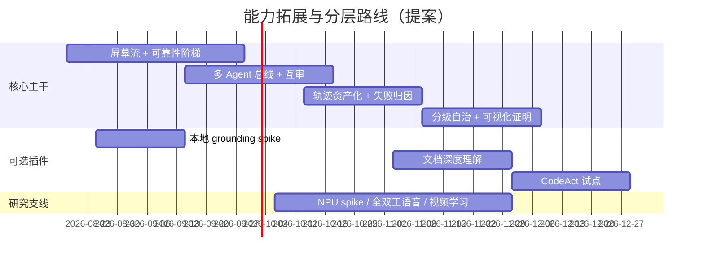

# 技术路线改进方案·能力拓展与功能分层（面向长期生产级应用）

> 版本：v0.1（提案）  
> 日期：2026-08-15  
> 依据：《技术文档-AI智能体输入法.md》v0.6、《技术路线评审与前沿多模态Agent演进-2026-08-15.md》、
> 《技术路线改进方案-面向生产级-2026-08-15.md》，以及 `agent-sdk/` 2026-08-15 代码实测。  
> 状态：提案，供决策评审。不改动已锁定决策 D1–D26；新增决策建议以 D27+（生产化）与 D32+（能力路线）编号登记。  
> 读者：产品/工程负责人、架构评审、SDK/插件生态开发者。

---

## 0. 摘要与定位

三份文档分工（避免一份文档越写越臃肿）：

| 文档 | 管什么 | 比喻 |
|---|---|---|
| 技术文档 v0.6 | 产品与功能基线（决策 + 契约 + 验收） | 宪法 |
| 改进方案·生产级（硬化） | 把现在的系统做稳：安全/韧性/发布/治理 | 消防与体检 |
| 评审与多模态演进（参考） | 路线对不对、下一代往哪走：感知/学习/规划/模型 | 战略研究 |
| **本文（能力拓展与分层）** | 能力往哪加、加在哪一层、凭什么不做：computer-use 定案、多 Agent 通信、生产力功能蓝图 | 规划与立项 |

三条贯穿原则：

1. **核心主干只收"安全边界、跨功能复用、常驻成本可接受"的能力**；其余一律插件/技能包/可选下载。
2. **每项功能必须回答三个问题**：放核心还是插件？默认开还是默认关？验收标准是什么？答不上来就不立项。
3. **不重复立项**：参考文档已给出详细方案的（屏幕流、轨迹工厂、分级自治等），本文只做"采纳关系 + 分层判定"，不复制其设计。

---

## 1. Computer Use 专项评估

### 1.1 现有方案是怎么实现的：原生内化 + 外部运行时混合

**直接结论：本产品的 computer-use 既不是 MCP、也不是纯 Skill，而是把"感知—执行—审批—审计"内化进了 Rust 核心库自身功能，只有两处依赖外部运行时（视觉模型、浏览器驱动）。**

| 环节 | 实现载体 | 证据（`agent-sdk/` 相对路径） |
|---|---|---|
| UI 树感知 | 原生 Rust + Windows UI Automation | `crates/owo-agent-core/src/accessibility.rs` |
| 屏幕/OCR | 原生：Media.Ocr + 本地 ONNX（ch_PP-OCRv4）+ 云 PP-OCRv6 可选 | `ocr.rs` / `onnx_ocr.rs` / `paddle_ocr.rs` |
| 视觉理解 | 外部模型：本地 Ollama 或 BYOK OpenAI-compatible 端点 | `vision.rs:7`（provider=ollama/openai） |
| 多源融合/定位 | 原生：SceneGraph + 加权定位（UIA/OCR/视觉/模板/历史） | `scene.rs` / `locate.rs` / `element_registry.rs` |
| 动作执行 | 原生：UIA InvokePattern 直驱 → SendInput 坐标兜底（带重试） | `executor.rs:409/457/638/814` |
| 动作工具 | 原生工具集：`screen_ocr`/`desktop_click|type|key|shortcut|launch|scroll`/`vision_grounding`/`desktop_wait_until` | `computer_use.rs:876/1186/1619` |
| 审批与熔断 | 原生：任务状态机 + 动作白名单 + 预算 + 敏感 UI 熔断 | `computer_task.rs` / `computer_use.rs:267`（task_gate_check） |
| 权限分级 | 原生：`screen_ocr`=Read、`browser_navigate`=Execute、`desktop_click`=Inject | `permissions.rs:170–221` |
| HTTP 面 | 原生路由 + OpenAPI：`/computer-use/*` + 桌面动作端点可选 task_id 门禁 | `owo-agent-server/src/lib.rs:292–306、1957–1978` |
| 浏览器 | **混合**：原生工具定义 → 派生 Node 子进程（Playwright + 本机 Edge，JSONL stdio） | `computer_use.rs:2086` + `scripts/browser-driver.js` |
| 可测性 | 原生模拟面：SimUiActionSource + owo-sim-qq/browser 确定性 e2e | `computer_use.rs:602` + `sim/` |

MCP 的位置：`mcp.rs` 是 **stdio/HTTP 的 MCP 客户端**（超时、杀进程重连、注册表），用于接入第三方工具生态（含外部的 windows-computer-use-mcp 之类）；**自研的 desktop 控制能力不走 MCP 转发**，MCP 是互操作补充而非实现底座。Skill 的位置：`skills/{documents,spreadsheets,pdf,browser}` 是"程序性知识 + 契约测试"包（如 browser 的 SKILL.md 描述工作流并带 Playwright 测试），**不承载桌面控制实现**。

判定：**"内化成软件本身功能"这一点已基本成立**——感知、执行、门禁、审计、HTTP、UI 面板都在 core/server 内；不成立的剩余部分只有两处：视觉理解受制于外部 VL 模型可用性、浏览器受制于外部 Node/Playwright 运行时。这两处应成为后续"完全内化"的改造目标（1.3）。

### 1.2 效果与质量评估（证据驱动）

**强项（已实测）**：

| 维度 | 证据 |
|---|---|
| 确定性优先 | UIA 语义锚点直驱为主、坐标兜底，不依赖截图猜位置；`screen_ocr` 行文本 + 坐标是主定位源 |
| 真实桌面闭环 | QQ 文本/文件/表情受控发送实测、VSCode 语音改代码 30/30=100%、浏览器搜索/下载闭环（ACCEPTANCE） |
| 审批式安全 | 任务级审批 + 目标应用校验 + 敏感面（密码/支付/验证码）熔断 + 动作预算 + 超时；`computer_use_tests` 11/11 |
| 本地确定性 OCR | ONNX ch_PP-OCRv4 纯 Rust，GDI 渲染已知文本 5/5 LCS=1.00，离屏小字可读 |
| 稳定性工程 | 元素稳定 ID 连续帧 34/34；SendInput 瞬败重试；窗口级后台截图；模拟面回归 2/2 |

**弱项（与参考文档 R2/R4/R6 交叉印证）**：

| 编号 | 弱项 | 代码/验收依据 | 影响 |
|---|---|---|---|
| C1 | 感知是拉取式轮询，无 UIA 事件驱动主链路 | `observe.rs` 部分接入事件，执行链路仍按调用全量抓取 | 每次感知冷启动 200–800ms，v3 预判无数据流 |
| C2 | 融合权重固定、不可学习 | `locate.rs` 固定权重 + 阈值规则 | 长尾界面（自绘/远程桌面/Canvas）要人肉调参 |
| C3 | 视觉只做证据/受限点击，无本地 grounding | `vision_grounding` 需 OCR 交叉验证，纯视觉元素仅置信度≥0.9 才可点 | 无 OCR 的图形界面基本失控 |
| C4 | 无 L1–L4 可靠性阶梯契约与占比监控 | 通道优先级散落在 `executor.rs` 实现里 | 无法量化"多少操作在降级"、无法驱动感知投资 |
| C5 | 无标准 GUI 基准 | evals 是自造 20 任务，未对接 WindowsAgentArena/OSWorld 类基准 | 成功率不可与业界可比 |
| C6 | 浏览器依赖外部 Node/Playwright | `browser-driver.js` 子进程 | 发布面多一个运行时、启动失败面扩大、安全边界复杂 |
| C7 | 工具 schema 未对齐 Anthropic CUA 方言 | 自造 screen_ocr/desktop_click 定义 | 不能直接换插业界 CUA/VLM 模型 |
| C8 | 真实桌面兼容矩阵仍窄 | Notepad/VSCode/QQ/浏览器已通；Office/微信等未系统覆盖 | 通用性承诺不足，只能逐应用收敛 |

**总体结论**：作为"**确定性、可审批、可审计的桌面操作层**"，现有方案质量良好（v0.5 级能力）；作为"**通用多模态 computer-use**"，质量中等——UIA/DOM 覆盖不到、OCR 读不出的图形化长尾界面是天花板。这正好说明参考文档"神经符号混合 C 路线"是对的：保留确定性主干，把视觉 grounding 与学习融合作为增量组件接入，而不是推倒重做。

### 1.3 改进建议与分层

| 建议 | 采纳关系 | 分层 | 验收口径 |
|---|---|---|---|
| 感知推流化（UIA AutomationEvent + 区域增量 OCR 缓存） | 参考文档 2.1.1 | 核心 | 感知查询 p95 <10ms（内存读）；8h soak 无泄漏 |
| 可靠性阶梯契约化 L1 语义直驱→L4 VLM 动作，占比进监控 | 参考文档 2.2 | 核心 | L1 占比 ≥70%（办公/浏览器场景）；L3/L4 占比可观测 |
| Set-of-Marks + computer-use schema 对齐 CUA 方言 | 参考文档 2.7.1 | 核心（schema） | 可换插业界 CUA 模型；不改自研工具语义 |
| 本地 GUI grounding（OS-Atlas/UI-TARS-grounding ONNX） | 参考文档 2.1.3 | 可选插件（模型随包 opt-in 下载） | ScreenSpot 类子集 ≥75%（spike S1 结论先行） |
| 浏览器 aria-ref 化、逐步去 Node 依赖 | 参考文档 2.2 + 本文新增 | 核心（长期） | 目标应用回归不退化；Node 仅作插件运行时 |
| 影子模式预演 + 回滚 | 参考文档 2.5 | 核心 | 高风险工作流首次执行必须预演通过 |
| GUI 基准 harness + owo-sim 任务生成器 | 参考文档 2.7.3/R4 | 核心（测试基建） | 夜间成功率看板；轨迹工厂供学习/混沌测试 |

红线保持：**视觉永远只做证据与受限点击，不做自主控制**（与 5.8 原则、D22 一致）；`inject/write/network` 边界任何等级自治不得低于 supervised（对齐 Q5）。

---

## 2. 多 Agent 通信与并行专项

### 2.1 现状盘点

| 能力 | 现状 | 局限 |
|---|---|---|
| 并行编排 | `goal.rs`：DAG 波次 + `JoinSet` + `max_parallel`（默认 4）+ 重试/replan/恢复幂等/预算 | worker 只能被"父调度器"调用，worker 之间不能互相通信 |
| 子代理 | `subagent.rs`：嵌套会话，深度 ≤2，explorer 只读/通用两种；结果以文本回传 | 同步父子调用，无消息协议、无互审、无共享黑板 |
| 审批 | 所有子代理共用同一 Approver/Policy | 审批上下文不区分"哪个 agent 的哪一步" |

### 2.2 改进：本地 Agent 总线（核心主干）

目标：让"多 Agent 通信并行"从"父调度 + 文本回传"升级为**可寻址、可审计、可取消的结构化协作**，同时保持本地优先与审批独立。

方案要点：

- **消息协议**：结构化消息 `{from,to|topic,kind,payload,correlation_id}`；kind ∈ task/result/review/refusal/progress；语义对齐 A2A 的 Task/Message 思路，但先做本地总线，远端 A2A 到团队协作（v2 末）再接。
- **原语**：
  - `handoff`：结构化交接（任务 + 上下文切片 + 权限沿用），不靠自然语言转录（防信息丢失与注入）；
  - `fan-out/fan-in`：在 `JoinSet` 基础上补**超时、取消传播、部分成功仲裁**（当前 JoinSet 只做限流与合并）；
  - `review`：critic agent 以只读策略评审产出，评审意见回流原作者，最多 N 轮；
  - `blackboard`：共享工作区状态经同一 Policy 门控读写，代替"把中间结果塞进 prompt"。
- **治理**：每个 agent 独立预算（轮次/token/时长）、依赖声明、等待图死锁检测、取消级联、结果验证（断言 + 仲裁者）。
- **可观测**：总线消息全部进 trace（correlation_id 关联父子）、审计区分 agent 身份。

验收标准：

- 并行 fan-out 在超时/单 worker 失败/取消三种场景下无孤儿任务、无死锁、状态可恢复；
- critic 评审样本（报告/代码/diff）与人工结论一致率 ≥ 阈值；评审全过只读权限门禁；
- 消息丢失/重复在崩溃恢复下可检测（correlation_id + 幂等）。

### 2.3 编排模式：核心内置最小集，其余插件

| 模式 | 分层 | 说明 |
|---|---|---|
| explore + worker | 核心（已有） | 只读探索 + 执行修复 |
| parallel-workers | 核心（已有 goal/plan，补齐超时/仲裁） | 数据搬运、批量重构 |
| reviewer-in-the-loop | 核心（新增，默认关） | 高风险产物（合同条款、SQL、对外文案）先互审 |
| debate-arbitrate | 插件（v2） | 多角色辩论 + 仲裁，仅高风险任务按需启用 |
| 领域角色 agent（合规/财务/研究） | 插件包 | 注册进 WorkerRegistry，随插件市场分发 |

---

## 3. 生产力功能蓝图：核心主干 vs 插件分层

### 3.1 分层判据

- **进核心主干**：牵涉安全边界（审批/权限/审计）、被 3 个以上功能复用、常驻成本低（内存/启动/后台任务少）、是"确定性能力"。
- **进插件/技能包**：领域或应用特定、可独立发布更新、不常驻（按需拉起）、第三方可开发。
- **不做/远期**：与"本地优先单用户桌面 Agent"定位错位、合规或工程成本不成比例、与已锁定决策冲突。

避免臃肿的硬约束：核心常驻内存 <300MB（已有预算延续）；插件冷启动 <500ms；内置技能保持最小集（现 4 个），新能力默认 opt-in 下载；面板懒加载；新模块必须先过"三个问题"（0 节原则 2）。

### 3.2 对 16 项参考功能逐项评审

| # | 功能 | 结论 | 分层 | 评审理由与落地 |
|---|---|---|---|---|
| 1 | 意图澄清与目标协商 | ✅ 采纳 | 核心 | 会话层加"目标不明确时反问"回合（字段/范围/输出/成功标准），接 R5 `/intent`；防止盲目执行。反滥用：澄清轮数上限 + 已有信息不重复问 |
| 2 | 元认知自我评估与置信度 | ⚠️ 改造 | 核心（路由触发器） | "自我怀疑式提示"易碎且不可验证；落地为**置信升级触发器**（任务自评低于阈值 → 升级强模型/请求人工），不做领域知识吹嘘 |
| 3 | 世界模型预测性调度 | ❌ 暂缓 | 远期（v3 后） | "精力曲线/预测延期"不可证伪、自动改他人日程有伦理与 ToS 风险；先做日程冲突**检测与提示**，不自动改会 |
| 4 | 长程任务状态管理与断点恢复 | ✅ 采纳 | 核心 | 已列入硬化方案 3.2.3（checkpoint/断点续跑）；补"跨天任务调度器"（复用 automation.rs 定时 + goal 恢复） |
| 5 | 主动建议引擎（机会发现） | ✅ 已有+升级 | 核心引擎 + 插件信号源 | proactive.rs 已实现 D24 四选与频控；H3 升级多信号意图预测，坚持"默认仅提示、分级审批" |
| 6 | 共同创作模式（结对工作） | ⚠️ 改造 | 插件（文档引擎） | 全实时交替编辑成本高；先做"改动联动一致性检查 + 引用/摘要自动刷新"（notes 块树已有基础）；结对编辑 v3 |
| 7 | 认知负荷自适应界面 | ✅ 采纳 | 插件（桌面前端） | 基于日历 + 空闲检测的通知折叠/免打扰；纯前端 + 本地信号，不进 core |
| 8 | 可解释决策链 | ✅ 采纳 | 核心（trace 增强） | trace 已有；补"每步为什么 + 备选方案 + 数据来源"引用与可视化证明（标注框/回放/图表） |
| 9 | 跨应用语义互操作 | ⚠️ 改造 | 插件 + 映射包 | "自动发现本体映射"过度承诺；落地为映射表 + 用户确认 + `.owflow` 数据搬运固化；口径换算做显式公式库 |
| 10 | 可撤销自主操作（沙箱预执行） | ✅ 采纳 | 核心 | 影子模式预演 + diff/影响预览 + 一键回滚；快照/回滚已有基础（session/notes/workflow） |
| 11 | 自我进化与策略优化 | ⚠️ 部分采纳 | 核心（数据闭环）+ v2（策略） | 采纳"执行反馈闭环"（轨迹资产化/失败归因/经验蒸馏——只改元数据不改代码）；"自动改提示词/自动换源"需护栏与可回滚，v2 再议 |
| 12 | 多模态屏幕理解与操作 | ✅ 已部分实现 | 核心 + 可选插件 | 见第 1 章专项评估；补本地 grounding（插件）+ 屏幕流（核心） |
| 13 | 组织知识网络自动构建 | ⚠️ 改造 | 个人版核心、团队版 v2 | 本地知识图（R5 memory_graph 承接）；"主动推送"降级为"检索时联想"，避免打扰 |
| 14 | 多智能体社会（角色化协作） | ⚠️ 部分采纳 | 核心最小集 + 角色插件 | 互审/仲裁进核心（默认关）；"辩论共识"仅高风险任务按需；角色 agent 插件化（见 2.3） |
| 15 | 跨组织安全协作协议 | ❌ 拒绝 | 不做 | 与本地优先单用户产品错位；联邦学习/同态加密的工程与合规成本不成比例；明确边界，防止路线被带偏 |
| 16 | 主动式组织协调 | ❌ 远期 | v4 再议 | 超出个人生产力产品；自动协调他人日程与 D25 白名单哲学冲突；只保留"冲突检测 + 人审建议" |

### 3.3 补充提出（超出 16 项、面向生产力的增量功能）

采纳参考文档 4.x 蓝图并做分层，不重复其细节：

- **核心主干**：屏幕流服务、可靠性阶梯、轨迹资产化 + 失败归因、经验蒸馏（playbook 路线）、思考预算自适应（级联 + 置信升级）、分级自治审批（earned autonomy）、GUI 基准 harness、影子模式、可视化证明、Prompt/前缀缓存。
- **插件/技能包**：文档深度理解（表格 VQA + 版面分析）、CodeAct 试点（沙箱内可 diff/可审计代码动作）、看视频学技能（P2）、移动表面（Android MCP）、领域本体映射包、悬浮球/快捷表面、全双工语音（云起步，本地 Moshi 类 P2）。
- **新增但需守门的功能**（防过度承诺）：跨应用"零配置本体对齐"（降级为映射包）、"agent 自动订酒店/改会议"（只做建议 + 用户确认）、"组织自动协调"（只做检测）。

### 3.4 避免软件臃肿的架构约束

| 约束 | 具体措施 |
|---|---|
| 常驻预算 | 核心常驻 <300MB；感知/模型进程按需拉起、空闲卸载；面板懒加载 |
| 装配最小化 | 内置技能保持 4 个最小集；grounding/VL/STT 模型 opt-in 下载（沿用 download-*.ps1 + 哈希校验） |
| 模块准入 | core 只收"安全/跨功能复用/常驻低成本"；新模块先以 feature flag 进 staged 目录 |
| 插件扩展点 | 统一六类：tool / view / skill / worker / perception-source / grounding-provider；插件市场分级（官方/社区/实验） |
| 版本兼容 | 插件 versions.json 已有；grounding-provider 等新扩展点纳入 schema 与签名校验 |
| 度量 | 常驻内存、冷启动、面板渲染、插件数纳入 /metrics 与发布门禁 |

---

## 4. 对参考文档的批判性复核（分析不合理之处）

**总体判断**：参考文档方向判断基本成立（C 路线 = 神经符号混合，与我方生产化方案不冲突且互补），六个结构性风险有代码证据支撑；但其作为"排期承诺"有四处需要修正，避免把研究假设当既定事实。

| # | 参考文档主张 | 复核结论 |
|---|---|---|
| A | R1 "技能库只会退化不会进化" | 措辞过强：已有健康度降级 + 重录 + 用户确认，是**有限进化**；准确表述是"缺自动执行反馈闭环"。结论方向（引入闭环）仍同意 |
| B | R3 "2026 年 Copilot+ PC 已普及 40+ TOPS NPU" | 普及率与量化 7B grounding 在 NPU 上的实际延迟未经实测；应以 S2 spike 退出标准为准，不预设结论；无 NPU 降级口径先行写入 3.3 |
| C | R4 对接 WindowsAgentArena/OSWorld | 成本被低估：Windows GUI 基准环境搭建、稳定性与真机矩阵是独立工程大项；应**先**把 owo-sim 升级为轨迹工厂（杠杆最高），外部基准第二期再对接 |
| D | 2.6 "断网时文本推理降级可用" | 与现有实测差距大（llama3.2:3b 单工具轮 64.8s、复杂任务超时）；改为"断网可用清单"（感知/OCR/STT/技能回放 100%，文本推理明确为弱降级）更诚实 |
| E | Q5 分级自治红线 | 同意 inject/write 永不 autonomous；但须补**可撤销机制**：等级迁移是显式审批事件，失败/断言缺失即降级（原文已有，强调写进权限模型规范） |
| F | 支线人力与主线并行 | 同意，但必须遵守 AGENTS-COORD 文件认领纪律；R5 已出现 GBK 编码损坏、lib.rs 越界 mod、半成品阻塞全量门禁的前车之鉴，研究支线不得再复制 |

**结论**：参考文档适合作为"方向研究与 spike 选题"，其 Q1–Q6 需决策层拍板；任何一条进入主线排期前，必须通过对应 spike 退出标准或等价证据，防止"研究文档直接变需求"。

---

## 5. 分期与决策点汇总

新增决策点（接续参考文档 Q1–Q6）：

| # | 议题 | 建议 |
|---|---|---|
| Q7 | 多 Agent 总线是否列为 v1 核心 | 是；最小原语（handoff/fan-out/critics/blackboard）+ 审计，debate 等高级模式插件化 |
| Q8 | 浏览器驱动是否内化、移除 Node/Playwright 依赖 | 分两步：先 aria-ref 化并加固子进程边界（H1）；彻底内化视 Windows WebView2 原生驱动 spike 结论（v2） |
| Q9 | L4 VLM 决策动作执行器 | 默认关闭的插件；仅经 S1 spike 与 schema 对齐后提供，不承诺 v1 能力 |
| Q10 | 明确不做边界 | 跨组织隐私计算、组织级自动协调、精力曲线预测式改日程：不实施，写入范围外清单 |

准入规则：以上任一能力进入主线版本，必须满足（1）对应 spike/基准退出标准；（2）与生产化 H1 的 P0 清零不冲突；（3）三个分层问题有明确答案。

---

## 附录：与既有文档的关系

- 本文不修改 D1–D26；与《技术路线改进方案-面向生产级-2026-08-15.md》正交：硬化方案保证"不塌"，本文保证"能力不乱加、加对层级"。
- 与《技术路线评审与前沿多模态Agent演进-2026-08-15.md》的差异：那份给"下一代怎么做"（感知/学习/模型），本文给"每一项能力落在核心还是插件、哪些不做、多 Agent 怎么通信"；两者共同输入主文档 §12 的支柱修订（支柱 6 执行反馈闭环、支柱 7 屏幕流世界模型）。
- 若采纳，建议三份改进文档的结论统一回写主文档：新增"能力分层判据"小节 + 修订 §9 路线图 + 登记 D27+/D32+ 决策。
