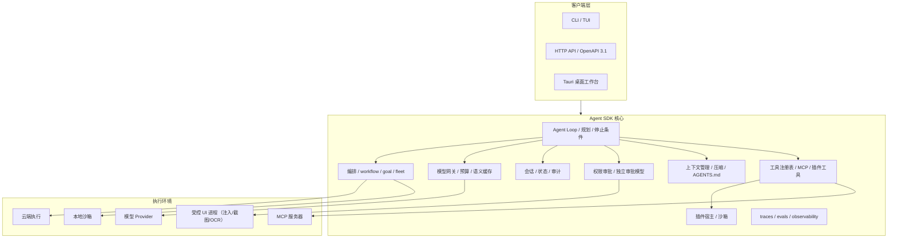

# 综合技术开发文档：OwO Agent SDK 生产级演进总纲

> 版本：v1.0（综合开发文档）  
> 日期：2026-08-16  
> 状态：面向工程实施的单一权威入口；不推翻已锁定决策 D1–D26，新增决策以 D27+ 登记  
> 读者：产品负责人、工程团队、架构评审、安全评审、测试/运维、插件生态开发者

## 0. 文档定位与使用约定

本文档把 `builGoal/` 下已经形成的产品基线、生产化硬化方案、能力分层方案、多模态演进方案和多 Agent 并行方案，收敛为一份**按项目进度逐步推进的综合技术开发文档**。它的作用不是复制各份详细设计，而是：

1. 明确当前基线、目标架构和剩余差距；
2. 把各份文档的详细设计映射为“直接引用 / 摘要并入 / 归档”三类；
3. 给出阶段准入与退出标准，使每个里程碑都能用证据验收；
4. 统一登记决策、风险、SLO 和待办，避免文档漂移。

详细设计的使用原则：

- **直接引用**：详细方案已经完整、可执行且不需要重写，本文只给入口与关键结论。
- **摘要并入**：多个文档存在交叉或重复，本文合并出唯一口径；原文保留作为证据。
- **归档**：结论已经被更高优先级文档或本文吸收，不再作为独立执行依据，原文移入 `builGoal/archive/` 或标记为历史证据。

### 0.1 源文档关系表

| 源文档 | 性质 | 使用方式 |
|---|---|---|
| [技术文档-AI智能体输入法.md](./技术文档-AI智能体输入法.md) | 产品与功能规范性基线，含 D1–D26、架构、契约、验收 | 直接引用：产品定义、模块契约、性能预算、安全隐私模型 |
| [技术路线改进方案-生产级GL-2026-08-15.md](./技术路线改进方案-生产级GL-2026-08-15.md) | 生产级硬化与阶段路线（P1–P12、v0.7→v4） | 直接引用：作为 v0.7/v1.0 硬化主方案 |
| [技术路线改进方案-面向生产级-2026-08-15.md](./archive/技术路线改进方案-面向生产级-2026-08-15.md) | 生产级差距 X01–X22、SLO 速查、GA 门槛 | 摘要并入：X 清单与 SLO 并入本文；原文归档为差距证据 |
| [技术路线改进方案-能力拓展与功能分层-2026-08-15.md](./技术路线改进方案-能力拓展与功能分层-2026-08-15.md) | Computer Use 专项、多 Agent 通信、功能分层 | 直接引用：作为能力准入与分层判据 |
| [技术路线评审与前沿多模态Agent演进-2026-08-15.md](./技术路线评审与前沿多模态Agent演进-2026-08-15.md) | 路线批判、C 路线、研究支线 R1–R4/S1–S5 | 直接引用：作为研究支线与 spike 选题 |
| [多Agent并行体系-生产级设计与跨机扩展-2026-08-16.md](./多Agent并行体系-生产级设计与跨机扩展-2026-08-16.md) | L0–L3 编排内核、跨机多系统扩展 | 直接引用：作为多 Agent 并行主方案 |
| [macOS支持-决策评审-2026-08-13.md](./archive/macOS支持-决策评审-2026-08-13.md) | macOS 顺延 v2 的决策记录 | 归档：结论已并入本文 §3、§7 |
| [输入法融合-前置条件补齐评审-2026-08-13.md](./archive/输入法融合-前置条件补齐评审-2026-08-13.md) | 输入法前置条件状态评审 | 归档：结论已并入本文 §3 与决策登记 |

### 0.2 文档维护规则

- 主文档只保留**规范性内容**：决策、架构、契约、阶段路线、验收口径。
- 滚动状态注、历史测试数量、已修复缺陷列表移入 `agent-sdk/ACCEPTANCE.md` 与 `agent-sdk/CHANGELOG.md`。
- 对外契约变更必须同一 PR 同步代码、`tests/route_contract_tests.rs`、OpenAPI 和 TypeScript SDK 四处。
- 所有新文件保持 UTF-8；不得经 GBK 控制台写入含中文的 `.rs/.md`。

---

## 1. 项目定位与范围

### 1.1 一句话定位

**面向开发者的 Codex 式 Agent 智能体 SDK + 桌面工作台：把“模型对话”变成“可编程、可审计、可扩展的智能体应用”。**

产品形态不是输入法，而是：

- Rust 核心 SDK：Agent loop、工具注册、上下文管理、会话、权限审批、审计、traces/evals；
- CLI/TUI、HTTP API（OpenAPI 3.1）、Tauri 桌面工作台三种客户端；
- 本地沙箱执行与可选云端执行双轨；
- MCP、Agent Skills、AGENTS.md、子代理、插件 SDK 与插件市场；
- 全域情景感知、操作学习、流程技能包（`.owskill`）与工作流（`.owflow`）。

### 1.2 已锁定方向

以下方向不重新讨论，只在本文中登记：

| 决策 | 结论 |
|---|---|
| D1 | 只实施 Agent 智能体方案，不实施输入法 |
| D2 | v1 交付 Windows 11 x64 only；macOS 顺延 v2 |
| D3 | 云端强模型默认 BYOK；本地模型为离线/隐私可选 |
| D5–D7 | 输入法形态、输入引擎、语言范围不实施 |
| D9 | v1 文本层桌面控制；v2 computer-use 审批版 |
| D10 | v1 本地插件 SDK + 沙箱；v2 公开市场 |
| D12 | Rust 核心 SDK + Tauri 2 + TypeScript 客户端 |
| D14 | Codex 式 Agent loop + 工具 + 审批 + AGENTS.md/Skills/MCP/子代理 |
| D15 | 本地沙箱 + 云端容器双执行 |
| D19/D22 | 全域情景感知四层；L2 截图按需采集、环形缓冲不落盘 |
| D23/D24/D26 | 示范学习 + 受限自主探索；主动建议默认仅提示；成果为流程技能包 |

完整 D1–D26 见主文档 §1.5，本文 §9 仅登记新增决策。

### 1.3 北极星与优先级

北极星：**本机服务 SLO 达标、信任边界成立、可安全升级、可逐步跨机扩展**。

优先级顺序固定为：

1. 安全
2. 可靠
3. 功能
4. 生态与体验

任何 P0 阻断项未清零前，不新增面向外部的功能承诺。

---

## 2. 现状基线（2026-08-16）

### 2.1 已完成能力

截至 2026-08-15/16，以下能力已经落地并通过本环境可执行验证：

| 领域 | 已实现 |
|---|---|
| Agent 核心 | loop、工具注册、权限 deny/ask/allow、独立审批 Auto-review、会话 fork/revert、审计、trace/eval 框架 |
| 感知执行 | SceneGraph、多源定位、动作程序解释器、结构化断言、技能健康度、本地 ONNX OCR |
| 桌面 | Web 工作台全面板 + Tauri 壳 + 便携包/NSIS/updater + 自启 |
| 新四线 | notes.rs、plugin.rs（签名/扫描/回滚）、workflow.rs、goal.rs + plan.rs、cloud_exec v0.2 |
| 多 Agent P0 | `fleet.rs`：AgentBus、有界邮箱、Supervisor、Budget、handoff 环检测、fan-out |
| 质量 | fmt/clippy 干净；workspace 测试 487 项历史全绿；路由契约、TS SDK、技能门禁、模拟回归通过 |

### 2.2 当前工作树注意点

- **R5 收尾已完成（2026-08-16，阶段 0 退出标准全过）**：`/team` 等 R5 路由已挂载、`route_contract_tests` 3/3、OpenAPI 173 路径与路由一致、桌面 9 面板挂载、workspace `cargo test` 691 项全绿、fmt/clippy/build/node/gate.ps1/TS SDK 全绿（详见 ACCEPTANCE 五十五节）。
- R6 并行线（多 Agent P0 原语、安全硬化 Wave 1、韧性 Wave 1）已随本轮门禁入库；SSE→observability 指标桥接、OS 级沙箱实证、Windows 凭据库接入为下一轮硬化入口。

### 2.3 成熟度判断

| 维度 | 判断 |
|---|---|
| 功能覆盖 | 领先基线，六线核心 + 桌面全量闭环 |
| 安全 | 策略层强，OS 隔离、密钥库、落盘加密、API 鉴权仍缺 |
| 可靠性 | 测试覆盖好，韧性机制（背压、优雅关闭、恢复演练）不足 |
| 发布工程 | 打包/签名骨架有，CI/CD、版本治理、灰度回滚不足 |
| 平台 | Windows 实机强；macOS 顺延 v2 |

结论：**功能上已是原型向产品的过渡态，生产级硬化是进入 v1.0 前不可省略的阶段。**

---

## 3. 目标架构与技术原则

### 3.1 架构原则

- SDK 优先，客户端只是壳。
- 进程隔离，崩溃不扩散。
- 本地优先，云端可选，数据出境显式开关。
- 一切能力可声明、可审批、默认拒绝。
- 审批与主 Agent 分离。
- 所有运行可 trace、可审计、可回放。

### 3.2 分层架构

### 3.3 进程与部署模型

| 进程 | 职责 | 崩溃策略 |
|---|---|---|
| `agent-sdk-core` | Agent loop、工具、权限、会话、网关、插件协调、存储 | 自动重启并恢复会话 |
| CLI/TUI | 交互客户端 | 可重建、无状态 |
| Tauri 桌面 | 面板、审批 UI、设置 | 可重建、无状态 |
| 本地执行沙箱 | 文件/命令执行 | 隔离销毁，核心不受影响 |
| 插件沙箱 | 第三方代码执行 | 隔离销毁，核心不受影响 |
| 受控 UI 进程 | 文本注入、UIA、截图、OCR 等平台敏感动作 | 最小权限 + 动作白名单 |
| 云端执行 | 长任务隔离执行 | 任务可重试/可恢复，diff 可回滚 |

### 3.4 工程边界：crate 拆分

为解决单 crate 过重、并行协作冲突和编译边界不清的问题，按稳定边界拆分：

| crate | 内容 |
|---|---|
| `owo-types` | 公共错误、DTO、事件枚举、强类型 ID；零 IO |
| `owo-protocol` | JSON-RPC/SSE schema、OpenAPI 片段、版本常量 |
| `owo-store` | SQLite、会话、审计、trace、迁移 |
| `owo-gateway` | Provider 适配、用量、预算、语义缓存 |
| `owo-perception` | accessibility、OCR、vision、scene、locate 等 |
| `owo-automation` | action_program、assert、executor、computer_use |
| `owo-learning` | learn、observe、memory、skill |
| `owo-orchestration` | workflow、goal、plan、cloud_exec、fleet |
| `owo-agent-core` | loop、tools、context、permissions、subagent、装配 |

验收：`cargo tree` 无环；`lib.rs` 只 re-export；既有测试不迁移语义仅迁移位置。

### 3.5 契约治理

- SSE 事件首字段 `v: 1`；OpenAPI 增加 `x-owo-api-version`。
- manifest、`.owskill`、`.owflow` 发布 JSON Schema，按 `schemaVersion` 选择校验器，兼容 N-1。
- 破坏性变更走 `/v1` 前缀或 content negotiation；弃用周期至少 2 个 minor，响应带 `Deprecation` 头。
- 请求幂等：HTTP 层 `Idempotency-Key`，任务层 `idempotency_key`。

---

## 4. 核心模块设计索引与要点

> 本节只写“必须统一的结论”和“指向详细设计的入口”。具体数据结构、算法和验收口径以对应文档为准。

### 4.1 Agent 核心与 Harness

- 循环：模型调用 → 解析工具调用 → 权限检查 → 执行 → 结果回填 → 再次调用。
- 上下文：workspace、active-app、clipboard、session、note；默认 60k token 工作集，压缩后原始记录落审计。
- 权限：deny → allow → ask；作用域外一律 deny；审批与主 Agent 分离。
- 会话：加密持久化，支持 fork、revert、checkpoint、崩溃恢复。
- 详细契约：主文档 §5.1–5.2、§6。

### 4.2 模型网关与成本

- Provider：OpenAI-compatible、Anthropic、Ollama、llama.cpp。
- 路由：`agent` 强模型；`planning/explore/summarize` 快速模型；`rag` 本地 embedding。
- 韧性：仅幂等请求重试，指数退避 + jitter；熔断器；provider failover；token/成本硬熔断。
- 成本：usage 归集到 session/workflow_run/goal_step/tool；支持按维度报表与分级预算。
- 缓存：prompt/前缀缓存，目标会话成本下降 40%+。

### 4.3 感知、执行与 Computer Use

#### 4.3.1 现有方案实现方式

**结论：本产品 computer-use 不是 MCP，也不是纯 Skill，而是“原生内化 + 两处外部运行时混合”。**

| 环节 | 实现载体 |
|---|---|
| UI 树 | 原生 Windows UI Automation |
| OCR | 原生 Media.Ocr + 本地 ONNX ch_PP-OCRv4 + 云 PP-OCRv6 可选 |
| 视觉理解 | 外部模型：本地 Ollama 或 BYOK OpenAI-compatible |
| 融合定位 | 原生 SceneGraph + `locate.rs` 加权定位 |
| 动作执行 | 原生 UIA InvokePattern 直驱 + SendInput 坐标兜底 |
| 审批熔断 | 原生任务状态机 + 动作白名单 + 预算 + 敏感面熔断 |
| 浏览器 | 混合：原生工具定义 → Node/Playwright 子进程 |

MCP 是第三方工具互操作补充；Skill 承载程序性知识与契约测试，不承载桌面控制实现。

#### 4.3.2 效果与质量

强项：

- 确定性优先，UIA 语义锚点为主、坐标兜底；
- 真实桌面闭环已通过 QQ、VSCode、浏览器验证；
- 审批式安全与敏感面熔断完备；
- 本地 ONNX OCR 确定性高，GDI 已知文本 5/5 LCS=1.00。

弱项：

- 感知为拉取式轮询，无 UIA 事件驱动主链路；
- 融合权重固定、不可学习；
- 视觉只做证据，无本地 GUI grounding；
- 无可靠性阶梯契约与占比监控；
- 无标准 GUI 基准；
- 浏览器依赖外部 Node/Playwright；
- 工具 schema 未对齐 Anthropic CUA 方言；
- 真实桌面兼容矩阵仍窄。

#### 4.3.3 改进方向

| 改进 | 分层 | 验收口径 |
|---|---|---|
| 屏幕流：UIA 事件 + 区域增量 OCR 缓存 | 核心 | 感知查询 p95 <10ms；8h soak 无泄漏 |
| 可靠性阶梯 L1 语义直驱 → L4 VLM 动作，占比监控 | 核心 | L1 占比 ≥70%（办公/浏览器） |
| SoM + computer-use schema 对齐 CUA | 核心 | 可换插业界 CUA 模型 |
| 本地 GUI grounding | 可选插件 | ScreenSpot 子集 ≥75%（spike 结论先行） |
| 浏览器 aria-ref 化、逐步去 Node 依赖 | 核心长期 | 目标应用回归不退化 |
| 影子模式预演 + 回滚 | 核心 | 高风险工作流首次执行必须预演 |

红线保持：**视觉永远只做证据与受限点击，不做自主控制。**

详细方案：能力拓展文档 §1、路线评审文档 §2.1–2.2。

### 4.4 操作学习与记忆

- 学习：示范学习 + 受限自主探索；轨迹资产化；失败归因；经验蒸馏。
- 记忆：情景记忆、语义记忆、程序性记忆三层；睡眠期计算做合并、消歧、索引重建。
- 时序知识图：实体-关系-时间三元组 + 向量 + FTS 三路混合检索 + LLM 重排。
- 详细方案：主文档 §5.8、路线评审 §2.3–2.4。

### 4.5 工作流与 Goal/Plan 编排

- `.owflow`：触发器 + 步骤图 + 子流程 + 条件 + 人审节点 + 回滚点。
- Goal/Plan：目标 → 计划 → 并行 worker → 验证 → 仲裁；支持重试、replan、恢复幂等、预算。
- 所有失败态只允许 retry / rollback / ask-user，禁止卡 Unknown。
- 详细方案：主文档 §12、能力拓展文档 §2、多 Agent 文档 §3。

### 4.6 插件系统与市场

- v1：本地插件 SDK + 独立子进程/WASM isolate + 能力 API + 权限声明。
- 安全：manifest 声明、核心强制、默认禁用网络/系统能力、热卸载/权限撤销立即生效。
- v2：Ed25519 签名、静态扫描、versions.json、更新回滚、公开市场。
- 扩展点统一六类：tool / view / skill / worker / perception-source / grounding-provider。

### 4.7 云端执行

- 当前：`cloud_exec.rs` v0.2，`CloudTransport` 抽象 + HTTP 契约 + 队列/恢复/重试 + 凭据不落盘。
- H2 生产化：持久化任务队列 + worker 池；VM 级隔离；短时凭据；计量计费；网络 egress 白名单；断点续传与 diff 回传。
- 边界：H1 默认关闭、仅本地模拟，不承诺远端 SLA；H2 上线前必须 staging + 渗透测试。

### 4.8 安全、隐私与审计

关键补齐项：

- OS 级执行沙箱：Windows AppContainer + Job Object；Linux bwrap；macOS sandbox-exec。
- 密钥安全：Windows Credential Manager/macOS Keychain；`apiKeyRef` 引用；环境变量保留为 CLI/CI 契约。
- 落盘加密：SQLite 使用 SQLCipher 或应用层 AES-256-GCM，DEK 经 DPAPI 保护。
- API 鉴权：启动随机 bearer token；CORS origin 白名单；全局与每会话限流。
- 审计防篡改：append-only + 分段 HMAC-SHA256 链；`owo-agent audit verify|export`。
- 对抗回归：注入、越权、审批钓鱼、工具描述投毒、MCP 恶意 server、zip-slip 等语料常态化。
- 数据权利：一键导出、一键删除、保留期配置、备份/恢复演练。

### 4.9 多 Agent 并行体系

一句话架构：**中心调度 + 监督树 + 结构化消息 + 内容寻址数据面 + 能力契约路由。**

四层模型：

| 层 | 形态 | 目标 |
|---|---|---|
| L0 | 单机进程内 | Agent 总线 + 监督树 + critic/blackboard |
| L1 | 单机多进程 | worker 子进程化、资源隔离、崩溃自愈 |
| L2 | 多机同系统 | 控制面 + 节点 agent、mTLS、CAS、远程 step |
| L3 | 多机多系统 | 异构能力网格、跨 OS 动作程序、跨机 computer-use |

编排内核组件：

- Scheduler、WorkerRegistry（CapabilityCard）、Supervisor、Lease Manager、Consensus、Lineage/Idempotency Store；
- CAS Artifact Store、Blackboard（CRDT 或写单主）、Experience Store。

五条基线约束：

1. 唯一调度主；
2. 结构化消息，禁止自由文本串线；
3. 预算与取消传播；
4. 共享状态有主或 CRDT；
5. 输出必须有 correlation_id trace 关联。

并行模式：数据并行 fan-out、best-of-n、流水线、角色/能力切分、经验异步聚合、共识裁决。默认能单 worker 完成的不拆，拆分收益 <30% 不拆。

跨机安全：用户模型 Key 永不出本机；跨机能力默认关闭；跨机 computer-use 默认禁用；不可信节点按拜占庭对待。

详细方案：多 Agent 并行体系文档。

---

## 5. 生产力功能蓝图与分层

### 5.1 分层判据

- **核心主干**：牵涉安全边界、被 3 个以上功能复用、常驻成本低、确定性能力。
- **插件/技能包**：领域或应用特定、可独立发布、按需拉起、第三方可开发。
- **不做/远期**：与本地优先单用户定位错位、合规或工程成本不成比例、与已锁定决策冲突。

### 5.2 16 项参考功能评审结果

| # | 功能 | 结论 | 分层 |
|---|---|---|---|
| 1 | 意图澄清与目标协商 | 采纳 | 核心 |
| 2 | 元认知自我评估与置信度 | 改造为置信升级触发器 | 核心 |
| 3 | 世界模型预测性调度 | 暂缓 | v3 后 |
| 4 | 长程任务状态管理与断点恢复 | 采纳 | 核心 |
| 5 | 主动建议引擎 | 已有 + H3 升级 | 核心引擎 + 插件信号源 |
| 6 | 共同创作模式 | 改造为一致性联动检查 | 插件 |
| 7 | 认知负荷自适应界面 | 采纳 | 插件（桌面前端） |
| 8 | 可解释决策链 | 采纳 | 核心 trace 增强 |
| 9 | 跨应用语义互操作 | 改造为映射表 + 用户确认 | 插件 |
| 10 | 可撤销自主操作 | 采纳 | 核心 |
| 11 | 自我进化与策略优化 | 部分采纳 | 核心数据闭环 + v2 策略 |
| 12 | 多模态屏幕理解与操作 | 部分已实现 | 核心 + 可选插件 |
| 13 | 组织知识网络 | 个人版核心、团队版 v2 | 核心/v2 |
| 14 | 多智能体社会 | 部分采纳 | 核心最小集 + 角色插件 |
| 15 | 跨组织安全协作协议 | 拒绝 | 不做 |
| 16 | 主动式组织协调 | 远期 | v4 再议 |

### 5.3 新增生产力能力

核心主干：屏幕流、可靠性阶梯、轨迹资产化与失败归因、经验蒸馏、思考预算自适应、分级自治审批、GUI 基准 harness、影子模式、可视化证明、Prompt/前缀缓存。

插件/技能包：文档深度理解、CodeAct 试点、移动表面、领域本体映射包、悬浮球、全双工语音。

守门项：跨应用“零配置本体对齐”降级为映射包；“自动订酒店/改会议”只做建议 + 用户确认；“组织自动协调”只做检测。

### 5.4 防止软件臃肿的硬约束

- 核心常驻内存 <300MB；
- 插件冷启动 <500ms；
- 内置技能保持最小集（现 4 个）；
- grounding/VL/STT 模型 opt-in 下载，带 SHA-256 校验；
- 面板懒加载；
- 新模块先 feature flag 进 staged，再灰度，再 GA；
- 常驻内存、冷启动、面板渲染、插件数纳入 `/metrics` 与发布门禁。

---

## 6. 生产级硬化方案与 SLO

### 6.1 差距清单（合并 X 清单与 P 清单）

#### P0：v1 GA 前必须清零

| 编号 | 差距 | 动作 |
|---|---|---|
| X01 | 无 OS 级执行沙箱 | `sandbox.rs` 抽象 + AppContainer/Job；恶意矩阵验收 |
| X02 | 模型凭据仅环境变量 | 钥匙串 + `apiKeyRef` |
| X03 | 本地 HTTP 无鉴权、CORS 全放开 | token + origin 白名单 + 限流 |
| X04 | SQLite 明文、审计无完整性 | 加密 + append-only + HMAC 链 |
| X05 | 无 CI/CD、工具链锁定、漏洞扫描 | GitHub Actions + rust-toolchain + cargo-audit/deny |
| X06 | 无版本与发布治理 | SemVer + CHANGELOG + tag + 双通道 |
| X07 | 并发/取消/优雅关闭/背压不足 | 令牌桶 + cancellation + 优雅关闭 + SSE resume |
| X08 | 云端执行仅为契约 + Mock | H1 明确边界；H2 生产化 |

#### P1：v1 应做、可灰度

- 指标、结构化日志、trace_id 关联；
- 备份/恢复/迁移/损坏恢复；
- 模糊测试与属性测试；
- 非 Windows 编译门禁；
- 性能基准回归；
- 模型网关重试/退避/熔断/failover；
- 隐私合规工具（导出、清空、保留期、DPIA）；
- 许可证与开源战略对齐；
- 真实模型 eval 周回归；
- 兼容矩阵自动化。

#### P2：后续排期

- 文档防漂移；
- 崩溃上报与可选遥测；
- 本地模型深度支持；
- 国际化与无障碍工程。

### 6.2 安全纵深方案

按顺序落地：

1. OS 沙箱（X01）
2. 密钥库 + 落盘加密（X02/X04）
3. 本地 API 鉴权与限流（X03）
4. CI/CD 与供应链（X05）
5. 服务端韧性与恢复（X07）
6. 发布、签名与升级（X06）
7. 云执行边界声明（X08）

关键不可变规则：

- 审批与主 Agent 分离；
- 越界操作默认 deny；
- 任何“沙箱”承诺必须可被 OS 实测；
- 模型凭据禁止写入代码、配置或提交；
- 数据出境显式开关，默认关闭。

### 6.3 可靠性与韧性方案

- 常驻服务自检：每 60s 检查 SQLite 可写、磁盘余量、句柄数、RSS。
- Tauri 壳对核心进程增加 supervisor：自动拉起 + 指数退避 + 连续失败转人工。
- SSE：单调 `seq`、`Last-Event-ID` 续传、有界队列、可合并事件丢弃 + 关键事件保留。
- SQLite：WAL、busy_timeout、启动 integrity_check、迁移框架、备份/恢复。
- 模型网关：重试、熔断、failover、成本硬熔断。
- 故障注入：编排层只允许 retry / rollback / ask-user，不允许 Unknown。

### 6.4 质量与发布工程

CI 四流：

| 流 | 触发 | 内容 |
|---|---|---|
| PR | 每次 push | fmt、clippy、快集测试、路由契约、TS SDK |
| Merge | main | 全量测试、OpenAPI/路由一致、便携包自检 |
| Nightly | 每晚 | soak、混沌、sim-regression、skill-gate、对抗语料 |
| Weekly | 每周 | 真模型 eval、红队样本、依赖审计、SBOM |

发布：SemVer + Conventional Commits + CHANGELOG + tag；Windows Authenticode；stable/beta 通道；灰度 10%→50%→100%，失败率阈值自动暂停；数据迁移 + 降级路径。

### 6.5 SLO 速查表

| 指标 | 目标（p95） |
|---|---|
| 本机 HTTP 服务可用性 | ≥99.9%（会话内） |
| 工具调度往返（本地） | <10ms |
| IPC 往返 | <5ms |
| 面板唤起 | <150ms |
| Agent 首 token（云端） | <3s |
| 会话恢复 | <200ms |
| 崩溃恢复 RTO | <5s（桌面拉起）/ 回合内恢复 |
| 正常关闭数据零丢失 | 100% |
| 审批拦截（内部注入样本） | ≥95% 且零误报 |
| eval 任务成功率 | ≥80% 持续回归 |

### 6.6 GA 门槛清单

1. P0 全清零；
2. SLO 连续 2 个发布周期达标；
3. CI 全绿；
4. 安全评审通过，恶意样例矩阵全过；
5. 发布可回滚；
6. 备份恢复演练通过；
7. 真实模型 eval 达标并稳定；
8. 白名单应用兼容矩阵全过；
9. 主文档 + CHANGELOG + ACCEPTANCE + OpenAPI 一致；
10. 开源策略与仓库 license 一致。

---

## 7. 分期实施路线

> 日期为估算，实际以决策评审通过和上一阶段退出标准为门。每一阶段只有退出标准全过才能进入下一阶段。

### 阶段 0：R5 收尾与基线恢复（✅ 已完成，2026-08-16）

目标：恢复全量门禁，关闭已知阻塞。**状态：退出标准全过，见 ACCEPTANCE 五十五节与 `.coord6/`。**

交付（已全部完成）：

- 挂载 `/team` 及 R5 未完成的 router；
- 补齐 `route_contract_tests` 的 `/team/export` 契约；
- 完成 lib.rs router 合并、OpenAPI 注册、桌面 8 个面板挂载；
- workspace 全量 `cargo test`、fmt、clippy、路由契约、TS SDK 全绿；
- `fleet.rs` P0 验收记录入库（并随本轮补 critic/blackboard/fan-out 超时仲裁用例）。

退出标准（全部满足）：

- `route_contract_tests` 通过（3/3）；
- `cargo test --workspace` 全绿（691 项）；
- 无新增 GBK/mojibake 文件（修复 2 处历史损坏 + gate.ps1 编码）；
- R5 交付物完成主控收尾，可进入硬化阶段。

### 阶段 1：v0.7 生产化加固（H1，约 6–8 周）

目标：把现有功能面钉牢，为 v1.0 对外做准备。

工作项与退出标准：

| 工作项 | 退出标准 |
|---|---|
| crate 拆分 + 错误码表 | workspace 多 crate；测试全绿；对外 API 不变 |
| CI 四流 + 平台矩阵 | PR/Merge/Nightly/Weekly 自动化；产物带 SBOM |
| SSE seq 续传 + 背压 + 幂等键 | 断线重连零丢失；重复提交零重复写 |
| SQLite 迁移 + 备份/恢复/导出删除 | 0.6 库自动迁移；备份恢复端到端 |
| 凭据库 + 审计哈希链 + 供应链门禁 | settings 无密钥；审计断链可检测 |
| 对抗语料 v1 + 指标 | 注入拦截 ≥99%、误报 <2% |
| soak + 混沌注入 | 8h soak RSS<+10%；无 Unknown 卡死 |
| 性能基准 + eval 100 任务周报 | criterion 门禁生效 |
| 外部验收常态化 | STT/QQ/OCR 一致性进 Weekly |

同时完成多 Agent P0 收尾：

- 将 critic/blackboard 编排模式接入 `goal.rs` worker 层；
- 取消级联无孤儿任务、handoff 无环、预算与背压生效。

### 阶段 2：v1.0 对外发布（约 8–10 周）

目标：第一个可对外承诺 stable 的版本。

交付：

- 插件进程级隔离 + OS 级执行沙箱实证；
- computer-use 执行期录像审计；
- 本地执行默认无云 Key 也可完整使用；
- TS SDK 上 npm、Schema 发布、插件脚手架、官方示例、文档站、SECURITY.md；
- macOS phase2（注入/感知/打包公证）达到与 Windows 同级验收；
- stable/beta 通道、灰度、自动暂停、诊断包、可选遥测；
- 许可证、隐私声明、第三方许可清单。

退出标准示例：

- 全新机器 30 分钟内完成首个任务成功率 ≥95%（20 人次引导样本）；
- stable 发布 4 周无 P0 回滚；
- updater 灰度 100% 无异常。

### 阶段 3：v2 助手化 GA（约 2–3 季度）

前置：v1.0 退出 + 云执行生产方案定案。

交付：

- 云执行生产化：任务队列、worker 池、VM 级隔离、短时凭据、计量计费、区域选择；
- `.owflow` GA：真实执行面 + 触发器全量 + 回滚点全类型；
- 主动生产力 v1：多信号意图打分 + 建议卡片 + 三级信任模型；
- 记忆/知识底座：向量 + FTS 混合检索 GA；
- 语音入口 GA；
- 插件市场 GA + 团队技能共享只读预览；
- 多格式笔记 v1 GA；
- macOS 实机落地；
- computer-use v2；
- 多 Agent P1/P2：worker 子进程化、双节点 Windows 网格。

退出标准：

- 100 并发云端任务 24h 稳定，隔离渗透测试通过；
- 12 个真实生产力工作流连续 4 周成功率 ≥90%；
- 建议接受率与打扰投诉率达标（内测 ≥50 人）；
- 双节点 24h 稳定、断网恢复、跨机审批回传正确、越权双层拦截。

### 阶段 4：v3 系统化（年度）

交付：

- 个人知识图：实体 + 关系 + 时间线 + 混合检索 + 引用可追溯；
- 多信号意图预测从建议升级为可授权自动；
- 统一自然语言入口（桌面/悬浮球/CLI；输入法仍受前置条件约束）；
- CodeAct 试点结论与可能 GA；
- 端到端加密同步；
- 多 Agent P3：macOS/Linux 异构节点 + 跨 OS 动作程序 + 审计聚合。

### 阶段 5：v4 协作化

交付：

- 团队空间（组织/项目/成员分级）；
- 工作流版本评审回滚；
- 共享前强制脱敏检查；
- 组织级审批与审计汇总；
- 企业 SSO、审计导出 API。

### 持续线（贯穿所有阶段）

- 对抗语料与红队：季度节奏，指标只升不降；
- 协议跟踪：MCP、Agent Skills、A2A 每季度评审一次；
- 容量演练：会话 10k、技能 500、工作流 200、索引 10 万块，每半年一次；
- 数据规模与隐私合规：数据导出、清空、保留期持续可用。

---

## 8. 里程碑与验收矩阵

| 里程碑 | 关键交付 | 验收口径 | 依赖 |
|---|---|---|---|
| M0 基线恢复 | R5 收尾 + 全量门禁 | route_contract 通过 | — |
| M1 硬化 | 沙箱/密钥/加密/鉴权/CI/韧性 | §6 GA 门槛 1–6 | M0 |
| M2 对外发布 | stable 通道、生态、macOS phase2 | 新机首任务 ≥95%；4 周无 P0 回滚 | M1 |
| M3 助手化 | 云执行、工作流、主动生产力、市场 | 12 工作流 4 周 ≥90%；100 并发 24h | M2 |
| M4 系统化 | 知识图、统一入口、加密同步 | 知识图 top-5 ≥0.8；主动授权审计可回放 | M3 |
| M5 协作化 | 团队空间、组织级治理 | 共享流程脱敏与回滚闭环 | M4 |

多 Agent 专项验收：

| 阶段 | 退出标准 |
|---|---|
| P0 本地总线 | critic 一致率达标；handoff 无环；无孤儿任务；契约测试全绿 |
| P1 单机多进程 | worker 崩溃不扩散；8h soak RSS<+10% |
| P2 多机同系统 | 双节点 24h 稳定；断网恢复；跨机审批正确；越权双层拦截 |
| P3 多机多系统 | 异构矩阵与单机同级；审计跨节点可验证 |

---

## 9. 决策登记

### 9.1 已锁定决策

D1–D26 以主文档 §1.5 为唯一权威来源，本文不重复逐条展开。

### 9.2 新增决策（D27+）

| # | 议题 | 建议结论 |
|---|---|---|
| D27 | crate 拆分 | 采纳，按 §3.4 边界执行 |
| D28 | API 版本与弃用政策 | 采纳，SSE/OpenAPI/schema 版本化 |
| D29 | 凭据库 | 采纳，桌面用 OS 凭据库，环境变量保留 CLI/CI |
| D30 | 审计哈希链 | 采纳，append-only + HMAC 链 |
| D31 | 可选遥测 | 进 v1 但默认关，聚合级、可撤 |
| D32 | computer-use 录像 | 默认关，任务级询问，保留期 7 天可导出 |
| D33 | 本地 Agent 总线进核心 | 采纳，作为编排内核底座 |
| D34 | 分布式 WorkerRegistry/控制面 | v2 能力，不在 v1.0 承诺 |
| D35 | A2A 对齐范围 | 只对齐 AgentCard/任务生命周期/push+HMAC |
| D36 | 不可信节点处理 | 按拜占庭对待，审批 + 沙箱 + 隔离 + 结果验证 |
| D37 | 用户模型 Key | 永不出本机，跨机调用经委托代理 + 短期凭据 |
| D38 | 跨机能力默认状态 | 默认关闭，逐节点登记 + 显式开启 |
| D39 | 跨机 computer-use | 默认禁用，仅在场场景与显式无人沙箱可开 |

### 9.3 待决策项

- 开源策略：SDK/core 建议 Apache-2.0，当前 workspace 为 GPL-3.0-only，需法务评审。
- 云端执行：自建编排 vs 托管平台，v2 前用两周 spike 对比后定案。
- 本地模型基线：是否修订为“NPU 40 TOPS 可选”，依赖 S2 spike 结论。
- 分级自治 autonomous 级是否允许 inject/write：不允许，永不低于 supervised。

---

## 10. 风险登记

| 风险 | 等级 | 缓解 |
|---|---|---|
| 生产化投入挤占功能迭代 | 高 | P0 未清零不加外部功能；20% 技术债预算 |
| OS 沙箱在 Windows 版本差异导致降级复杂 | 中 | 能力探测 + 显式降级提示 + 样例矩阵 |
| SQLCipher/DPAPI 构建与迁移成本 | 中 | 分阶段：先钥匙串 + 敏感列，再全库加密 |
| 本地 API token 被同机恶意进程窃取 | 中 | token 轮换 + ACL + 敏感端点二次确认 |
| 灰度/updater 缺陷导致无法升级 | 高 | updater 自举回滚 + 通道 kill-switch |
| 云执行安全合规成本被低估 | 高 | VM 级隔离 + 短时凭据 + staging 先行 |
| 分布式复杂度被低估 | 高 | L0/L1 先钉语义，L2/L3 只换 transport |
| 跨 OS 兼容矩阵成本 | 中 | CapabilityCard 路由 + sim 面先行 |
| 跨机隐私/数据驻留 | 高 | 数据不跨区默认；屏幕证据只回传结构化结果 |
| 并行成本失控 | 中 | best-of-n ≤3；fan-out 预算硬上限；收益 <30% 不拆 |
| 审批疲劳 | 中 | 分级自治；已验证技能才开放；跨机默认 supervised |
| 文档漂移 | 中 | 单一权威文档 + ACCEPTANCE 活引用 + CI 契约 |

---

## 11. 文档维护与归档策略

### 11.1 单一权威入口

本文是执行入口。详细设计文档保持可追溯，但出现冲突时按以下优先级裁决：

1. 本文的阶段路线与验收口径；
2. `技术文档-AI智能体输入法.md` 的决策与契约；
3. 生产级 GL 的硬化方案；
4. 能力拓展、路线评审、多 Agent 并行方案的专项设计。

### 11.2 归档动作

建议以下文档移入 `builGoal/archive/`，结论已在本文或主文档中吸收：

- `macOS支持-决策评审-2026-08-13.md`
- `输入法融合-前置条件补齐评审-2026-08-13.md`
- `技术路线改进方案-面向生产级-2026-08-15.md`（X 清单与 SLO 已并入本文 §6）

其余根目录设计文档保持 active，作为详细设计来源。

### 11.3 后续维护

- 每完成一个阶段，更新本文 §7 状态注；
- 测试数量、验收证据写 `agent-sdk/ACCEPTANCE.md`，不在本文重复历史快照；
- 新增不可逆决策写 `builGoal/adr/` 并同步本文 §9；
- 影响对外契约的变更走 RFC + 三同步门禁。

---

## 附录 A：源文档映射

| 文档 | 主要用途 |
|---|---|
| `技术文档-AI智能体输入法.md` | 产品定义、D1–D26、架构、模块、契约、安全隐私 |
| `技术路线改进方案-生产级GL-2026-08-15.md` | 生产化差距 P1–P12、v0.7→v4、治理 |
| `技术路线改进方案-面向生产级-2026-08-15.md` | 差距 X01–X22、SLO、GA 门槛 |
| `技术路线改进方案-能力拓展与功能分层-2026-08-15.md` | Computer Use、多 Agent 通信、功能分层 |
| `技术路线评审与前沿多模态Agent演进-2026-08-15.md` | C 路线、R1–R4、S1–S5、决策 Q1–Q6 |
| `多Agent并行体系-生产级设计与跨机扩展-2026-08-16.md` | L0–L3 编排内核、跨机安全、D33–D39 |
| `macOS支持-决策评审-2026-08-13.md` | macOS 顺延 v2 的决策依据 |
| `输入法融合-前置条件补齐评审-2026-08-13.md` | 输入法前置条件状态 |

## 附录 B：常用缩写

| 缩写 | 含义 |
|---|---|
| MCP | Model Context Protocol |
| A2A | Agent-to-Agent |
| CUA | Computer Use Agent / Anthropic computer-use 工具方言 |
| SoM | Set-of-Marks |
| CAS | Content-Addressed Storage |
| CRDT | Conflict-free Replicated Data Type |
| SBOM | Software Bill of Materials |
| SLO | Service Level Objective |
| NPU | Neural Processing Unit |
| ONNX | Open Neural Network Exchange |
| DPAPI | Windows Data Protection API |
| UIA | Windows UI Automation |
| AX | macOS Accessibility API |

## 附录 C：当前开放问题

| # | 问题 | 处理 |
|---|---|---|
| O1 | R5 `/team` 等 router 未挂载 | 阶段 0 立即收尾 |
| O2 | workspace license 与开源策略不一致 | 法务评审 + 决策层 |
| O3 | 云执行自建 vs 托管 | v2 前两周 spike |
| O4 | NPU 本地模型能力门槛 | S2 spike 退出后定案 |
| O5 | computer-use 录像默认策略 | D32 默认关，产品评审确认 |
| O6 | 可选遥测数据字典与公示 | v1 上线前完成隐私声明 |
| O7 | SQLite 迁移失败降级只读的 UI 提示 | R8 已实现降级+提示；桌面状态行接入完成 |
| O8 | 备份/恢复与加密落盘（DPAPI）的先后顺序 | Agent 3 交付 storage_crypto 后，备份需与加密信封对齐 |

---

## 附录 D：R8 增量实施记录（2026-08-16）

四线并行（主控/集成 + 多 Agent 编排 + 生产化安全 + 可靠性与可观测性），收尾按 `agent-sdk/ACCEPTANCE.md` 第五十六节登记。本节记录与本文 §5/§6 的增量映射。

### D.1 SQLite 迁移框架（§5.7 存储层）

- `PRAGMA user_version` + 顺序迁移表 `MIGRATIONS`（v1：sessions 列补齐，替代原运行时隐式 ALTER）；
- 启动自动迁移（事务内逐条应用并推进 user_version）；迁移失败降级只读（`SQLITE_OPEN_READ_ONLY`）并保留原因提示；
- 禁止隐式 ALTER 落地：任何 schema 变更必须以新迁移条目显式注册。

### D.2 存储运维（备份/恢复/导出/清空）

- `POST /storage/backup`：zip 打包 index.db + settings + notes + skills + workflows + memory + plugin_state + automations + goals/intent-workflows/eval 报告，排除缓存与模型（§6 隐私面），附 manifest.json；
- `POST /storage/restore`：恢复前自动备份；zip-slip 防护（条目数/单条/总量上限 + 路径净化）；index.db 校验后暂存、重启生效；
- `POST /storage/export`：全量标准 JSON（sessions/audit/notes/skills/workflows/settings）；
- `POST /storage/clear`：二次确认后清空会话/审计/笔记/记忆/自动化，清空后完整性校验。

### D.3 服务端韧性（§5.7 服务进程）

- 全局并发 turn 上限（信号量，`OWO_SERVER_MAX_CONCURRENT_TURNS`，默认 4）；
- 优雅关闭：停止接收 → 完成在途（30s 限时）→ flush 审计 → 退出；`POST /server/shutdown`（二次确认）；
- 强杀恢复：`server.pid` 文件 + `recover_force_kill`（陈旧 pid 清理、存活实例拒绝双开）。

### D.4 主控接线（R8 集成面）

- Agent 4 `usage_router`（/usage/summary、/usage/records）并入；turn 入口预算硬熔断 + 会话维度用量记录 + `/usage/topup` 加额恢复；
- Agent 4 `logging` trace_id 中间件（X-Trace-Id 继承/生成 + 响应头回填 + JSON 结构化访问日志 + 统一脱敏）；
- Agent 2 core 变更（RunnerConfig capability 字段）在 goal_api 同步；
- 桌面"存储与恢复"面板 + gate.ps1 UTF-8 校验。

### D.5 模型网关韧性（R9，§5.4 模型层）

- `RetryPolicy`：指数退避（2^n × base，封顶）+ 0..20% jitter；429/网络/流式空闲看门狗可重试，预算/出境/解析类错误不重试；`OWO_MODEL_RETRY_MAX/BASE_MS/MAX_DELAY_MS`；
- `CircuitBreaker`：连续失败阈值（默认 5）→ Open（快速失败）→ 冷却（默认 10s）→ HalfOpen（单探测）→ 成功恢复 Closed；`OWO_MODEL_CIRCUIT_THRESHOLD/COOLDOWN_SECS`；
- `ResilientProvider`：Provider 链 failover（强模型 → 次选云 `OWO_MODEL_FALLBACK_BASE_URLS` → 本地端点免 key）；不可重试错误不降级；
- token/成本硬停：流式路径每块检查预算（OpenAiCompatibleProvider::complete_stream），超限立即停轮并返回可读错误；
- 流式空闲看门狗失败：整条消息重试/降级，成功后才回放增量（防重复内容）；
- CLI 主链路（serve/run_eval）接线 `ResilientProvider::from_config`；新增 `owo-agent backup` 子命令。

### D.6 API 契约治理（R10，§6 HTTP 契约）

- SSE 事件帧 data 统一携带 `v` 字段（`SSE_PROTOCOL_VERSION=1`；缺 v 视为 v=0 的兼容加法）；
- OpenAPI 顶层 `x-owo-api-version`（`OWO_API_VERSION="0.7"`）；
- `/schemas/{kind}/{version}`：plugin-manifest / owskill / owflow 三份 JSON Schema（draft-07）版本化发布；
- 弃用策略：`DEPRECATED_ROUTES` 注册表 + `Deprecation` 响应头中间件；破坏性变更弃用期 ≥2 个 minor；路由/事件变更走 lib.rs 契约区 RFC 注释登记；
- 错误码表接入 HTTP 层：`error_codes`（domain/reason/retryable + HTTP 映射）经 `api_error_response` 统一为 `{error:{code,message,retry_after_ms,domain,reason,retryable}}`。

### D.7 发布工程（R10）

- updater：manifest 增 `channel`（stable/beta）/`cohort` 灰度/`rolloutFailureThreshold`/`paused`（上一清单失败率超阈值自动暂停）；
- 桌面打包：版本号从 Cargo.toml 同步 + Authenticode 签名占位（signtool）+ NSIS + SBOM 纳入 release；
- `sbom.ps1`：cargo metadata 依赖清单（SPDX 2.3）+ 产物 sha256；
- `SECURITY.md` 与 `desktop/web/privacy.md`（数据字典/一键关闭/保留期）。

---

> 本文是综合开发文档，不替代任何详细设计的证据链。实施时请按本文 §7 的阶段顺序推进，并把每一阶段的验收证据写入 `agent-sdk/ACCEPTANCE.md`。
